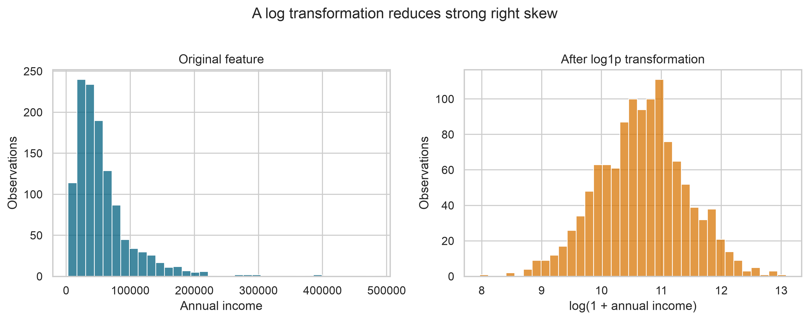
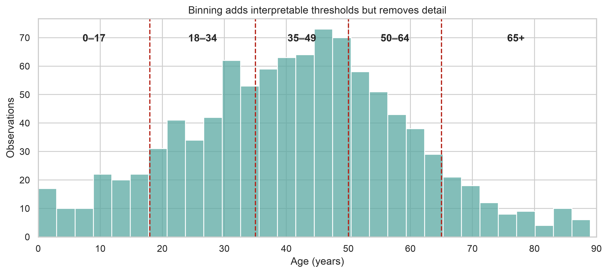
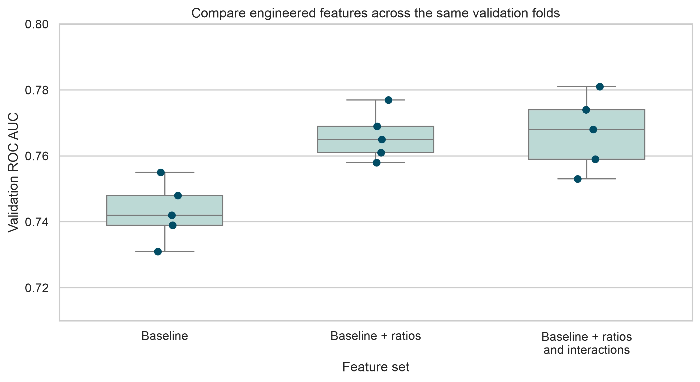

# Feature Engineering {#lesson03}

:::cdi-message
- **ID:** ADS-L03
- **Type:** Feature engineering
- **Audience:** Intermediate
- **Theme:** Useful features connect domain knowledge with modelling goals
:::

Feature engineering turns raw variables into representations that make the
structure of a modelling problem easier to learn. It combines domain knowledge,
data understanding, and careful preprocessing.

The goal is not to create as many columns as possible. The goal is to create
features that are meaningful, reproducible, available when predictions are
made, and appropriate for the model being used.

## Learning objectives

By the end of this chapter, you should be able to:

- distinguish feature engineering from data cleaning;
- identify and prevent target leakage;
- create numeric, categorical, date, and interaction features;
- place learned transformations inside a scikit-learn pipeline;
- evaluate whether engineered features improve validation performance; and
- document feature definitions so that they can be reproduced.

## From cleaned data to model-ready features

Data cleaning corrects problems such as invalid values, inconsistent labels,
and duplicate records. Feature engineering changes how valid information is
represented for modelling.

For example, a cleaned dataset may contain `annual_income` and
`household_size`. A model may benefit from an additional feature:

\[
\text{income per person} =
\frac{\text{annual income}}{\text{household size}}
\]

This derived feature may express household resources more directly than either
input variable alone.

Useful features generally satisfy four conditions:

1. **Relevant** — connected to the outcome through a plausible mechanism.
2. **Available** — known at the moment a prediction must be made.
3. **Stable** — defined consistently across training and future data.
4. **Testable** — evaluated using data that did not determine the transformation.

## Define the prediction point first

Before creating features, state when the prediction will be made. This defines
which information is legitimately available.

Suppose the goal is to predict whether a patient will be readmitted using
information available at hospital discharge. Age, diagnosis, length of stay,
and discharge status may be valid inputs. A follow-up visit recorded two weeks
later is not valid because it occurs after the prediction point.

This distinction prevents **target leakage**: the use of information that would
not be available in the real prediction setting or that reveals the outcome
directly.

Common leakage sources include:

- variables recorded after the outcome occurs;
- aggregates computed using the full dataset;
- imputing, scaling, or selecting features before splitting the data;
- repeated observations from the same person appearing in both training and
  validation data; and
- identifiers or administrative fields that indirectly encode the target.

::: {.callout-warning}
## Leakage can produce excellent but unusable results

A feature may be strongly associated with the target and still be invalid.
Always ask: **Would this value be known for a new case at prediction time?**
:::

## Split before learning transformations

Rules based only on domain knowledge can be defined before splitting. Any rule
that learns from observed values must be fitted using training data only.

```python
from sklearn.model_selection import train_test_split

X = data.drop(columns="target")
y = data["target"]

X_train, X_test, y_train, y_test = train_test_split(
    X,
    y,
    test_size=0.20,
    stratify=y,
    random_state=42,
)
```

The test set should remain untouched until the workflow and modelling choices
have been finalized. During development, compare alternatives using
cross-validation on the training set.

If observations are grouped or ordered in time, a random split may be
inappropriate. Use a group-aware or time-aware split that reflects how the
model will encounter future data.

## Numeric feature engineering

### Ratios and rates

Ratios can express scale-adjusted relationships, but the denominator requires
careful handling.

```python
import numpy as np

features = data.copy()
features["income_per_person"] = np.where(
    features["household_size"] > 0,
    features["annual_income"] / features["household_size"],
    np.nan,
)
```

Do not silently replace an undefined ratio with zero. Zero is a meaningful
value and may misrepresent missing or invalid information.

### Logarithmic transformations

Variables such as income, transaction value, or biomarker concentration may be
strongly right-skewed. A logarithmic transformation can reduce the influence of
very large values and make multiplicative differences easier to model.

```python
features["log_annual_income"] = np.log1p(features["annual_income"])
```

`np.log1p(x)` calculates \(\log(1+x)\), which permits zero values. It still
requires values greater than or equal to zero.

The same feature can look very different after transformation. The original
values below have a long right tail, while the transformed values are more
evenly distributed.

{#fig-log-transformation fig-alt="Two histograms compare annual income before and after a log transformation. The original distribution has a long right tail; the transformed distribution is more balanced." width=95%}

The figure is generated by
`scripts/python/03-generate_feature_engineering_figures.py`.

### Binning

Binning can create interpretable groups, especially when meaningful thresholds
come from domain knowledge.

```python
import pandas as pd

features["age_group"] = pd.cut(
    features["age"],
    bins=[0, 18, 35, 50, 65, np.inf],
    labels=["0-17", "18-34", "35-49", "50-64", "65+"],
    right=False,
)
```

Binning also discards within-group variation. Retain the original continuous
variable unless there is a clear reason not to, and compare both versions.

{#fig-age-binning fig-alt="A histogram of age with vertical dashed lines marking five age groups: 0 to 17, 18 to 34, 35 to 49, 50 to 64, and 65 plus." width=90%}

The boundaries make the groups easy to interpret, but two people on opposite
sides of a boundary may be more similar than their category labels suggest.

## Categorical feature engineering

Most estimators require categorical variables to be represented numerically.
One-hot encoding creates an indicator column for each observed category.

```python
from sklearn.preprocessing import OneHotEncoder

encoder = OneHotEncoder(
    handle_unknown="ignore",
    sparse_output=False,
)
```

`handle_unknown="ignore"` allows the fitted encoder to process categories that
appear in new data but were absent from the training set. For high-cardinality
variables, one-hot encoding may create too many sparse columns. Consider:

- combining genuinely rare levels into an `Other` category;
- representing a category using defensible domain groupings;
- using a model that handles categorical predictors directly; or
- applying a supervised encoder within cross-validation.

Target encoding must never be computed once on the full training dataset and
then evaluated on those same encoded rows. It should be learned within each
training fold to avoid leaking target information into validation folds.

## Date and time features

Dates often contain several useful components.

```python
features["event_date"] = pd.to_datetime(
    features["event_date"],
    errors="coerce",
)

features["event_year"] = features["event_date"].dt.year
features["event_month"] = features["event_date"].dt.month
features["event_day_of_week"] = features["event_date"].dt.dayofweek
features["event_is_weekend"] = (
    features["event_day_of_week"] >= 5
).astype("int8")
```

Elapsed time may be more informative than separate calendar components.

```python
reference_date = pd.Timestamp("2026-08-01")

features["days_since_event"] = (
    reference_date - features["event_date"]
).dt.days
```

In a production workflow, the reference date must be defined from the prediction
context rather than hard-coded accidentally. Never calculate elapsed time from
a future date unavailable at prediction time.

## Interaction features

An interaction represents a relationship in which the effect of one feature
depends on another.

```python
features["dose_per_kg"] = np.where(
    features["weight_kg"] > 0,
    features["dose_mg"] / features["weight_kg"],
    np.nan,
)
```

Polynomial and interaction terms can also be generated systematically.

```python
from sklearn.preprocessing import PolynomialFeatures

interaction_builder = PolynomialFeatures(
    degree=2,
    interaction_only=True,
    include_bias=False,
)
```

Systematic expansion can increase dimensionality quickly. Use it with
regularization, cross-validation, and a clear modelling rationale.

## Put preprocessing inside a pipeline

A pipeline ensures that imputers, scalers, encoders, and the model are fitted in
the correct order. During cross-validation, scikit-learn learns each
transformation using only the training fold.

```python
from sklearn.compose import ColumnTransformer
from sklearn.impute import SimpleImputer
from sklearn.linear_model import LogisticRegression
from sklearn.pipeline import Pipeline
from sklearn.preprocessing import OneHotEncoder, StandardScaler

numeric_features = [
    "age",
    "annual_income",
    "household_size",
]
categorical_features = ["region", "employment_type"]

numeric_pipeline = Pipeline(
    steps=[
        ("imputer", SimpleImputer(strategy="median")),
        ("scaler", StandardScaler()),
    ]
)

categorical_pipeline = Pipeline(
    steps=[
        ("imputer", SimpleImputer(strategy="most_frequent")),
        (
            "encoder",
            OneHotEncoder(handle_unknown="ignore"),
        ),
    ]
)

preprocessor = ColumnTransformer(
    transformers=[
        ("numeric", numeric_pipeline, numeric_features),
        ("categorical", categorical_pipeline, categorical_features),
    ],
    remainder="drop",
)

model_pipeline = Pipeline(
    steps=[
        ("preprocessor", preprocessor),
        (
            "model",
            LogisticRegression(max_iter=1_000, random_state=42),
        ),
    ]
)
```

Fit the complete pipeline, not its preprocessing steps separately.

```python
model_pipeline.fit(X_train, y_train)
predictions = model_pipeline.predict(X_test)
```

::: {.callout-note}
## Scaling depends on the model

Standardization is often important for distance-based models, support vector
machines, neural networks, and regularized linear models. Tree-based models
generally do not require numeric scaling. The preprocessing design should match
the estimator.
:::

## Add custom domain features safely

When a domain transformation must operate inside a pipeline, place it in a
reusable function and wrap it with `FunctionTransformer`.

```python
from sklearn.preprocessing import FunctionTransformer


def add_domain_features(frame):
    transformed = frame.copy()
    transformed["income_per_person"] = np.where(
        transformed["household_size"] > 0,
        transformed["annual_income"]
        / transformed["household_size"],
        np.nan,
    )
    return transformed


feature_builder = FunctionTransformer(
    add_domain_features,
    validate=False,
)
```

The feature builder can become the first step of the full pipeline. Keeping the
logic in one place prevents training and prediction workflows from implementing
different feature definitions.

## Evaluate feature value with cross-validation

An engineered feature is useful only if it improves the workflow on appropriate
validation data or provides a justified benefit such as interpretability or
fairness.

```python
from sklearn.model_selection import StratifiedKFold, cross_validate

cv = StratifiedKFold(
    n_splits=5,
    shuffle=True,
    random_state=42,
)

scores = cross_validate(
    model_pipeline,
    X_train,
    y_train,
    cv=cv,
    scoring=["roc_auc", "accuracy"],
    return_train_score=False,
)

print(scores["test_roc_auc"].mean())
print(scores["test_accuracy"].mean())
```

Compare a defensible baseline with one change at a time:

1. fit the baseline feature set;
2. add or revise a feature group;
3. evaluate both workflows using the same folds and metrics;
4. inspect variation across folds, not only the mean score; and
5. retain the change only when the benefit is credible and relevant.

Feature engineering is an iterative modelling decision, not a one-time data
preparation step.

{#fig-feature-set-validation fig-alt="Three boxplots with individual validation-fold points compare ROC AUC across baseline features, baseline plus ratios, and baseline plus ratios and interactions." width=88%}

The points represent the individual folds. In this illustrative result, ratio
features improve performance consistently, while adding interactions provides
no equally clear improvement. The scores are demonstration values, not results
from a fitted study model.

### Generate the chapter figures

From the repository root, choose either of the following alternatives.

**Option 1 — use the chapter-specific Bash helper:**

```bash
bash scripts/bash/03-generate_feature_engineering_figures.sh
```

**Option 2 — run the plotting script directly:**

```bash
.venv/bin/python scripts/python/03-generate_feature_engineering_figures.py
```

Both commands generate the same three figures under `results/figures/`. The
Bash helper calls the Python script using the repository-specific `.venv`, so
run either command, not both. These ordinary `bash` blocks are displayed for
learners to copy; Quarto does not execute them while rendering the chapter.

The plotting code remains copyable but is not executed when Quarto renders the
chapter:

```python
import seaborn as sns

sns.boxplot(
    data=validation_scores,
    x="feature_set",
    y="roc_auc",
    color="#b8ded9",
    showfliers=False,
)
sns.stripplot(
    data=validation_scores,
    x="feature_set",
    y="roc_auc",
    color="#024d66",
    jitter=0.08,
)
```

## Feature selection is part of the pipeline

More features do not necessarily improve generalization. Redundant, unstable,
or noisy predictors can increase computation and make interpretation harder.

Feature selection approaches include:

- **filter methods**, such as variance or univariate association thresholds;
- **wrapper methods**, such as recursive feature elimination; and
- **embedded methods**, such as L1 regularization or tree-based importance.

Any supervised selection method must be fitted within each cross-validation
fold. Selecting features once using the complete dataset leaks validation
information into the model-building process.

Model-derived importance is also not proof that a feature is causal. Importance
describes how a fitted model used the available predictors under a particular
dataset and modelling specification.

## Document the feature set

A feature dictionary makes engineered data auditable and easier to reproduce.

| Feature | Source variables | Definition | Availability | Notes |
|---|---|---|---|---|
| `income_per_person` | `annual_income`, `household_size` | Income divided by household size | Prediction time | Missing when household size is not positive |
| `event_is_weekend` | `event_date` | 1 for Saturday or Sunday; otherwise 0 | Prediction time | Date parsed before extraction |
| `dose_per_kg` | `dose_mg`, `weight_kg` | Dose divided by body weight | Prediction time | Units must be verified |

For each feature, record:

- its exact formula or transformation;
- source columns and units;
- missing-value behavior;
- valid range and category definitions;
- the prediction-time availability rule; and
- the code version that created it.

## Practical workflow

Use the following sequence when engineering features:

1. define the target, unit of observation, and prediction point;
2. identify information available at that point;
3. split the data using a strategy appropriate to the problem;
4. build a simple baseline with minimal preprocessing;
5. propose features from domain knowledge and exploratory evidence;
6. implement learned transformations inside a pipeline;
7. compare alternatives using consistent cross-validation;
8. examine errors, stability, and subgroup performance; and
9. document and version the final feature definitions.

## Common mistakes

Avoid these recurring problems:

- engineering features before defining the prediction setting;
- computing medians, category frequencies, or target encodings on all data;
- using future information in historical records;
- treating identifiers as ordinary numeric predictors;
- creating ratios without checking zero values and units;
- expanding interactions without controlling dimensionality;
- evaluating many alternatives against the test set; and
- assuming a feature is useful because it has a plausible name.

## Knowledge check

1. Why should imputation and scaling be fitted inside cross-validation?
2. When can a highly predictive variable still be invalid?
3. Why might a ratio be more informative than its two source variables?
4. What risk is introduced by target encoding?
5. Why should engineered features be compared against a baseline using the same
   validation folds?

## Chapter summary

Feature engineering connects domain knowledge with statistical learning. Strong
features are available at prediction time, defined consistently, and evaluated
without leakage. Pipelines make learned transformations reproducible and keep
them within the correct training boundaries. The best feature set is not the
largest one; it is the smallest defensible representation that improves the
modelling objective on unseen data.

The next chapter builds on this model-ready representation by examining how to
choose and evaluate predictive models systematically.
