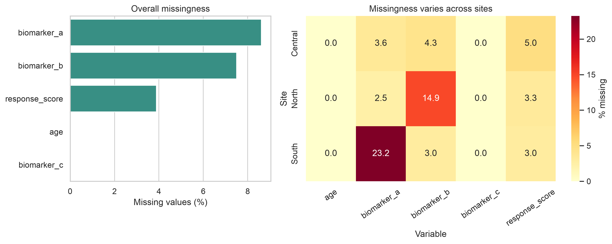
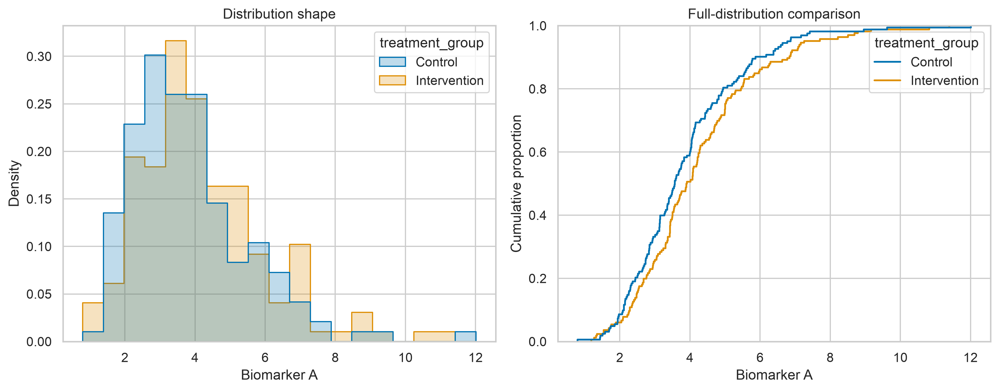
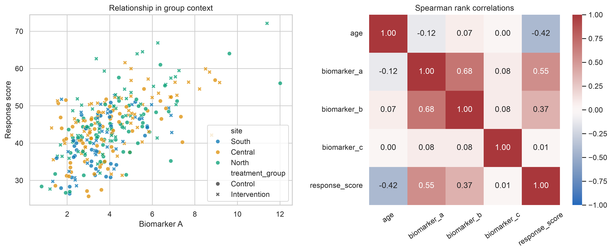
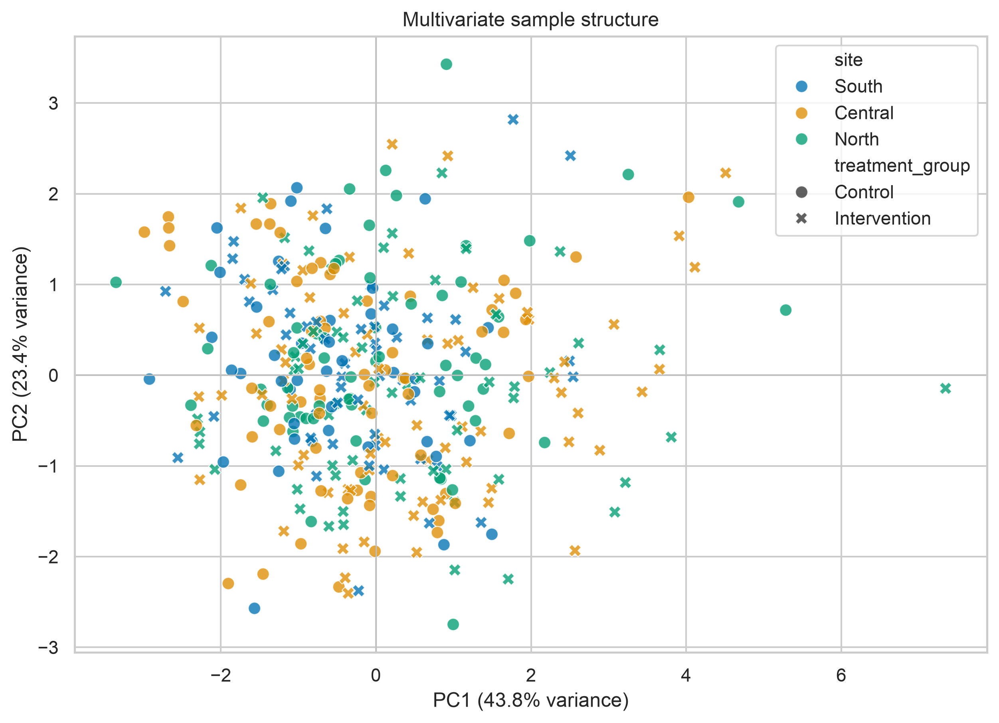

# Exploratory Analysis for Complex Data {#lesson04}

:::cdi-message
- **ID:** ADS-L04
- **Type:** Exploratory analysis
- **Audience:** Intermediate
- **Theme:** Exploration reveals structure, uncertainty, and analytical risk
:::

Exploratory data analysis (EDA) is the disciplined process of learning how a
dataset is structured before choosing or trusting a model. For complex data,
this means looking beyond individual variables. We examine missingness,
skewness, dependence, group structure, unusual observations, and possible data
leakage together.

EDA does not prove a hypothesis. It helps us identify patterns worth explaining,
assumptions that may fail, and decisions that must be documented before formal
modelling.

## Learning objectives

By the end of this chapter, you should be able to:

- audit the analytical structure of a complex dataset;
- distinguish missing values, unusual observations, and genuine heterogeneity;
- use distributional, relational, and multivariate views together;
- recognise clustering, confounding, redundancy, and leakage risks;
- create a reproducible exploratory report without altering the source data; and
- translate exploratory findings into defensible modelling decisions.

## Why complex data require layered exploration

A summary table can describe each variable separately while concealing the
structure that matters most. A dataset may contain repeated observations from
the same participant, measurements collected at different sites, highly
correlated features, or missing values concentrated in one subgroup. Treating
all rows and columns as independent can then lead to misleading conclusions.

A useful EDA moves through several layers:

1. **Structure** — What does one row represent? Which variables identify groups,
   time points, sites, batches, or outcomes?
2. **Quality** — Are values missing, duplicated, impossible, or inconsistently
   encoded?
3. **Distributions** — Are variables symmetric, skewed, bounded, zero-inflated,
   or multimodal?
4. **Relationships** — Which variables move together, and do relationships vary
   across groups?
5. **Multivariate structure** — Do samples cluster, separate, or appear unusual
   when many features are considered together?
6. **Analytical risk** — Could grouping, preprocessing, feature construction, or
   data leakage distort later modelling?

## Start with the analytical unit

Before plotting anything, state what a row represents. A row might be one
person, one visit, one specimen, one transaction, or one sensor reading. Then
identify variables that create dependence between rows.

```python
analysis_unit = "one participant visit"
identifier_columns = ["participant_id", "visit_id"]
group_columns = ["site", "treatment_group"]
time_column = "visit_month"
outcome_column = "response_score"
```

This short declaration prevents a common mistake: treating repeated or nested
measurements as though every row were independent.

## Build a structural audit

Begin with shape, data types, uniqueness, missingness, and numeric summaries.
Keep identifiers out of calculations where they have no analytical meaning.

```python
import pandas as pd

data = pd.read_csv("data/processed/analysis_dataset.csv")

print(data.shape)
print(data.dtypes)
print(data.head())

audit = pd.DataFrame({
    "dtype": data.dtypes.astype(str),
    "missing_n": data.isna().sum(),
    "missing_pct": data.isna().mean().mul(100),
    "unique_n": data.nunique(dropna=True),
})

print(audit.sort_values("missing_pct", ascending=False))
```

Check duplicate analytical keys separately from fully duplicated rows.

```python
key_columns = ["participant_id", "visit_id"]

duplicate_keys = data.duplicated(subset=key_columns, keep=False)
duplicate_rows = data.duplicated(keep=False)

print(data.loc[duplicate_keys, key_columns].sort_values(key_columns))
print(f"Fully duplicated rows: {duplicate_rows.sum()}")
```

A repeated participant is not automatically a duplicate. It may be an expected
longitudinal record. The analytical key determines whether repetition is valid.

## Examine missingness as structure

The percentage missing in each variable is useful, but it does not show whether
values are missing together or within particular groups. Explore both marginal
and conditional missingness.

```python
missing_by_site = (
    data.groupby("site", observed=True)
    .agg(
        rows=("participant_id", "size"),
        biomarker_missing=("biomarker_a", lambda x: x.isna().mean()),
        response_missing=("response_score", lambda x: x.isna().mean()),
    )
)

print(missing_by_site)
```

If missingness differs by site, time, outcome, or treatment group, complete-case
analysis may change the composition of the dataset. Record the pattern before
choosing deletion, imputation, or a model that can accommodate missing data.

## Explore distributions with context

No single plot fully describes a distribution. Histograms reveal overall shape;
empirical cumulative distribution functions (ECDFs) make group comparisons less
dependent on bin width; boxplots and violin plots highlight spread and possible
heterogeneity.

```python
import matplotlib.pyplot as plt
import seaborn as sns

sns.set_theme(style="whitegrid", context="notebook")

fig, axes = plt.subplots(1, 2, figsize=(11, 4.5))

sns.histplot(
    data=data,
    x="biomarker_a",
    hue="treatment_group",
    element="step",
    stat="density",
    common_norm=False,
    ax=axes[0],
)

sns.ecdfplot(
    data=data,
    x="biomarker_a",
    hue="treatment_group",
    ax=axes[1],
)

plt.tight_layout()
plt.show()
```

Look for skewness, long tails, floor or ceiling effects, excess zeros, and
multiple modes. A second mode may reflect genuine subpopulations, site effects,
batch effects, or inconsistent measurement—not merely a need for transformation.

## Investigate relationships, not only correlations

Correlation is a compact description of association, not a complete account of
the relationship. Pearson correlation is sensitive to linearity and influential
observations; Spearman correlation describes monotonic rank association and is
often more robust to skewness.

```python
feature_columns = [
    "age",
    "biomarker_a",
    "biomarker_b",
    "biomarker_c",
    "response_score",
]

pearson = data[feature_columns].corr(method="pearson")
spearman = data[feature_columns].corr(method="spearman")

print(pearson.round(2))
print(spearman.round(2))
```

Always pair a correlation matrix with relational plots. Colouring observations
by a meaningful group can reveal confounding, subgroup-specific slopes, or
Simpson's paradox.

```python
sns.scatterplot(
    data=data,
    x="biomarker_a",
    y="response_score",
    hue="site",
    style="treatment_group",
)

plt.show()
```

## Compare groups without hiding sample size

Group summaries should include both the estimate and the number of observations
supporting it.

```python
group_summary = (
    data.groupby(["site", "treatment_group"], observed=True)
    .agg(
        n=("participant_id", "size"),
        response_mean=("response_score", "mean"),
        response_median=("response_score", "median"),
        response_sd=("response_score", "std"),
    )
    .reset_index()
)

print(group_summary)
```

Differences between groups may reflect the exposure of interest, but they may
also reflect age, site, batch, measurement timing, or selection. EDA can expose
these alternatives; it cannot by itself establish causality.

## Identify unusual and influential observations

An unusual value is not automatically an error. It may be a valid extreme,
measurement failure, data-entry problem, or member of a rare subgroup. Preserve
the original value, investigate its provenance, and document any exclusion.

The interquartile-range rule can flag observations for review:

```python
q1 = data["response_score"].quantile(0.25)
q3 = data["response_score"].quantile(0.75)
iqr = q3 - q1

lower = q1 - 1.5 * iqr
upper = q3 + 1.5 * iqr

review_rows = data.loc[
    ~data["response_score"].between(lower, upper, inclusive="both")
]

print(review_rows)
```

This rule is a screening device, not an automatic deletion rule. Later,
model-specific diagnostics such as leverage, residuals, and Cook's distance may
show whether an observation materially changes an estimate.

## Reveal multivariate structure

Principal component analysis (PCA) provides a low-dimensional view of variation
across correlated numeric features. Standardise features first when they use
different units. Fit preprocessing only to the appropriate training data once a
predictive workflow begins.

```python
from sklearn.impute import SimpleImputer
from sklearn.pipeline import make_pipeline
from sklearn.preprocessing import StandardScaler
from sklearn.decomposition import PCA

feature_columns = [
    "age",
    "biomarker_a",
    "biomarker_b",
    "biomarker_c",
]

pca_pipeline = make_pipeline(
    SimpleImputer(strategy="median"),
    StandardScaler(),
    PCA(n_components=2),
)

scores = pca_pipeline.fit_transform(data[feature_columns])
```

A PCA plot can reveal broad gradients, clusters, or unusual observations. It
does not prove that visible clusters are stable or biologically meaningful.
Check whether separation aligns with site, batch, missingness, or another known
technical factor before assigning substantive meaning.

## Reproducible chapter figures

The companion script generates a synthetic, participant-level dataset for
illustration and creates four figures:

- missingness by variable and site;
- distributions by treatment group;
- feature relationships and rank correlations; and
- PCA sample structure.

Run the Python script directly:

```bash
python scripts/python/04-generate_exploratory_analysis_figures.py
```

Or use the Bash wrapper, which runs the same Python workflow:

```bash
bash scripts/bash/04-generate_exploratory_analysis_figures.sh
```

Both commands create the same reproducible outputs in `results/figures/` and
write the illustrative dataset to `data/processed/04-exploratory_data.csv`.

### Missingness by variable and site

{fig-alt="Two-panel figure showing overall missingness percentages and a heatmap of missingness percentages by site." width=95%}

The overall bar chart shows scale, while the site-level heatmap shows whether
missingness is concentrated within a particular part of the study.

### Distributions across groups

{fig-alt="Histogram and ECDF comparing biomarker A distributions between two treatment groups." width=95%}

The histogram communicates shape; the ECDF provides a bin-independent comparison
of the full distributions.

### Relationships and dependence

{fig-alt="Scatterplot of biomarker A against response score by study site and a Spearman correlation heatmap." width=95%}

The scatterplot retains group context that the correlation coefficients alone
cannot show.

### Multivariate sample structure

{fig-alt="Principal component scatterplot with points coloured by site and styled by treatment group." width=90%}

Interpret separation cautiously. Technical and study-design variables should be
checked before a component is given a substantive interpretation.

## From exploration to modelling decisions

An EDA should end with an analytical decision log rather than a collection of
plots. Record observations and consequences explicitly.

| Exploratory finding | Possible analytical consequence |
|---|---|
| Repeated observations within participants | Use grouped splitting and consider multilevel or longitudinal models |
| Missingness differs by site | Investigate collection processes and use site-aware sensitivity analysis |
| Strongly skewed positive feature | Consider transformation, robust summaries, or a distribution-appropriate model |
| Highly correlated predictors | Assess redundancy, regularisation, or dimension reduction |
| Site-specific relationship | Include interactions or stratified analyses where justified |
| PCA separation aligns with batch | Correct or model the batch effect before substantive interpretation |
| Outcome-derived feature identified | Remove it from predictors to prevent leakage |

## Common analytical risks

### Exploring the test set

Repeatedly inspecting the held-out test set can influence feature selection and
model design. Once the predictive question is defined, reserve the test set for
final evaluation and perform model-directed exploration on the training data.

### Ignoring clustered observations

Rows from the same participant, household, site, or time series are dependent.
Random row-level splitting can place related observations in both training and
test sets and overstate generalisation.

### Treating association as explanation

A visually strong relationship may arise from confounding, selection, or data
collection. Use domain knowledge and an explicit causal or statistical design
before giving it explanatory meaning.

### Automatically deleting outliers

Removing every extreme value can erase valid heterogeneity and bias results.
Investigate, document, and compare sensitivity analyses.

### Allowing the outcome into preprocessing

Any feature calculated with future information, test-set information, or the
outcome can cause leakage. Fit imputers, scalers, encoders, feature selectors,
and dimension-reduction methods inside the training workflow.

## Chapter checklist

Before moving to modelling, confirm that you can answer:

- What does one row represent?
- Which observations are repeated, nested, temporal, or spatially related?
- Which variables are identifiers, predictors, outcomes, groups, or metadata?
- Where are missing values concentrated?
- Which distributions require special treatment?
- Which relationships differ across groups?
- Are unusual observations plausible and traceable?
- Does multivariate structure align with technical or substantive variables?
- Could any feature leak information unavailable at prediction time?
- Which exploratory findings change the modelling plan?

## Key takeaway

Exploratory analysis is not a decorative prelude to modelling. It is a structured
audit of the data-generating and data-collection processes. When distributions,
relationships, missingness, and multivariate structure are examined together,
the resulting model is easier to justify, diagnose, and reproduce.

