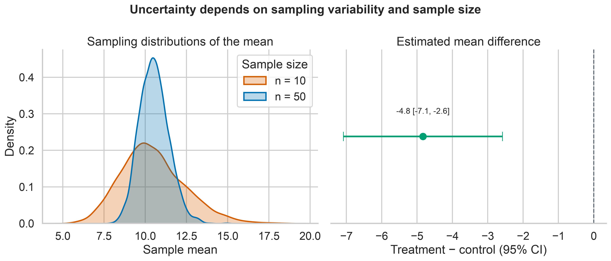

# Statistical Inference {#lesson05}

:::cdi-message
- **ID:** ADS-L05
- **Type:** Statistical inference
- **Audience:** Intermediate
- **Theme:** Samples support claims only when uncertainty is quantified
:::

Exploratory analysis describes the data that were observed. Statistical inference goes further: it uses a sample to estimate an unknown population quantity while making the uncertainty in that estimate explicit.

This distinction matters. A difference between two sample means may reflect a meaningful population difference, ordinary sampling variation, bias in the way observations were collected, or some combination of these. Inferential methods help quantify sampling uncertainty, but they cannot repair poor study design or make an unrepresentative sample representative.

By the end of this chapter, you should be able to:

- distinguish populations, samples, parameters, and statistics;
- use standard errors and confidence intervals to express uncertainty;
- formulate and interpret hypothesis tests correctly;
- report effect sizes alongside uncertainty and p-values;
- select parametric, robust, or resampling methods based on the data and design;
- account for multiple testing; and
- write conclusions that separate statistical evidence from practical importance.

## From a sample to a population claim

Suppose an organization compares a new process with its current process. The observed data contain two sample means, but the scientific or operational question concerns the corresponding population means.

| Concept | Meaning | Example |
|---|---|---|
| Population | The complete group or process of interest | All future cases handled by either process |
| Sample | The observations actually collected | Cases included in the evaluation |
| Parameter | An unknown population quantity | The population mean difference, $\mu_1-\mu_0$ |
| Statistic | A quantity calculated from the sample | The sample mean difference, $\bar{x}_1-\bar{x}_0$ |
| Estimator | A rule used to estimate a parameter | Difference in sample means |
| Estimate | The observed value produced by an estimator | A difference of 4.2 units |

Inference is credible only when the sample and analysis preserve the structure of the data-generating process. Before calculating a p-value or confidence interval, ask:

1. How were observations selected?
2. How were groups or conditions assigned?
3. Are observations independent, paired, clustered, or repeatedly measured?
4. Are important sources of selection bias or confounding present?
5. What population and time period can the sample reasonably represent?

:::callout-warning
## A larger sample does not remove systematic bias

Increasing the sample size reduces sampling variability. It does not correct confounding, measurement error, selection bias, data leakage, or dependence that the analysis ignores.
:::

## Point estimates and sampling distributions

A **point estimate** is a single best estimate of a parameter. Examples include a sample mean, median, proportion, correlation, regression coefficient, or difference between groups.

If the study were repeated under the same conditions, the estimate would usually change. The distribution of estimates across these hypothetical repetitions is the **sampling distribution**. Its spread is summarized by the **standard error**.

For a sample mean based on independent observations,

$$
SE(\bar{x}) = \frac{s}{\sqrt{n}},
$$

where $s$ is the sample standard deviation and $n$ is the sample size. The standard deviation describes variation among observations; the standard error describes uncertainty in an estimated quantity. They are not interchangeable.

```python
import numpy as np
from scipy import stats

values = np.array([18.2, 17.5, 19.1, 16.8, 18.9, 17.7, 18.4, 19.3])

mean = values.mean()
standard_deviation = values.std(ddof=1)
standard_error = stats.sem(values)

print(f"Mean: {mean:.2f}")
print(f"SD: {standard_deviation:.2f}")
print(f"SE: {standard_error:.2f}")
```

The standard error generally decreases as the sample size increases. This improves precision, but it does not guarantee that the estimate is unbiased or practically useful.

## Confidence intervals

A confidence interval combines a point estimate with a margin of error. For a population mean with an unknown population standard deviation, a two-sided interval is commonly based on the $t$ distribution:

$$
\bar{x} \pm t_{1-\alpha/2,\,n-1}\frac{s}{\sqrt{n}}.
$$

```python
from scipy import stats

confidence_level = 0.95
degrees_of_freedom = len(values) - 1
critical_value = stats.t.ppf(
    1 - (1 - confidence_level) / 2,
    df=degrees_of_freedom,
)
margin_of_error = critical_value * standard_error
confidence_interval = (
    mean - margin_of_error,
    mean + margin_of_error,
)

print(confidence_interval)
```

### Interpreting a 95% confidence interval

The 95% refers to the long-run performance of the procedure: if the same sampling and interval-building process were repeated many times, approximately 95% of the resulting intervals would contain the true parameter under the model assumptions.

For one computed frequentist interval, avoid saying that there is a 95% probability that the fixed population parameter lies inside it. A clear applied interpretation is:

> The estimated mean is 18.24, with a 95% confidence interval from 17.49 to 18.98.

The interval communicates both the estimated value and its precision. A wide interval indicates that substantively different parameter values remain compatible with the data and model.

:::callout-tip
## Prefer intervals to isolated significance labels

An interval shows the direction, plausible magnitude, and precision of an effect. A label such as “significant” or “not significant” discards most of that information.
:::

## Comparing two independent groups

For independent groups, Welch's $t$-test is usually a safer default than the equal-variance Student $t$-test because it does not assume identical population variances.

```python
import numpy as np
from scipy import stats

control = np.array([71, 68, 75, 73, 69, 74, 72, 70, 76, 67, 73, 71])
treatment = np.array([66, 64, 70, 68, 63, 69, 65, 67, 71, 64, 66, 68])

result = stats.ttest_ind(treatment, control, equal_var=False)
difference = treatment.mean() - control.mean()

print(f"Mean difference: {difference:.2f}")
print(f"Welch t statistic: {result.statistic:.3f}")
print(f"Two-sided p-value: {result.pvalue:.4f}")
```

The sign of the difference depends on the subtraction order. Define the estimand before interpreting the result:

$$
\Delta = \mu_{\text{treatment}}-\mu_{\text{control}}.
$$

Here, a negative estimate means that the treatment mean is lower than the control mean.

### Confidence interval for the mean difference

SciPy returns the test result and, in current versions, can also calculate its confidence interval.

```python
interval = result.confidence_interval(confidence_level=0.95)

print(f"95% CI: ({interval.low:.2f}, {interval.high:.2f})")
```

When code must support multiple library versions, calculate the Welch interval explicitly or use a tested project dependency lock.

## Hypothesis testing as a decision framework

A hypothesis test compares the observed data with what would be expected under a null model.

- The **null hypothesis**, $H_0$, usually represents no difference or no association.
- The **alternative hypothesis**, $H_1$, represents the effect or association under investigation.
- The **test statistic** measures how far the estimate is from the null value relative to its uncertainty.
- The **p-value** is the probability, assuming the null hypothesis and model assumptions are true, of obtaining a test statistic at least as extreme as the observed one.

For the two-group comparison:

$$
H_0: \mu_{\text{treatment}}-\mu_{\text{control}}=0
$$

$$
H_1: \mu_{\text{treatment}}-\mu_{\text{control}}\neq0.
$$

A p-value is not:

- the probability that the null hypothesis is true;
- the probability that the result occurred “by chance”;
- the size or importance of an effect;
- evidence that the study design was unbiased; or
- the probability that the result will replicate.

### Statistical decision and scientific conclusion

If a prespecified significance level is $\alpha=0.05$, a p-value below 0.05 leads to rejection of $H_0$ under that decision rule. It does not create a sharp scientific boundary between truth and falsehood. Values just below and just above 0.05 often represent very similar evidence.

A responsible conclusion combines:

- the estimated effect and its direction;
- the confidence interval;
- the p-value when a test was planned and relevant;
- the assumptions and study design;
- practical or scientific importance; and
- sensitivity to reasonable alternative analyses.

## Effect size and practical importance

With a sufficiently large sample, a negligible difference can produce a small p-value. With a small sample, an important difference can remain imprecisely estimated. Effect sizes provide a scale for magnitude.

For two independent groups, Hedges' $g$ is a small-sample-corrected standardized mean difference:

$$
g = J\frac{\bar{x}_1-\bar{x}_0}{s_p},
$$

where $s_p$ is the pooled standard deviation and $J$ is a small-sample correction.

```python
import numpy as np

def hedges_g(group_1, group_0):
    """Return Hedges' g for two independent groups."""
    n_1, n_0 = len(group_1), len(group_0)
    variance_1 = np.var(group_1, ddof=1)
    variance_0 = np.var(group_0, ddof=1)
    pooled_sd = np.sqrt(
        ((n_1 - 1) * variance_1 + (n_0 - 1) * variance_0)
        / (n_1 + n_0 - 2)
    )
    cohen_d = (np.mean(group_1) - np.mean(group_0)) / pooled_sd
    correction = 1 - 3 / (4 * (n_1 + n_0) - 9)
    return correction * cohen_d

effect_size = hedges_g(treatment, control)
print(f"Hedges' g: {effect_size:.2f}")
```

Standardized effects support comparison across scales, but a raw effect in meaningful units is often easier to interpret. Report both when useful. Generic thresholds for “small,” “medium,” and “large” should not replace domain knowledge.

## Parametric, robust, and resampling approaches

Method selection should follow the estimand, study design, data type, sample size, and plausible assumptions—not a mechanical normality-test decision.

| Question or data structure | Possible method | Main quantity |
|---|---|---|
| One continuous outcome, two independent groups | Welch's $t$-test | Difference in means |
| One continuous outcome, paired observations | Paired $t$-test | Mean paired difference |
| Strong skew or influential outliers | Trimmed-mean or robust method | Robust location difference |
| Ordered or continuous outcome with rank focus | Mann–Whitney test | Probability/rank-based contrast |
| Paired rank-based comparison | Wilcoxon signed-rank test | Distribution of paired differences |
| Few distributional assumptions desired | Permutation test | Design-specific null contrast |
| Uncertainty for a complex statistic | Bootstrap interval | Statistic chosen by the analyst |
| Binary outcome | Proportion interval, risk difference, odds ratio, or logistic model | Chosen binary-effect measure |
| Clustered or repeated observations | Mixed model, GEE, cluster bootstrap, or cluster-robust SE | Design-specific effect |

:::callout-important
## Different methods may answer different questions

The Mann–Whitney test is not simply a “nonparametric test of medians.” Without additional distributional assumptions, it concerns relative ranks or stochastic ordering. Choose a method whose estimand matches the question.
:::

## Bootstrap confidence intervals

The bootstrap approximates a sampling distribution by repeatedly resampling the observed cases with replacement. It is especially useful when an analytic standard error is unavailable or when the statistic has a complicated sampling distribution.

```python
from scipy import stats

bootstrap_result = stats.bootstrap(
    (treatment, control),
    statistic=lambda x, y: np.mean(x) - np.mean(y),
    paired=False,
    confidence_level=0.95,
    method="BCa",
    n_resamples=10_000,
    rng=np.random.default_rng(20260801),
)

print(bootstrap_result.confidence_interval)
```

The resampling unit must match the independent unit in the study. If patients are nested within clinics, resampling individual rows as if they were independent can substantially understate uncertainty. A cluster-aware bootstrap would resample clinics, not isolated patient rows.

## Permutation tests

A permutation test constructs a reference distribution by rearranging labels in a way justified by the null hypothesis and study design.

```python
permutation_result = stats.permutation_test(
    (treatment, control),
    statistic=lambda x, y: np.mean(x) - np.mean(y),
    permutation_type="independent",
    alternative="two-sided",
    n_resamples=20_000,
    rng=np.random.default_rng(20260801),
)

print(f"Permutation p-value: {permutation_result.pvalue:.4f}")
```

Exchangeability is essential: under the null model, the labels must be legitimately rearrangeable. Paired, clustered, blocked, or time-dependent designs require restricted permutations that preserve their structure.

## Assumptions and diagnostics

Assumptions belong to the complete data-generating and analysis process. Useful checks include:

- **Independence:** justified mainly by design, not by a plot or test.
- **Outcome scale:** appropriate for the chosen estimate and model.
- **Distributional shape:** inspect skew, tails, discreteness, and influential observations.
- **Variance structure:** use methods such as Welch's test when equal variance is doubtful.
- **Missingness:** investigate why values are absent and whether complete-case analysis is defensible.
- **Model form:** inspect residuals and nonlinear patterns when using regression models.
- **Sample size:** determine whether asymptotic approximations are credible.

Normality tests can be misleading: they have low power in small samples and can flag inconsequential deviations in large samples. Use them, if at all, as one piece of evidence alongside design knowledge and graphical diagnostics.

## Multiple comparisons

Testing many hypotheses increases the chance of obtaining at least one small p-value even when all null hypotheses are true. If 20 independent null hypotheses are tested at $\alpha=0.05$, the probability of at least one false rejection is

$$
1-(1-0.05)^{20}\approx0.64.
$$

Two common error-control goals are:

- **Family-wise error rate (FWER):** control the probability of one or more false rejections; Holm's method is often preferable to basic Bonferroni correction.
- **False discovery rate (FDR):** control the expected proportion of false discoveries among rejected hypotheses; the Benjamini–Hochberg procedure is widely used in high-dimensional analysis.

```python
import numpy as np
from statsmodels.stats.multitest import multipletests

p_values = np.array([0.001, 0.012, 0.031, 0.049, 0.210, 0.740])

reject, adjusted_p_values, _, _ = multipletests(
    p_values,
    alpha=0.05,
    method="fdr_bh",
)

for raw, adjusted, decision in zip(p_values, adjusted_p_values, reject):
    print(f"raw={raw:.3f}, adjusted={adjusted:.3f}, reject={decision}")
```

Define the family of hypotheses transparently. Adjustment should follow the scientific question and analysis plan, not be used selectively after seeing the results.

## Power and sample size

**Statistical power** is the probability that a test rejects the null hypothesis when a specified alternative is true. Power depends on:

- the effect size considered important;
- outcome variability;
- sample size;
- significance level;
- study design and allocation ratio; and
- the planned statistical test.

```python
from statsmodels.stats.power import TTestIndPower

analysis = TTestIndPower()
sample_size_per_group = analysis.solve_power(
    effect_size=0.50,
    alpha=0.05,
    power=0.80,
    ratio=1.0,
    alternative="two-sided",
)

print(f"Required sample size per group: {np.ceil(sample_size_per_group):.0f}")
```

Plan around the smallest effect that would matter in context, not an arbitrary standardized effect. Inflate the initial target when attrition, clustering, noncompliance, or unusable measurements are expected.

Post hoc “observed power” calculated from the observed effect adds little beyond the p-value and confidence interval. After data collection, focus on the estimated effect and its uncertainty.

## Visualizing uncertainty

The chapter figure contrasts the variability of individual observations with the uncertainty of estimated means, then shows the treatment-control estimate with its confidence interval.

{#fig-statistical-inference-overview fig-alt="Two-panel statistical inference figure. The first panel compares sampling distributions of the mean for sample sizes 10 and 50. The second panel shows the treatment minus control mean difference with a 95 percent confidence interval and a vertical zero reference line."}

Generate the figure directly with Python:

```bash
python scripts/python/05-generate_statistical_inference_figures.py
```

Or use the Bash helper, which runs the same Python script and therefore produces the same output:

```bash
bash scripts/bash/05-generate_statistical_inference_figures.sh
```

The plotting code remains in `scripts/python/` so the guide stays readable while the complete workflow remains reproducible.

## A reproducible reporting pattern

Use a structured result rather than reporting only a p-value.

```python
result_summary = {
    "estimand": "treatment mean minus control mean",
    "estimate": difference,
    "confidence_level": 0.95,
    "confidence_interval": (interval.low, interval.high),
    "test": "Welch two-sample t-test",
    "p_value": result.pvalue,
    "effect_size": effect_size,
    "effect_size_measure": "Hedges' g",
    "n_treatment": len(treatment),
    "n_control": len(control),
}
```

A concise narrative might read:

> The treatment group had a lower mean outcome than the control group. The estimated treatment-minus-control difference was reported with its 95% confidence interval, Welch-test p-value, and Hedges' $g$. Conclusions were limited to the sampled population and depended on the independence and measurement assumptions.

Replace general phrases with the computed values and domain-specific interpretation. Also state whether the analysis was confirmatory or exploratory, how missing observations were handled, and whether multiplicity adjustment was applied.

## Common inference failures

| Failure | Why it is a problem | Better practice |
|---|---|---|
| Reporting only “p < 0.05” | Hides magnitude and precision | Report estimate, interval, exact p-value, and context |
| Treating non-significance as proof of no effect | An imprecise study may miss important effects | Examine the confidence interval and consider equivalence methods |
| Choosing a test after inspecting the desired result | Inflates researcher degrees of freedom | Prespecify the primary analysis and label exploratory analyses |
| Ignoring pairing or clustering | Usually understates uncertainty | Preserve the design in the model and resampling scheme |
| Testing baseline differences in randomized groups as a gatekeeper | Randomization, not a baseline p-value, establishes allocation | Assess meaningful imbalance and use a justified adjusted model |
| Removing outliers solely to obtain significance | Makes conclusions outcome-dependent | Use documented rules and sensitivity analyses |
| Equating statistical with practical significance | Small effects can be detectable but irrelevant | Compare effects with domain-specific thresholds |
| Interpreting association as causation | Observational associations may be confounded | Use causal design and assumptions appropriate to the claim |

## Practical workflow

Use the following sequence for a defensible inferential analysis:

1. Define the population, outcome, exposure or intervention, comparison, and estimand.
2. Identify the independent sampling or assignment unit.
3. Document the study design, missingness, exclusions, and potential biases.
4. Explore distributions and data quality without selecting results opportunistically.
5. Choose a method that targets the estimand and respects dependence.
6. Calculate the point estimate, uncertainty interval, and planned test.
7. Quantify effect size in meaningful units and, when helpful, standardized units.
8. Adjust for multiple comparisons when the inferential family requires it.
9. Perform sensitivity or robustness analyses that address credible alternatives.
10. Report limitations and distinguish statistical evidence from practical conclusions.

## Chapter summary

Statistical inference is not a machine for converting data into certainty. It is a disciplined framework for learning from incomplete information.

The central habits are:

- define the target parameter before selecting a method;
- preserve the study design in the analysis;
- report estimates with uncertainty;
- interpret p-values narrowly and correctly;
- evaluate magnitude as well as statistical compatibility;
- control multiplicity when many claims are tested; and
- communicate the assumptions that make the conclusion defensible.

The next stage of applied data science builds on these habits by using models to explain relationships, adjust for covariates, and generate predictions without losing sight of uncertainty and design.
