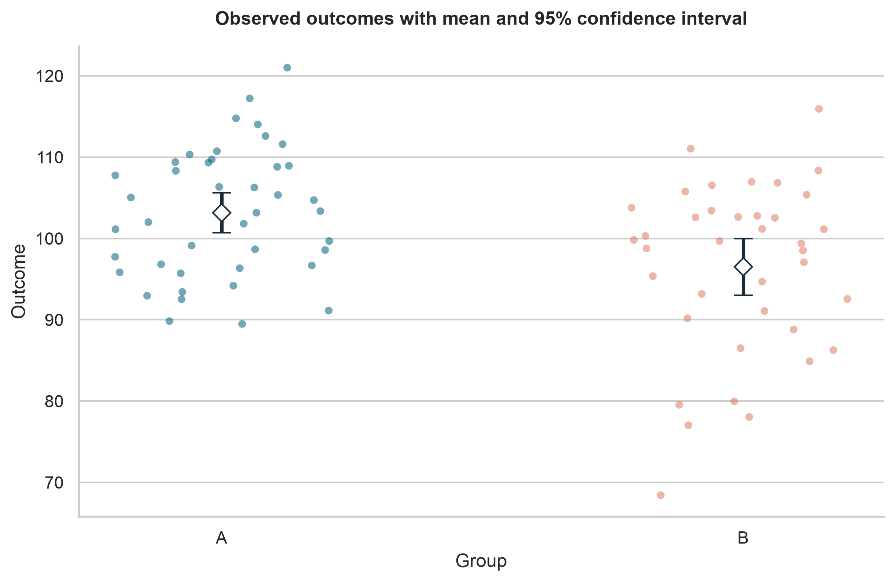
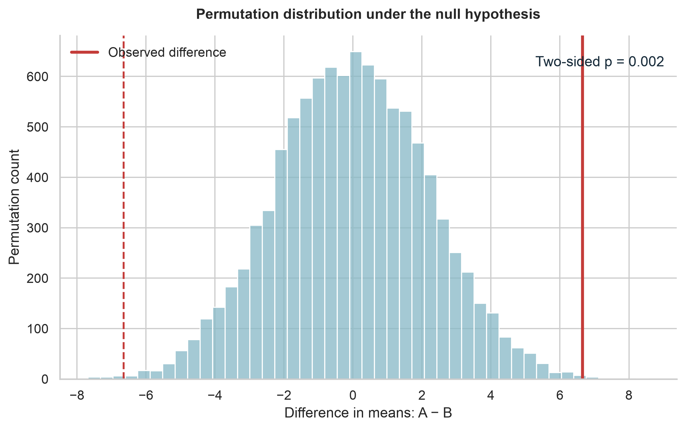
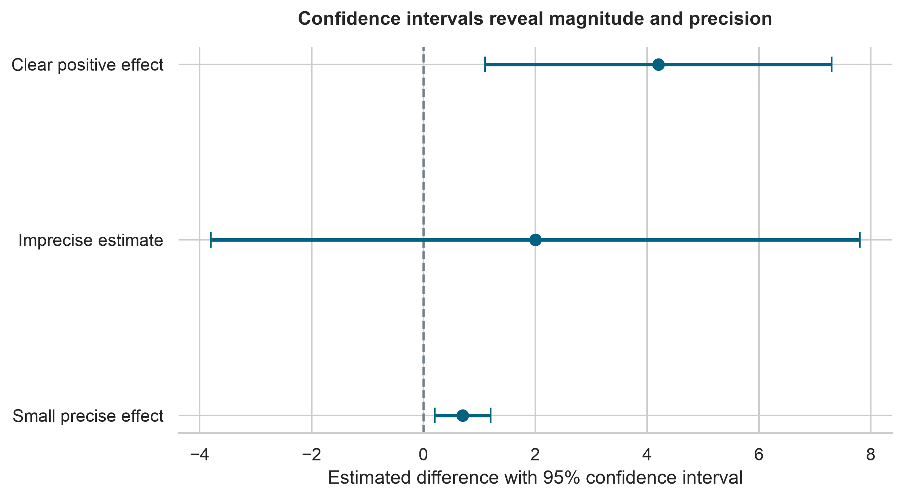
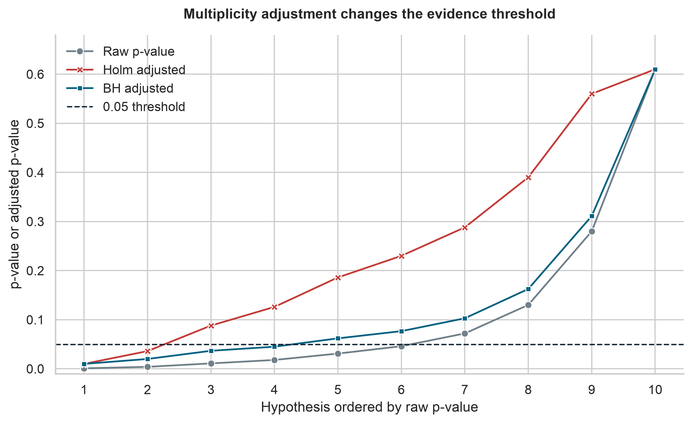

# Hypothesis Testing {#lesson06}

:::cdi-message
- **ID:** ADS-L06
- **Type:** Hypothesis testing
- **Audience:** Intermediate
- **Theme:** Statistical evidence requires assumptions, context, and careful interpretation
:::

## Overview

Hypothesis testing provides a structured way to evaluate whether an observed pattern is compatible with a stated statistical model. It is useful when an analysis must move beyond describing a sample and address a focused question about a population, process, or intervention.

A statistical test does not prove that a scientific claim is true or false. It measures how surprising the observed data—or a more extreme result—would be if the null hypothesis and the test assumptions were correct. A defensible conclusion therefore combines the test result with the estimated effect, its uncertainty, the study design, and subject-matter context.

By the end of this chapter, you should be able to:

- translate a research question into statistical hypotheses;
- distinguish statistical significance from practical importance;
- select a test that matches the design, variable types, and assumptions;
- interpret *p*-values, confidence intervals, and effect sizes together;
- use permutation and bootstrap methods when they are appropriate;
- control false discoveries when testing multiple hypotheses; and
- report conclusions without overstating the evidence.

## From a research question to a testable claim

Begin with the scientific question, not the software function. A useful question identifies the population, outcome, comparison or exposure, and quantity of interest.

Suppose a study compares systolic blood pressure after two treatment strategies. Let

$$
\Delta = \mu_A - \mu_B,
$$

where $\mu_A$ and $\mu_B$ are the population mean outcomes under strategies A and B. A two-sided test can be written as

$$
H_0: \Delta = 0
\qquad \text{versus} \qquad
H_1: \Delta \ne 0.
$$

The null hypothesis, $H_0$, represents the reference model. The alternative hypothesis, $H_1$, represents the departure the study is designed to detect.

The parameter must match the question. If the scientific interest is a median, probability, odds ratio, risk difference, or regression coefficient, a hypothesis about means may answer the wrong question.

:::callout-important
## Directional hypotheses require advance justification

Use a one-sided alternative only when effects in the opposite direction would not alter the scientific or practical conclusion and the direction was specified before examining the data. Choosing a one-sided test after seeing the result invalidates its interpretation.
:::

## The logic of hypothesis testing

A conventional test follows a sequence:

1. State $H_0$ and $H_1$ in terms of a population parameter.
2. Choose a test statistic that measures departure from $H_0$.
3. Determine its reference distribution under $H_0$.
4. Calculate the observed statistic and *p*-value.
5. Evaluate assumptions and sensitivity.
6. Interpret the result alongside the effect estimate and uncertainty.

The *p*-value is

$$
p = P(\text{result at least as extreme as observed} \mid H_0,\ \text{model assumptions}).
$$

It is not the probability that $H_0$ is true, the probability that the result occurred by chance, or the probability that the finding will replicate.

### Significance level and decision rule

The significance level, $\alpha$, is a pre-specified long-run tolerance for rejecting a true null hypothesis under repeated use of the procedure. A common value is 0.05, but it is not universally appropriate.

If $p \le \alpha$, the result is described as statistically significant under the stated procedure. If $p > \alpha$, the evidence is insufficient to reject $H_0$. The second outcome is not evidence that the groups are identical or that the null hypothesis has been proven.

Avoid reducing a result to a binary label. Values just below and just above 0.05 usually represent similar evidence, and neither conveys the size or importance of an effect.

## Errors, power, and sample size

Every testing procedure can make errors.

| Reality | Reject $H_0$ | Do not reject $H_0$ |
|---|---:|---:|
| $H_0$ is true | Type I error | Correct decision |
| $H_0$ is false | Correct decision | Type II error |

The Type I error rate is controlled by $\alpha$. The Type II error probability is denoted by $\beta$, and statistical power is

$$
\text{Power} = 1 - \beta.
$$

Power generally increases with a larger true effect, larger sample size, lower unexplained variability, more efficient design, and—in some settings—a higher $\alpha$. Sample-size planning should use the smallest scientifically meaningful effect, not an unrealistically large effect chosen to make the study affordable.

:::callout-note
## Observed power is not a useful post-test explanation

Power is a design property evaluated over hypothetical repeated samples. After data have been observed, report the estimated effect and its confidence interval rather than calculating “observed power” from the same estimate.
:::

## Estimation comes first

Hypothesis tests and confidence intervals address related questions. For many standard two-sided procedures, a test at level $\alpha=0.05$ rejects $H_0$ when the corresponding 95% confidence interval excludes the null value.

A confidence interval adds information that a *p*-value cannot provide:

- the direction of the estimated effect;
- the range of values compatible with the data and model;
- the precision of the estimate; and
- whether scientifically meaningful effects remain plausible.

An effect can be statistically significant but too small to matter. Conversely, a non-significant result with a wide confidence interval may remain compatible with both important benefit and important harm.

## Select a method from the study design

The correct method depends on how observations were generated and related. Independence, pairing, clustering, repeated measurements, censoring, and confounding cannot be repaired by selecting a different function at the end of the analysis.

| Question and design | Common method | Effect to report | Important checks |
|---|---|---|---|
| One continuous outcome, two independent groups | Welch's two-sample *t*-test | Mean difference; standardized mean difference when useful | Independence; influential observations; sampling design |
| One continuous outcome, paired measurements | Paired *t*-test | Mean paired difference | Correct pairing; distribution of within-pair differences |
| Continuous or ordinal outcome, two independent groups | Mann–Whitney test | Probability-of-superiority or rank-based effect | Independence; interpretation depends on distribution shapes |
| Continuous or ordinal outcome, paired measurements | Wilcoxon signed-rank test | Paired rank effect or median-compatible estimate | Symmetry of paired differences for the usual location interpretation |
| Continuous outcome, three or more groups | ANOVA or linear model | Group contrasts; partial $\eta^2$ when appropriate | Residual structure; variance pattern; planned contrasts |
| Two categorical variables | Chi-square test of independence | Risk difference, risk ratio, odds ratio, or Cramér's $V$ | Expected counts; independent observations |
| Small categorical table | Fisher's exact test | Odds ratio with interval | Fixed-margin assumptions; sparse cells |
| Association between continuous variables | Pearson or Spearman correlation | Correlation coefficient with interval | Linearity for Pearson; monotonicity for Spearman; influential points |
| Outcome adjusted for predictors | Regression model | Coefficients or transformed effects with intervals | Functional form; residuals; dependence; model specification |

Welch's *t*-test is generally preferable to the equal-variance Student test for two independent groups because it does not require equal population variances and performs well when variances happen to be similar.

:::callout-warning
## A rank test is not automatically a test of medians

The Mann–Whitney test compares distributions through ranks. It can be interpreted as a simple location or median comparison only under additional shape and spread assumptions. Report an effect whose meaning matches the method and data.
:::

## Assumptions are part of the analysis

Assumptions should be evaluated using the design, visual diagnostics, and subject-matter knowledge. A preliminary significance test of normality or equal variance is rarely a good switch for choosing between procedures.

### Independence

Independence is primarily a design assumption. Measurements from the same person, household, clinic, batch, site, or time series are often correlated. Treating them as independent usually understates uncertainty. Paired tests, mixed-effects models, generalized estimating equations, cluster-robust inference, or time-series methods may be needed.

### Distributional form

For *t*-based inference, the key concern is the sampling distribution of the mean or model coefficient—not whether the raw data pass a normality test. Inspect distributions and residuals for severe skewness, heavy tails, and influential observations. Larger samples often improve robustness, but they do not fix dependence, bias, or a poorly specified estimand.

### Variance and influential observations

Unequal group variances are handled naturally by Welch's test. Extreme observations should be investigated for errors and scientific relevance rather than deleted merely to obtain significance. If results depend strongly on a few observations, show that sensitivity transparently.

## A reproducible two-group analysis

The following example compares an outcome between two independent groups. The code is intentionally non-executable in the guide; it is presented for learning and adaptation.

```python
import pandas as pd
from scipy import stats

data = pd.read_csv("data/processed/hypothesis_testing_data.csv")

group_a = data.loc[data["group"] == "A", "outcome"].dropna()
group_b = data.loc[data["group"] == "B", "outcome"].dropna()

result = stats.ttest_ind(group_a, group_b, equal_var=False)
mean_difference = group_a.mean() - group_b.mean()

print(f"Mean difference: {mean_difference:.2f}")
print(f"Welch t statistic: {result.statistic:.2f}")
print(f"p-value: {result.pvalue:.4f}")
```

The complete workflow should also calculate a confidence interval, report group summaries, inspect the data visually, and document exclusions and missing values.

### Effect size and confidence interval

For independent groups, the unstandardized mean difference remains interpretable in the original units. A standardized mean difference can support comparisons across differently scaled outcomes but should not replace the original-unit estimate.

```python
import numpy as np

mean_difference = group_a.mean() - group_b.mean()
standard_error = np.sqrt(
    group_a.var(ddof=1) / len(group_a)
    + group_b.var(ddof=1) / len(group_b)
)

degrees_freedom = (
    (group_a.var(ddof=1) / len(group_a) + group_b.var(ddof=1) / len(group_b)) ** 2
    / (
        (group_a.var(ddof=1) / len(group_a)) ** 2 / (len(group_a) - 1)
        + (group_b.var(ddof=1) / len(group_b)) ** 2 / (len(group_b) - 1)
    )
)

critical_value = stats.t.ppf(0.975, degrees_freedom)
confidence_interval = (
    mean_difference - critical_value * standard_error,
    mean_difference + critical_value * standard_error,
)
```

## Randomization and resampling methods

Simulation-based methods make the inferential logic visible and can reduce reliance on closed-form reference distributions. They still require a design-consistent resampling scheme.

### Permutation test

Under a null hypothesis that makes group labels exchangeable, randomly reassign the labels, recalculate the statistic, and compare the observed statistic with the resulting null distribution.

```python
from scipy import stats

permutation_result = stats.permutation_test(
    (group_a.to_numpy(), group_b.to_numpy()),
    statistic=lambda x, y: np.mean(x) - np.mean(y),
    permutation_type="independent",
    alternative="two-sided",
    n_resamples=20_000,
    rng=np.random.default_rng(20260801),
)
```

Exchangeability must reflect the study design. Paired, blocked, clustered, and time-dependent data require restricted permutations rather than unrestricted shuffling.

### Bootstrap confidence interval

The bootstrap repeatedly samples observations with replacement to approximate the sampling distribution of an estimator.

```python
bootstrap_result = stats.bootstrap(
    (group_a.to_numpy(), group_b.to_numpy()),
    statistic=lambda x, y: np.mean(x) - np.mean(y),
    paired=False,
    confidence_level=0.95,
    method="BCa",
    n_resamples=20_000,
    rng=np.random.default_rng(20260801),
)
```

Bootstrap samples must preserve the data-generating structure. Resample pairs for paired data and use cluster- or block-level methods for clustered or dependent data.

## Visualize the estimate and the reference distribution

A useful hypothesis-testing figure should reveal both the data and the inferential result. Recommended displays include:

- jittered observations with group summaries and confidence intervals;
- an estimation plot showing the raw groups and their difference;
- the permutation null distribution with the observed statistic marked; and
- a coefficient or forest plot for several estimated effects and intervals.

Avoid bar charts that display only means and standard errors; they conceal distribution shape, sample size, overlap, and unusual observations.

### Raw data and group estimates

The first figure retains every observation while adding the group means and 95% confidence intervals. This makes sample size, spread, overlap, and unusual values visible alongside the estimates.

{#fig-06-group-estimates fig-cap="Observed outcomes with group means and 95% confidence intervals." width=85%}

### Permutation reference distribution

The permutation distribution shows the mean differences expected when the group labels are exchangeable under the null hypothesis. The solid line marks the observed difference; the dashed line marks its equally extreme value in the opposite direction for the two-sided comparison.

{#fig-06-permutation-null fig-cap="Permutation null distribution with the observed difference marked." width=85%}

### Magnitude and precision

Confidence intervals distinguish a clearly positive estimate from an imprecise result and from a small but precisely estimated effect. Statistical significance alone does not communicate these differences.

{#fig-06-ci-interpretation fig-cap="Effect estimates and confidence intervals reveal both magnitude and precision." width=85%}

The commands below are shown as non-executable examples. Run either one from
the project root to generate the chapter figures:

```bash
bash scripts/bash/06-generate-hypothesis-testing-figures.sh
```

```bash
python scripts/python/06-generate_hypothesis_testing_figures.py
```

The Bash script and Python command are alternative entry points to the same figure-generation workflow and should produce the same outputs.

## Multiple testing and selective reporting

When many null hypotheses are tested, the chance of at least one small *p*-value increases. For $m$ independent tests conducted at level $\alpha$, the probability of at least one Type I error is

$$
1 - (1 - \alpha)^m.
$$

For 20 independent tests at $\alpha=0.05$, this probability is approximately 0.64.

Two common control targets are:

- **Family-wise error rate (FWER):** the probability of one or more false rejections in a family. Holm's procedure is generally preferable to unadjusted testing and is more powerful than the simple Bonferroni procedure.
- **False discovery rate (FDR):** the expected proportion of false discoveries among rejected hypotheses. The Benjamini–Hochberg procedure is widely used in high-dimensional analyses.

```python
from statsmodels.stats.multitest import multipletests

results["p_value_holm"] = multipletests(
    results["p_value"], method="holm"
)[1]

results["q_value_bh"] = multipletests(
    results["p_value"], method="fdr_bh"
)[1]
```

Define the hypothesis family based on the scientific analysis plan. Adjustment cannot correct outcome switching, undisclosed exploratory analyses, or selective reporting.

Raw and adjusted *p*-values can lead to different conclusions. Holm adjustment controls the family-wise error rate and is typically more conservative than Benjamini–Hochberg adjustment, which controls the false discovery rate.

{#fig-06-multiple-testing fig-cap="Comparison of raw, Holm-adjusted, and Benjamini–Hochberg-adjusted p-values." width=85%}

## Equivalence and non-inferiority

Failure to reject a difference is not evidence of equivalence. To support practical similarity, define an equivalence margin $\Delta_E$ that represents the largest difference considered unimportant.

The two one-sided tests procedure evaluates

$$
H_0: \Delta \le -\Delta_E \; \text{or} \; \Delta \ge \Delta_E
$$

against the alternative that $-\Delta_E < \Delta < \Delta_E$. Equivalence is supported when the appropriate confidence interval lies entirely within the pre-specified equivalence bounds.

Non-inferiority questions use a one-sided margin and require particular care with design, adherence, analysis population, and interpretation. The margin must be scientifically justified before analysis.

## Common mistakes

### Treating significance as importance

A very small effect can produce a small *p*-value in a large sample. Report the effect in meaningful units and compare it with a scientifically relevant threshold.

### Treating non-significance as no effect

A large *p*-value may reflect imprecision rather than similarity. Examine the confidence interval and ask which effects remain compatible with the data.

### Testing assumptions to choose a test mechanically

Normality and equal-variance tests add another unstable decision layer. Use design knowledge, diagnostics, robust procedures, and sensitivity analysis.

### Ignoring dependence

Repeated or clustered observations do not become independent because they occupy separate rows. Model the dependence explicitly.

### Running many analyses and reporting only the smallest result

Undisclosed analytic flexibility makes nominal *p*-values misleading. Separate confirmatory analyses from exploratory analyses and report the full analysis path.

### Writing causal conclusions from observational associations

A hypothesis test does not eliminate confounding, selection bias, measurement error, or reverse causation. Causal claims require a defensible design and assumptions beyond statistical significance.

## A reporting template

A concise report should identify the estimand, method, effect, uncertainty, and limitations:

> The estimated mean outcome was 4.2 units higher in group A than in group B (95% CI: 1.1 to 7.3). Welch's two-sample test produced $t(df)=2.67$ and $p=0.010$. The interval excludes no difference, but the practical importance of the estimate should be judged against the pre-specified meaningful-effect threshold. The analysis assumes independent observations and does not by itself establish causality.

Include the following where relevant:

- group sample sizes and descriptive summaries;
- the exact test and whether it was one- or two-sided;
- the effect estimate in interpretable units;
- a confidence interval and exact *p*-value;
- multiplicity adjustment and the defined test family;
- assumption checks and sensitivity analyses; and
- missing-data handling, exclusions, and deviations from the analysis plan.

## A practical decision workflow

Before reporting a test, ask:

1. What population quantity am I trying to estimate?
2. Does the comparison match the study design?
3. Are observations independent, paired, clustered, or repeated?
4. Which assumptions are essential for this procedure?
5. What effect size is scientifically meaningful?
6. Does the confidence interval exclude important benefit, harm, or equivalence?
7. Were multiple hypotheses tested?
8. Would a reasonable alternative analysis change the conclusion?
9. Can the result support association only, or is a causal interpretation justified?

## Key takeaways

- Hypothesis testing evaluates data relative to a specified null model; it does not prove hypotheses.
- The study design and estimand determine the method.
- A *p*-value is not an effect size or the probability that the null hypothesis is true.
- Effect estimates and confidence intervals should accompany test results.
- Non-significance does not establish equality; equivalence requires an equivalence design.
- Dependence, multiplicity, and selective analysis can invalidate otherwise correct calculations.
- Transparent reporting and sensitivity analysis are central to defensible inference.

## Next step

The next chapter builds on these principles by using statistical models to describe and predict outcomes while accounting for multiple variables. The same discipline remains essential: define the target, examine assumptions, quantify uncertainty, and distinguish statistical evidence from substantive importance.
