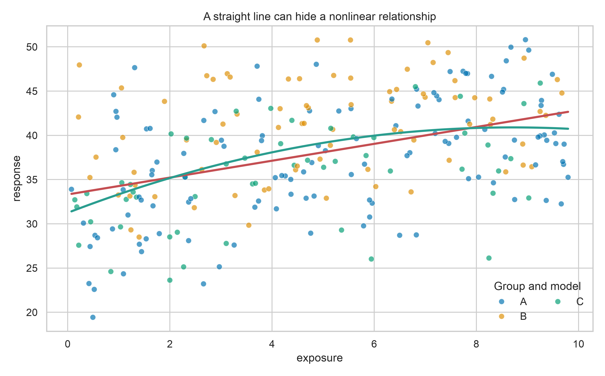
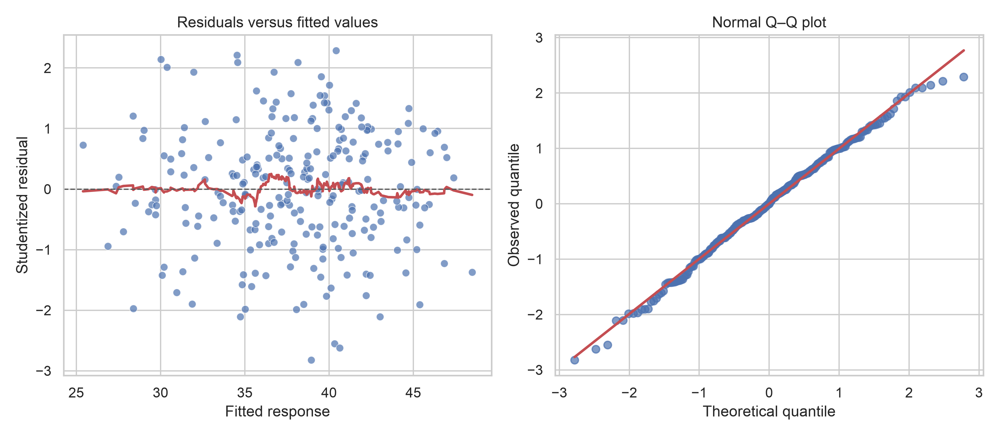
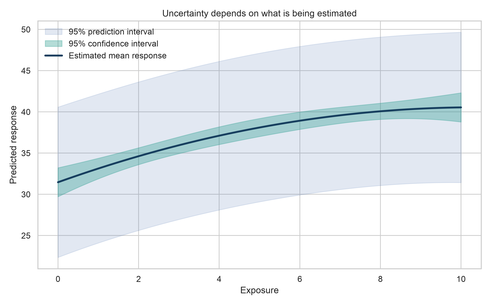

# Regression Modelling {#lesson07}

:::cdi-message
- **ID:** ADS-L07
- **Type:** Statistical modelling
- **Audience:** Intermediate
- **Theme:** Regression connects relationships, assumptions, and interpretable estimates
:::

Regression is not only a prediction technique. It is a framework for describing how an outcome changes with one or more predictors, quantifying uncertainty, checking assumptions, and separating association from claims that the data cannot support.

By the end of this chapter, you will be able to:

- distinguish explanatory and predictive regression goals;
- fit and interpret simple and multiple linear regression models;
- encode categorical predictors and account for nonlinear relationships;
- evaluate performance on data that were not used to fit the model;
- diagnose residual patterns, influential observations, and multicollinearity;
- communicate coefficients, predictions, and uncertainty without implying causation; and
- use regularization when a more stable predictive model is needed.

## 7.1 Regression begins with the question

Suppose an analyst wants to model a continuous outcome, `response`, using variables describing exposure, age, group membership, and a second continuous measurement.

Two goals that use similar code may require different decisions:

| Goal | Main question | Primary emphasis |
|---|---|---|
| Explanation | How is the outcome associated with a predictor after accounting for specified variables? | Coefficients, uncertainty, assumptions, subject-matter justification |
| Prediction | How accurately can the outcome be estimated for new observations? | Generalization error, validation, calibration, robustness |

Define the outcome, predictors, population, unit of observation, and intended use before fitting a model. Predictor selection should follow the question and available domain knowledge—not only automated significance testing.

::: {.callout-warning}
Regression estimates conditional associations. A coefficient is not automatically a causal effect. Causal interpretation requires an appropriate design, defensible assumptions, and explicit handling of confounding and selection mechanisms.
:::

## 7.2 Prepare a reproducible modelling dataset

The examples use a synthetic dataset so that the workflow is fully reproducible. In a real project, replace the simulation with a documented data-loading and cleaning step.

```python
import numpy as np
import pandas as pd

rng = np.random.default_rng(42)
n = 320

data = pd.DataFrame({
    "exposure": rng.uniform(0, 10, n),
    "age": rng.normal(45, 12, n).clip(18, 80),
    "group": rng.choice(["A", "B", "C"], n, p=[0.45, 0.35, 0.20]),
})

data["biomarker"] = 0.55 * data["age"] + rng.normal(0, 6, n)
group_effect = data["group"].map({"A": 0.0, "B": 4.0, "C": -3.0})

data["response"] = (
    18
    + 2.4 * data["exposure"]
    - 0.14 * data["exposure"] ** 2
    + 0.28 * data["age"]
    + group_effect
    + rng.normal(0, 4.5, n)
)

data.head()
```

Inspect types, missingness, ranges, and duplicates before splitting the data.

```python
data.info()
data.isna().sum()
data.describe(include="all").T
data.duplicated().sum()
```

### Split before learning from the data

For prediction, reserve test observations before estimating preprocessing rules or model parameters.

```python
from sklearn.model_selection import train_test_split

train_data, test_data = train_test_split(
    data,
    test_size=0.20,
    random_state=42,
)
```

If observations are repeated within people, sites, households, or time periods, a random row split may leak information. Use a group-aware or time-aware split that matches how the model will encounter future data.

## 7.3 Start with a simple linear model

A simple linear regression can be written as

$$
Y_i = \beta_0 + \beta_1 X_i + \varepsilon_i,
$$

where $\beta_0$ is the intercept, $\beta_1$ is the expected change in $Y$ for a one-unit increase in $X$, and $\varepsilon_i$ represents unexplained variation.

```python
import statsmodels.formula.api as smf

simple_model = smf.ols(
    "response ~ exposure",
    data=train_data,
).fit()

print(simple_model.summary())
```

Interpret the slope in its units and within the observed predictor range. For example: “Within the training data, a one-unit increase in exposure was associated with an estimated average change of $\hat\beta_1$ units in response.”

The straight fitted line in @fig-07-regression-fit summarizes an average trend. The curved data-generating relationship also shows why a visually plausible linear fit can still be systematically incomplete.

{#fig-07-regression-fit fig-alt="Scatter plot of response against exposure with a straight linear fit and a curved quadratic fit."}

## 7.4 Build a multiple regression deliberately

Multiple linear regression estimates the association of each predictor with the outcome while holding the other included predictors constant:

$$
Y_i = \beta_0 + \beta_1 X_{1i} + \cdots + \beta_p X_{pi} + \varepsilon_i.
$$

Use formulas to express transformations and categorical predictors clearly.

```python
multiple_model = smf.ols(
    "response ~ exposure + I(exposure ** 2) + age + C(group)",
    data=train_data,
).fit()

print(multiple_model.summary())
```

Here:

- `I(exposure ** 2)` allows the exposure–response relationship to curve;
- `C(group)` creates indicator terms using one group as the reference; and
- the age coefficient is conditional on exposure, its squared term, and group.

When a squared term is present, the coefficient of `exposure` alone is not a constant slope. The marginal slope is

$$
\frac{\partial \widehat{Y}}{\partial X}
= \hat\beta_1 + 2\hat\beta_2 X,
$$

so the estimated change depends on the exposure level.

### Interactions answer conditional questions

An interaction allows the association of one predictor to differ across values of another.

```python
interaction_model = smf.ols(
    "response ~ exposure * C(group) + age",
    data=train_data,
).fit()
```

Include an interaction because the scientific or operational question calls for it. Retain the corresponding main effects so the model remains hierarchically interpretable.

## 7.5 Evaluate prediction on unseen observations

$R^2$ describes variance explained relative to an intercept-only model, but it does not measure error in the outcome's units. Report it with error metrics.

```python
from sklearn.metrics import mean_absolute_error, mean_squared_error, r2_score

test_predictions = multiple_model.predict(test_data)

mae = mean_absolute_error(test_data["response"], test_predictions)
rmse = mean_squared_error(
    test_data["response"],
    test_predictions,
) ** 0.5
r2 = r2_score(test_data["response"], test_predictions)

print({"MAE": mae, "RMSE": rmse, "R2": r2})
```

- **MAE** is the average absolute error and is usually easy to communicate.
- **RMSE** gives greater weight to large errors.
- **$R^2$** is unitless and should be interpreted relative to the use case and test population.

Compare against a simple baseline, such as predicting the training mean. A complex model that does not improve on a credible baseline has limited practical value.

## 7.6 Diagnose the fitted model

Diagnostics ask whether the fitted model is an adequate approximation for the intended purpose. They are not a ritual for declaring a model “valid.”

### Residual patterns

Residuals are observed outcomes minus fitted values. Examine them against fitted values for curvature and changing variance, and use a quantile–quantile plot to assess tail behaviour relevant to inference.

{#fig-07-regression-diagnostics fig-alt="Two diagnostic panels: residuals against fitted values and a normal quantile-quantile plot."}

In @fig-07-regression-diagnostics, look for:

- a curved residual pattern, suggesting missing nonlinear structure;
- a funnel shape, suggesting non-constant variance;
- extreme Q–Q departures, suggesting unusual tails or outliers; and
- isolated observations that deserve data-quality and influence checks.

### Influence and leverage

Cook's distance summarizes how much the fitted model changes when an observation is omitted.

```python
influence = multiple_model.get_influence()
influence_table = influence.summary_frame()

influence_table[
    ["hat_diag", "student_resid", "cooks_d"]
].sort_values("cooks_d", ascending=False).head()
```

Do not delete an influential observation merely because it is influential. Verify the record, understand why it is unusual, and report a sensitivity analysis when its inclusion materially changes the conclusion.

### Multicollinearity

Correlated predictors can make individual coefficients unstable even when overall prediction remains acceptable.

```python
from statsmodels.stats.outliers_influence import variance_inflation_factor

design = multiple_model.model.exog
vif = pd.DataFrame({
    "term": multiple_model.model.exog_names,
    "VIF": [
        variance_inflation_factor(design, index)
        for index in range(design.shape[1])
    ],
})

vif
```

Polynomial terms are often correlated by construction. Centering a continuous predictor before creating its square can improve numerical stability and make the intercept more meaningful.

## 7.7 Quantify uncertainty

A confidence interval describes uncertainty around an estimated mean relationship. A prediction interval additionally includes observation-level variability and is therefore wider.

```python
prediction_grid = pd.DataFrame({
    "exposure": np.linspace(0, 10, 100),
    "age": train_data["age"].mean(),
    "group": "A",
})

prediction_summary = multiple_model.get_prediction(
    prediction_grid
).summary_frame(alpha=0.05)
```

{#fig-07-regression-uncertainty fig-alt="Regression curve with a narrow confidence band and a wider prediction band."}

@fig-07-regression-uncertainty holds age at its training mean and group at `A`. State such reference values whenever presenting adjusted predictions.

## 7.8 Use pipelines and regularization for prediction

For predictive modelling, a scikit-learn pipeline keeps transformations inside cross-validation and prevents leakage. Ridge regression shrinks coefficients toward zero and can improve stability when predictors are numerous or correlated.

```python
from sklearn.compose import ColumnTransformer
from sklearn.impute import SimpleImputer
from sklearn.linear_model import Ridge
from sklearn.model_selection import GridSearchCV, KFold
from sklearn.pipeline import Pipeline
from sklearn.preprocessing import OneHotEncoder, PolynomialFeatures, StandardScaler

numeric_features = ["exposure", "age", "biomarker"]
categorical_features = ["group"]

numeric_pipeline = Pipeline([
    ("impute", SimpleImputer(strategy="median")),
    ("polynomial", PolynomialFeatures(degree=2, include_bias=False)),
    ("scale", StandardScaler()),
])

categorical_pipeline = Pipeline([
    ("impute", SimpleImputer(strategy="most_frequent")),
    ("encode", OneHotEncoder(handle_unknown="ignore")),
])

preprocessor = ColumnTransformer([
    ("numeric", numeric_pipeline, numeric_features),
    ("categorical", categorical_pipeline, categorical_features),
])

ridge_pipeline = Pipeline([
    ("prepare", preprocessor),
    ("model", Ridge()),
])

search = GridSearchCV(
    ridge_pipeline,
    param_grid={"model__alpha": np.logspace(-3, 3, 25)},
    scoring="neg_root_mean_squared_error",
    cv=KFold(n_splits=5, shuffle=True, random_state=42),
)

search.fit(train_data[numeric_features + categorical_features], train_data["response"])
ridge_predictions = search.predict(
    test_data[numeric_features + categorical_features]
)
```

The test set remains untouched while cross-validation selects `alpha`. Evaluate it once after model selection.

## 7.9 Generate the chapter figures

The figure script recreates the synthetic data, fits the documented models, and writes all three chapter figures.

From the project root, run either command:

```bash
python scripts/python/07-generate_regression_modelling_figures.py
```

or use the Bash helper:

```bash
bash scripts/bash/07-generate_regression_modelling_figures.sh
```

Both commands generate:

- `results/figures/07-regression-fit.png`;
- `results/figures/07-regression-diagnostics.png`; and
- `results/figures/07-regression-uncertainty.png`.

The complete implementation belongs in `scripts/python/`; the shorter examples in this chapter remain ordinary, non-executable fenced blocks for learners to read and copy.

## 7.10 Report regression results responsibly

A useful regression report should include:

1. the modelling goal, population, outcome, and unit of analysis;
2. predictor definitions and the rationale for transformations or interactions;
3. the split or validation strategy and safeguards against leakage;
4. coefficient estimates with confidence intervals for explanatory work;
5. test-set error with a baseline for predictive work;
6. diagnostic findings, influential observations, and sensitivity analyses;
7. the range over which predictions are supported; and
8. limitations, including why associations should not be interpreted causally.

Prefer an interpretable statement such as:

> Holding age and group constant, the estimated exposure–response relationship was nonlinear. Predictive performance was evaluated on a held-out test set, and uncertainty increased from the estimated mean response to individual-level predictions.

Avoid reporting only “the model was significant” or “$R^2$ was high.” Those statements do not tell readers whether errors are acceptable, assumptions are reasonable, or the result answers the original question.

## 7.11 Chapter checklist

Before accepting a regression analysis, confirm that you have:

- [ ] defined whether the goal is explanation, prediction, or both;
- [ ] chosen predictors using the question and domain knowledge;
- [ ] split or grouped observations in a way that prevents leakage;
- [ ] encoded categories and transformations explicitly;
- [ ] compared predictive performance with a baseline;
- [ ] inspected residuals, influence, and coefficient stability;
- [ ] distinguished confidence intervals from prediction intervals;
- [ ] avoided unsupported extrapolation and causal language; and
- [ ] saved code, figures, and model decisions reproducibly.

Regression is valuable because it makes assumptions and estimated relationships visible. The next modelling decision should follow from the data structure, the intended use, and the cost of being wrong—not from a preference for complexity.
