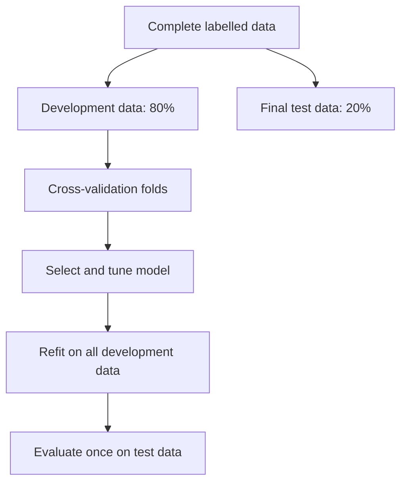
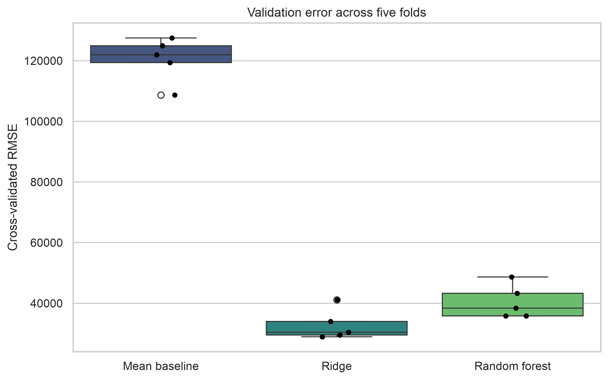
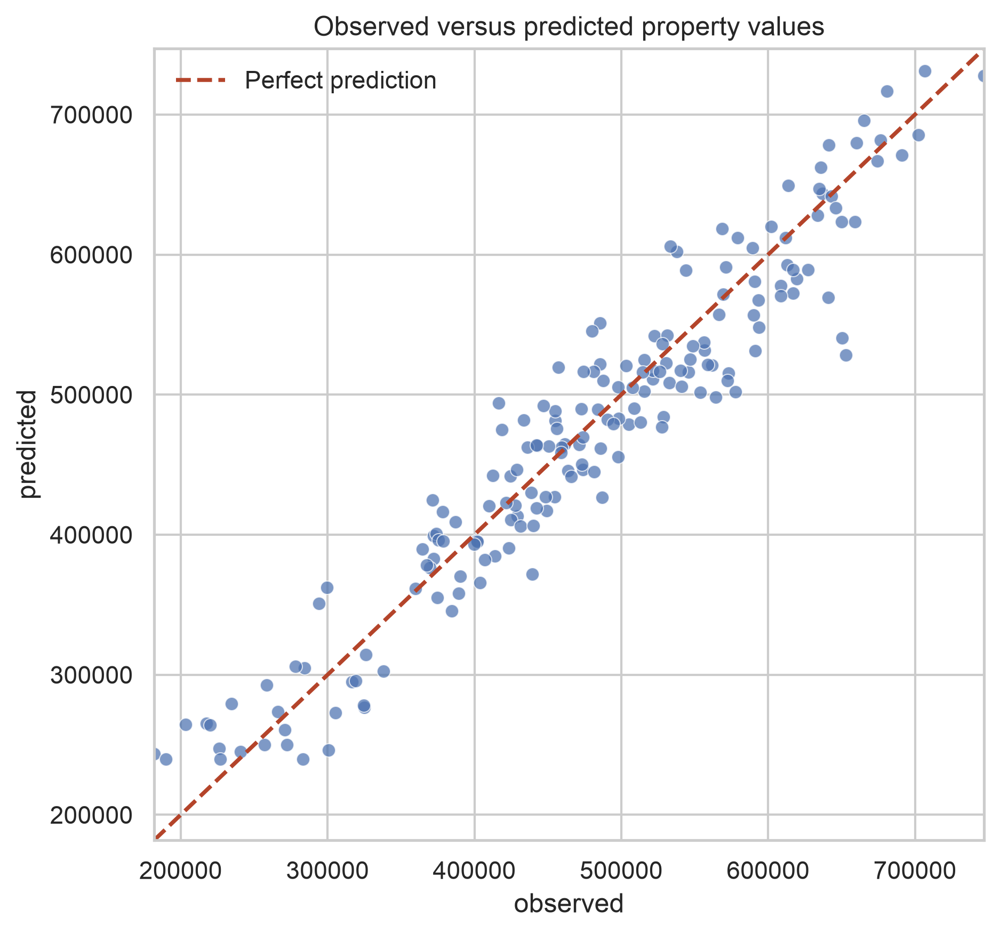
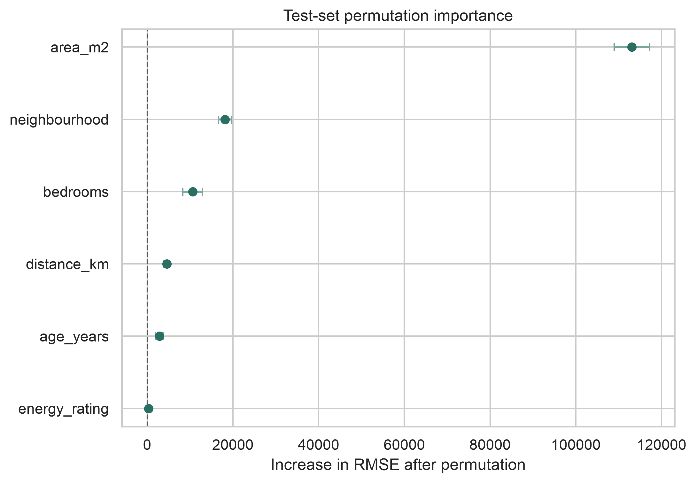

# Predictive Model Building {#lesson08}

:::cdi-message
- **ID:** ADS-L08
- **Type:** Predictive modelling
- **Audience:** Intermediate
- **Theme:** Reliable prediction begins with a clearly defined target and evaluation plan
:::

## Overview

Chapter 07 introduced regression modelling for explanation and inference. This chapter shifts the emphasis to **prediction**: estimating how well a fitted model will perform on observations it has not seen before.

A predictive workflow is more than calling `.fit()`. It requires a target that matches the practical question, a defensible data split, preprocessing learned from training data only, comparison with a simple baseline, model tuning without touching the test set, and evaluation with metrics that reflect the cost of error.

By the end of this chapter, you will be able to:

- translate a practical question into a supervised learning target;
- separate training, validation, and final test decisions;
- build leakage-safe preprocessing and modelling pipelines;
- compare a baseline, linear model, and nonlinear model;
- tune model hyperparameters with cross-validation;
- evaluate predictions with complementary regression metrics; and
- save a fitted pipeline and reproducible diagnostic figures.

## 8.1 Define the prediction task

Before selecting an algorithm, define four elements explicitly.

| Element | Guiding question | Chapter example |
|---|---|---|
| Unit of observation | What does one row represent? | One property |
| Features | What information is available when predicting? | Area, age, rooms, distance, neighbourhood |
| Target | What quantity must be predicted? | Property value |
| Use case | How will the prediction support a decision? | Preliminary valuation |

The timing of feature availability matters. A variable recorded after the outcome occurs may be strongly associated with the target but unusable at prediction time. Including it creates **target leakage** and produces an unrealistically optimistic evaluation.

:::callout-warning
## Prediction is not causation

A feature that improves predictive accuracy is not necessarily a cause of the outcome. Predictive importance describes usefulness to the fitted model under the observed data-generating conditions.
:::

## 8.2 Use a reproducible demonstration dataset

The accompanying script creates a small synthetic property dataset locally. It includes numeric and categorical predictors, modest missingness, nonlinear signal, and random noise. Because the data are simulated, the example can be reproduced without an internet connection.

Run the complete workflow from the project root with either Python or the Bash helper:

```bash
python scripts/python/08-build-predictive-model.py
```

```bash
bash scripts/bash/08-build-predictive-model.sh
```

Both commands produce the same model, tables, and figures.

## 8.3 Protect the final test set

The first modelling action is to reserve data that will not influence feature engineering, preprocessing, model selection, or tuning.

```python
from sklearn.model_selection import train_test_split

X_train, X_test, y_train, y_test = train_test_split(
    X,
    y,
    test_size=0.20,
    random_state=42,
)
```

The training portion supports model development. Cross-validation repeatedly divides it into internal training and validation folds. The test set is used once, after the modelling choices are fixed.



For time-ordered, spatial, grouped, or repeated-measures data, a random split may leak related information across partitions. Use a split strategy that reflects how future predictions will actually be made, such as `TimeSeriesSplit` or `GroupKFold`.

## 8.4 Keep preprocessing inside the pipeline

Numeric variables require median imputation and scaling for the regularized linear model. Categorical variables require most-frequent imputation and one-hot encoding. A `ColumnTransformer` applies these operations to the appropriate columns.

```python
from sklearn.compose import ColumnTransformer
from sklearn.impute import SimpleImputer
from sklearn.pipeline import Pipeline
from sklearn.preprocessing import OneHotEncoder, StandardScaler

numeric_pipeline = Pipeline(
    steps=[
        ("imputer", SimpleImputer(strategy="median")),
        ("scaler", StandardScaler()),
    ]
)

categorical_pipeline = Pipeline(
    steps=[
        ("imputer", SimpleImputer(strategy="most_frequent")),
        ("encoder", OneHotEncoder(handle_unknown="ignore")),
    ]
)

preprocessor = ColumnTransformer(
    transformers=[
        ("numeric", numeric_pipeline, numeric_features),
        ("categorical", categorical_pipeline, categorical_features),
    ]
)
```

Placing preprocessing inside the modelling pipeline ensures that imputation, scaling, and encoding are learned separately within each training fold. This is a central defence against data leakage.

## 8.5 Establish a baseline

A complex model is useful only if it improves on a credible simple alternative. For continuous outcomes, predicting the training-set mean provides a transparent baseline.

```python
from sklearn.dummy import DummyRegressor

baseline = Pipeline(
    steps=[
        ("preprocessor", preprocessor),
        ("model", DummyRegressor(strategy="mean")),
    ]
)
```

This chapter compares three candidates:

- a mean-prediction baseline;
- Ridge regression, which provides a regularized linear benchmark; and
- a random forest, which can learn nonlinearities and interactions.

## 8.6 Compare models with cross-validation

Repeated model assessment is more informative than relying on a single validation split. The script uses five-fold shuffled cross-validation with a fixed seed.

```python
from sklearn.model_selection import KFold, cross_validate

cv = KFold(n_splits=5, shuffle=True, random_state=42)

scores = cross_validate(
    estimator=model,
    X=X_train,
    y=y_train,
    cv=cv,
    scoring={
        "mae": "neg_mean_absolute_error",
        "rmse": "neg_root_mean_squared_error",
        "r2": "r2",
    },
    n_jobs=-1,
)
```

Scikit-learn represents error scorers as negative values because its model-selection interface assumes that larger scores are better. Multiply MAE and RMSE scores by `-1` before reporting them.

{#fig-08-model-comparison fig-alt="Boxplots comparing cross-validated root mean squared error for a baseline, Ridge regression, and random forest."}

## 8.7 Tune only the selected model

Hyperparameter search should answer a focused question. After comparing the candidate families, the script tunes the random forest over a small, interpretable grid.

```python
from sklearn.model_selection import GridSearchCV

parameter_grid = {
    "model__max_depth": [None, 8, 14],
    "model__min_samples_leaf": [1, 3, 6],
    "model__max_features": ["sqrt", 0.8],
}

search = GridSearchCV(
    estimator=random_forest_pipeline,
    param_grid=parameter_grid,
    scoring="neg_root_mean_squared_error",
    cv=cv,
    n_jobs=-1,
    refit=True,
)
search.fit(X_train, y_train)
```

A larger search space does not guarantee a better real-world model. It increases computation and the chance of adapting too closely to cross-validation noise. Search ranges should be motivated by model behaviour and practical constraints.

## 8.8 Evaluate once on the test set

After tuning, evaluate the refitted pipeline on the untouched test data.

```python
from sklearn.metrics import mean_absolute_error, mean_squared_error, r2_score

test_predictions = search.best_estimator_.predict(X_test)

test_mae = mean_absolute_error(y_test, test_predictions)
test_rmse = mean_squared_error(y_test, test_predictions) ** 0.5
test_r2 = r2_score(y_test, test_predictions)
```

| Metric | Interpretation | Limitation |
|---|---|---|
| MAE | Typical absolute prediction error in target units | Gives all absolute errors equal weight |
| RMSE | Error measure that penalizes large misses more strongly | Sensitive to unusually large errors |
| R² | Proportion of test-set variation captured relative to the test mean | Does not express error in target units |

Report at least one metric in the target's original units. Whether an error is acceptable depends on the decision context, not on a universal threshold.

{#fig-08-observed-predicted fig-alt="Scatter plot of observed versus predicted property values with a diagonal reference line."}

The observed-versus-predicted plot reveals calibration problems, compressed predictions, and unusually large misses that a single summary metric can conceal.

## 8.9 Inspect errors, not only averages

Residuals are calculated as observed minus predicted values. Positive residuals indicate underprediction; negative residuals indicate overprediction.

```python
residuals = y_test - test_predictions
```

Inspect errors across meaningful subgroups as well as across the full test set. Similar aggregate performance can hide systematically weaker predictions for a location, population, instrument, or time period.

The generated file `results/tables/08-test-predictions.csv` retains row-level observed values, predictions, and residuals for further investigation.

## 8.10 Interpret predictive contribution carefully

Permutation importance measures the reduction in test performance after one feature is randomly disrupted. It can be applied to the complete fitted pipeline and does not depend on a model-specific impurity calculation.

```python
from sklearn.inspection import permutation_importance

importance = permutation_importance(
    search.best_estimator_,
    X_test,
    y_test,
    scoring="neg_root_mean_squared_error",
    n_repeats=20,
    random_state=42,
    n_jobs=-1,
)
```

{#fig-08-permutation-importance fig-alt="Horizontal point and interval plot ranking property features by permutation importance."}

Correlated predictors can share information, causing the importance of each individual feature to appear smaller. Importance should therefore be treated as model- and dataset-dependent evidence, not as a causal ranking.

## 8.11 Save the complete fitted pipeline

Save preprocessing and the fitted estimator together so future data receive exactly the same transformations.

```python
from joblib import dump

dump(search.best_estimator_, "models/08-property-value-pipeline.joblib")
```

The script also records:

- `data/processed/08-property-modelling-data.csv`;
- `results/tables/08-cross-validation-results.csv`;
- `results/tables/08-test-metrics.csv`;
- `results/tables/08-test-predictions.csv`; and
- `results/tables/08-permutation-importance.csv`.

Model artifacts should be loaded only from trusted sources. A saved object also needs context: dependency versions, training-data definition, target definition, evaluation results, and the date it was produced.

## 8.12 Common modelling failures

| Failure | Why it is misleading | Better practice |
|---|---|---|
| Preprocessing before splitting | Test-set information influences training | Fit preprocessing inside a pipeline |
| Choosing a model from test results | The test set becomes part of model selection | Use cross-validation for selection |
| Reporting accuracy without a baseline | Improvement cannot be judged | Compare with a simple task-appropriate model |
| Using only R² | Practical error magnitude remains unclear | Add MAE or RMSE in target units |
| Tuning many models and parameters | Selection can adapt to validation noise | Use a focused, documented search |
| Explaining importance causally | Predictive association is mistaken for intervention evidence | Use cautious model-specific language |

## 8.13 Reproducibility checklist

- [ ] The target and prediction time are defined.
- [ ] Every feature is available at prediction time.
- [ ] The split strategy matches the data structure and intended use.
- [ ] The final test set is untouched during model development.
- [ ] Preprocessing is contained within the pipeline.
- [ ] Candidate models are compared with the same folds and metrics.
- [ ] A simple baseline is included.
- [ ] Random seeds and dependency versions are recorded.
- [ ] Final metrics are reported in practical units.
- [ ] Errors and subgroup performance are inspected.
- [ ] The complete fitted pipeline is saved with supporting metadata.

## 8.14 Chapter summary

Predictive modelling is a controlled comparison of generalization performance. A defensible workflow protects unseen data, learns preprocessing only from training observations, compares models against a baseline, tunes within cross-validation, and evaluates the final pipeline once on a test set. Interpretation then focuses on the size, distribution, and practical consequences of prediction errors.

The next stage can extend this workflow to classification, probability calibration, threshold selection, or deployment and monitoring.

