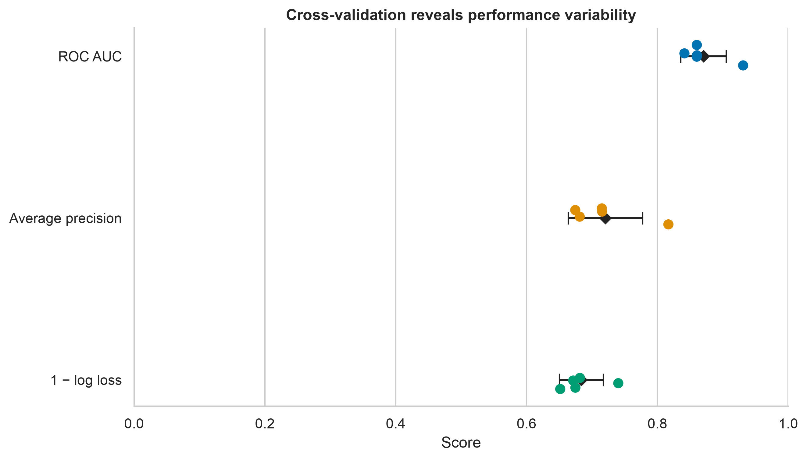
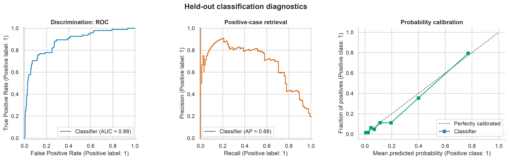
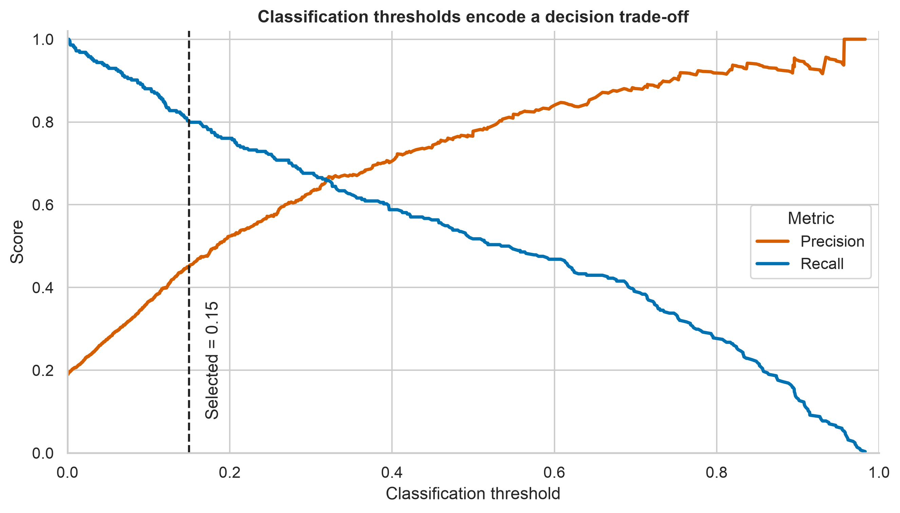

# Model Evaluation and Validation {#sec-lesson09}

:::cdi-message
- **ID:** ADS-L09
- **Type:** Model evaluation
- **Audience:** Intermediate
- **Theme:** Performance estimates must reflect how a model will be used
:::

## Learning objectives

By the end of this chapter, you should be able to:

- distinguish model evaluation from model validation;
- assign clear roles to training, validation, and test data;
- construct leakage-safe preprocessing and modelling pipelines;
- select metrics that match the prediction task and decision context;
- use cross-validation to estimate performance variability;
- tune a classification threshold without contaminating the test set;
- assess discrimination, calibration, subgroup performance, and uncertainty; and
- communicate model performance without overstating generalizability.

## Why evaluation is more than reporting a score

A model can fit the available data well and still fail on new cases. Model
evaluation asks how well a fitted model performs under a specified metric.
Model validation asks whether that estimate remains credible for the intended
population, time period, setting, and workflow.

The goal is therefore not to find the largest score. It is to obtain an honest
estimate of future performance and understand where that estimate may fail.

:::cdi-note
A performance estimate is meaningful only when the data split, preprocessing,
metric, threshold, and intended use are clearly defined.
:::

## A validation strategy starts with the deployment scenario

Before splitting data, identify what the model will encounter in practice.
Random splitting is appropriate only when future observations are plausibly
exchangeable with current observations.

| Intended use | Preferred validation design | Main risk addressed |
|---|---|---|
| New independent observations from the same population | Stratified random split or stratified cross-validation | Class imbalance and sampling variation |
| Future observations | Forward or rolling time split | Temporal leakage and changing data distributions |
| New patients, customers, sites, or devices | Group-aware split | The same entity appearing in training and validation data |
| A new hospital, region, laboratory, or organization | Leave-one-group/site-out validation | Poor transportability across settings |
| Final confirmation after model development | Untouched holdout or external dataset | Optimism caused by repeated model selection |

If observations are clustered, repeated, spatially related, or ordered in time,
the split must preserve that structure.

## Training, validation, and test data

The three partitions have different purposes:

- **Training data** estimate model parameters.
- **Validation data** guide model and hyperparameter choices.
- **Test data** provide one final estimate after all choices are fixed.

When the dataset is too small for a separate validation set, cross-validation
can be performed within the training data. The test set must remain untouched.

```python
from sklearn.model_selection import train_test_split

X_train, X_test, y_train, y_test = train_test_split(
    X,
    y,
    test_size=0.20,
    stratify=y,
    random_state=42,
)
```

`stratify=y` approximately preserves the class proportions. It does not solve
group dependence, temporal structure, or distribution shift.

## Prevent data leakage with pipelines

Data leakage occurs when information unavailable at prediction time influences
model development. Common examples include:

- scaling or imputing before the split;
- selecting features using the complete dataset;
- creating predictors from future information;
- allowing repeated records from one entity into different folds; and
- tuning hyperparameters or thresholds on the test set.

Preprocessing should be fitted separately inside every training fold. A
scikit-learn pipeline enforces this ordering.

```python
from sklearn.compose import ColumnTransformer
from sklearn.impute import SimpleImputer
from sklearn.linear_model import LogisticRegression
from sklearn.pipeline import Pipeline
from sklearn.preprocessing import OneHotEncoder, StandardScaler

numeric_pipeline = Pipeline(
    steps=[
        ("imputer", SimpleImputer(strategy="median")),
        ("scaler", StandardScaler()),
    ]
)

categorical_pipeline = Pipeline(
    steps=[
        ("imputer", SimpleImputer(strategy="most_frequent")),
        ("encoder", OneHotEncoder(handle_unknown="ignore")),
    ]
)

preprocessor = ColumnTransformer(
    transformers=[
        ("numeric", numeric_pipeline, numeric_features),
        ("categorical", categorical_pipeline, categorical_features),
    ]
)

model = Pipeline(
    steps=[
        ("preprocess", preprocessor),
        ("classifier", LogisticRegression(max_iter=2_000)),
    ]
)
```

## Cross-validation estimates variability

In *k*-fold cross-validation, the training data are divided into *k* folds. The
model trains on *k* - 1 folds and is evaluated on the remaining fold, repeating
until every fold has served as validation data.

```python
from sklearn.model_selection import StratifiedKFold, cross_validate

cv = StratifiedKFold(n_splits=5, shuffle=True, random_state=42)

scores = cross_validate(
    model,
    X_train,
    y_train,
    cv=cv,
    scoring={
        "roc_auc": "roc_auc",
        "average_precision": "average_precision",
        "neg_log_loss": "neg_log_loss",
    },
    n_jobs=-1,
)
```

Report the fold-level distribution or a summary such as the mean and standard
deviation. A mean alone hides instability.

```python
import pandas as pd

cv_results = pd.DataFrame(scores)
summary = cv_results.filter(like="test_").agg(["mean", "std"]).T
print(summary)
```

When both hyperparameter tuning and an unbiased internal performance estimate
are required, use **nested cross-validation**: an inner loop selects settings,
and an outer loop estimates performance. For grouped or temporal data, replace
the generic splitter with an appropriate group-aware or time-aware strategy.

## Choose metrics from the consequence of error

### Classification metrics

Let true positives be TP, false positives FP, true negatives TN, and false
negatives FN.

| Metric | Question answered | Important caution |
|---|---|---|
| Accuracy | What proportion of predictions is correct? | Can be misleading with class imbalance |
| Precision | Of predicted positives, how many are positive? | Changes with prevalence and threshold |
| Recall (sensitivity) | Of actual positives, how many are detected? | Does not account for false positives |
| Specificity | Of actual negatives, how many are correctly rejected? | Does not account for false negatives |
| F1 score | How well are precision and recall balanced? | Ignores true negatives |
| ROC AUC | How well are positives ranked above negatives? | May appear optimistic for rare outcomes |
| Average precision / PR AUC | How strong is positive-case retrieval? | Baseline depends on prevalence |
| Log loss | Are predicted probabilities accurate and appropriately confident? | Penalizes confident wrong predictions |
| Brier score | How close are probabilities to binary outcomes? | Mixes calibration and discrimination |

For rare positive outcomes, report precision–recall performance alongside ROC
AUC. When probabilities inform decisions, evaluate calibration in addition to
discrimination.

```python
from sklearn.metrics import (
    average_precision_score,
    brier_score_loss,
    classification_report,
    log_loss,
    roc_auc_score,
)

test_probability = model.predict_proba(X_test)[:, 1]
test_prediction = (test_probability >= 0.50).astype(int)

print(classification_report(y_test, test_prediction))
print("ROC AUC:", roc_auc_score(y_test, test_probability))
print("Average precision:", average_precision_score(y_test, test_probability))
print("Log loss:", log_loss(y_test, test_probability))
print("Brier score:", brier_score_loss(y_test, test_probability))
```

### Regression metrics

| Metric | Interpretation | Important caution |
|---|---|---|
| MAE | Mean absolute error in outcome units | Treats errors linearly |
| RMSE | Square-root mean squared error | Gives greater weight to large errors |
| Median absolute error | Typical robust absolute error | Can hide large tail errors |
| $R^2$ | Improvement over predicting the mean | Does not measure calibration or practical usefulness |
| MAPE | Mean percentage error | Unstable when observed values are zero or near zero |

Always compare the model with a meaningful baseline, such as predicting the
training-set mean, median, prevalence, or current operational rule.

```python
from sklearn.dummy import DummyRegressor
from sklearn.metrics import mean_absolute_error, root_mean_squared_error

baseline = DummyRegressor(strategy="median")
baseline.fit(X_train, y_train)

baseline_prediction = baseline.predict(X_test)
model_prediction = model.predict(X_test)

print("Baseline MAE:", mean_absolute_error(y_test, baseline_prediction))
print("Model MAE:", mean_absolute_error(y_test, model_prediction))
print("Model RMSE:", root_mean_squared_error(y_test, model_prediction))
```

## Thresholds are decision choices

A probability model and a classification decision are not the same object. The
default threshold of 0.50 is rarely justified automatically. Select a threshold
using validation predictions and an explicit objective, then freeze it before
the final test evaluation.

```python
import numpy as np
from sklearn.metrics import precision_recall_curve
from sklearn.model_selection import cross_val_predict

validation_probability = cross_val_predict(
    model,
    X_train,
    y_train,
    cv=cv,
    method="predict_proba",
    n_jobs=-1,
)[:, 1]

precision, recall, thresholds = precision_recall_curve(
    y_train,
    validation_probability,
)

eligible = np.where(recall[:-1] >= 0.80)[0]
selected_threshold = thresholds[eligible[np.argmax(precision[:-1][eligible])]]
```

This example selects the threshold with the highest precision among candidates
that achieve at least 80% recall. A real objective should reflect the costs,
benefits, capacity constraints, and ethical implications of decisions.

## Discrimination and calibration answer different questions

**Discrimination** measures whether the model ranks higher-risk cases above
lower-risk cases. **Calibration** measures whether predicted probabilities
agree with observed frequencies. A model can discriminate well and still
produce unreliable probabilities.

```python
from sklearn.calibration import CalibrationDisplay
from sklearn.metrics import PrecisionRecallDisplay, RocCurveDisplay
import matplotlib.pyplot as plt

fig, axes = plt.subplots(1, 3, figsize=(15, 4.5))

RocCurveDisplay.from_predictions(y_test, test_probability, ax=axes[0])
PrecisionRecallDisplay.from_predictions(y_test, test_probability, ax=axes[1])
CalibrationDisplay.from_predictions(
    y_test,
    test_probability,
    n_bins=8,
    strategy="quantile",
    ax=axes[2],
)

plt.tight_layout()
plt.show()
```

The project script generates a publication-ready evaluation summary:

```bash
python scripts/python/09-generate-model-evaluation-figures.py
```

Or run the equivalent Bash wrapper:

```bash
bash scripts/bash/09-generate-model-evaluation-figures.sh
```

{fig-alt="Dot and interval plot comparing ROC AUC, average precision, and one minus log loss across cross-validation folds."}

{fig-alt="Three panels showing an ROC curve, precision-recall curve, and calibration curve for a classifier evaluated on held-out data."}

{fig-alt="Line plot showing how precision increases and recall decreases as the classification threshold changes, with the selected threshold marked."}

## Quantify uncertainty

Test-set metrics are estimates, not constants. Confidence intervals can be
obtained with bootstrap resampling when the sampling structure is respected.

```python
import numpy as np
from sklearn.metrics import roc_auc_score

rng = np.random.default_rng(42)
bootstrap_auc = []

for _ in range(2_000):
    index = rng.integers(0, len(y_test), len(y_test))
    sampled_y = np.asarray(y_test)[index]
    sampled_probability = test_probability[index]

    if np.unique(sampled_y).size == 2:
        bootstrap_auc.append(roc_auc_score(sampled_y, sampled_probability))

lower, upper = np.quantile(bootstrap_auc, [0.025, 0.975])
print(f"ROC AUC 95% bootstrap interval: {lower:.3f} to {upper:.3f}")
```

For clustered data, resample clusters rather than individual rows. When
comparing models, apply both models to the same resampled observations so the
comparison remains paired.

## Examine subgroup performance and robustness

An acceptable overall score can conceal poor performance for an important
subgroup. Where sample size and governance permit, examine metrics by relevant
groups such as site, region, age band, device, or acquisition period.

```python
evaluation = X_test[["site"]].copy()
evaluation["outcome"] = np.asarray(y_test)
evaluation["probability"] = test_probability

subgroup_auc = (
    evaluation.groupby("site", observed=True)
    .apply(
        lambda data: roc_auc_score(data["outcome"], data["probability"])
        if data["outcome"].nunique() == 2
        else np.nan,
        include_groups=False,
    )
    .rename("roc_auc")
)
```

Subgroup results require uncertainty intervals and sample counts. They should
be interpreted in context rather than reduced to a single fairness claim.
Robustness checks may also include missingness patterns, shifted prevalence,
measurement changes, and performance over time.

## A reproducible evaluation workflow

Use the following sequence to protect the final estimate:

1. Define the prediction target, unit of observation, intended use, and error costs.
2. Choose a split that represents the deployment scenario.
3. Reserve the test set before exploratory model comparison.
4. Place all learned preprocessing and feature selection inside a pipeline.
5. Establish a simple baseline.
6. Tune models and thresholds using training data and validation procedures only.
7. Inspect fold variability, discrimination, calibration, and relevant subgroups.
8. Freeze the complete workflow, metric set, and threshold.
9. Evaluate once on the test set and report uncertainty.
10. Plan external or prospective validation and post-deployment monitoring.

## What to report

A transparent model evaluation report should include:

- dataset source, eligibility criteria, sample size, and outcome prevalence;
- unit of splitting and any grouping or temporal constraints;
- preprocessing, feature selection, model, and hyperparameter search space;
- validation design, number of folds or repeats, and random seed;
- baseline and primary metric selected before final evaluation;
- secondary metrics, threshold rule, calibration, and subgroup analyses;
- point estimates with uncertainty intervals;
- missing-data handling and leakage controls;
- intended population and known limitations; and
- conditions requiring recalibration, retraining, or model retirement.

## Common mistakes

| Mistake | Why it is misleading | Better practice |
|---|---|---|
| Reporting training performance | Measures fit to seen data | Use validation and held-out test data |
| Preprocessing the complete dataset | Leaks validation information | Fit preprocessing inside each training fold |
| Optimizing many models on one test set | Turns the test set into validation data | Keep one untouched final test set |
| Reporting only accuracy | Conceals error types and imbalance | Report task-relevant threshold and probability metrics |
| Selecting 0.50 automatically | Ignores decision costs | Tune the threshold on validation predictions |
| Reporting only mean CV performance | Hides instability | Show fold scores or uncertainty |
| Treating internal validation as universal proof | Ignores distribution shift | Validate across time, sites, or external data |

## Chapter summary

Reliable evaluation is a design problem, not a final calculation. The split
must represent intended use, preprocessing must remain inside the validation
loop, metrics must reflect the consequences of error, and the test set must be
protected from model selection. Strong validation combines discrimination,
calibration, uncertainty, subgroup assessment, and transparent reporting.

:::cdi-next
The next chapter can build on this evaluation framework by moving from internal
performance estimates to model interpretation, deployment readiness, or
monitoring—depending on the guide sequence.
:::
