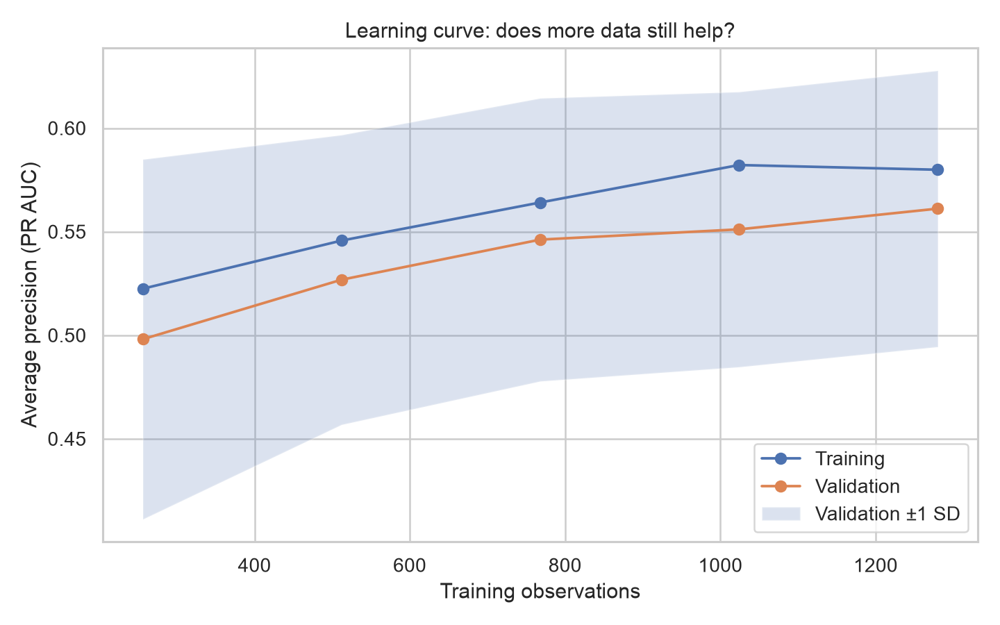
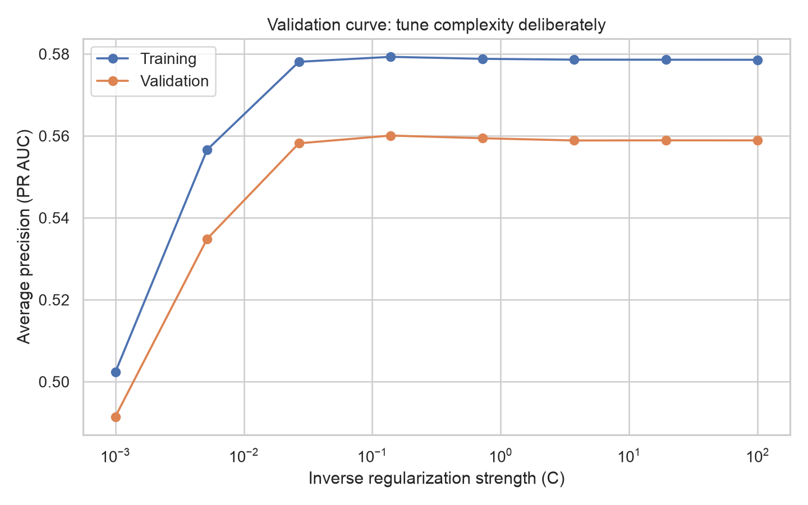
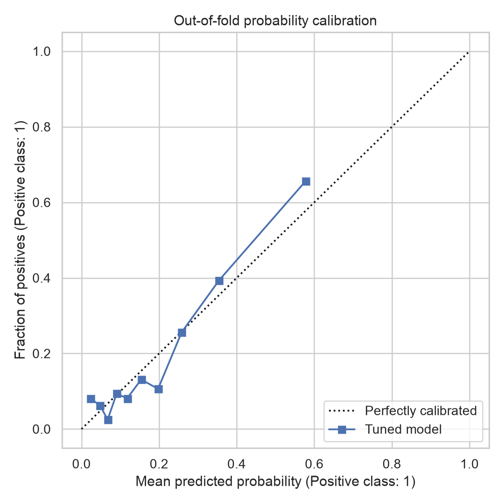

# Model Improvement {#sec-lesson10}

:::cdi-message
- **ID:** ADS-L10
- **Type:** Model improvement
- **Audience:** Intermediate
- **Theme:** Better models result from disciplined iteration, not complexity alone
:::

## Learning objectives

By the end of this chapter, you should be able to:

- diagnose whether a model is limited by bias, variance, data quality, or the decision threshold;
- improve a complete preprocessing-and-model pipeline without introducing data leakage;
- tune a focused set of hyperparameters with cross-validation;
- use learning curves, validation curves, calibration, and subgroup errors to guide the next experiment;
- compare a candidate model with its baseline using out-of-fold evidence; and
- stop iterating when added complexity no longer produces a meaningful improvement.

## Improvement is a controlled experiment

Model improvement is not the search for the most complicated algorithm. It is a sequence of controlled experiments in which one justified change is evaluated against a stable baseline.

The evaluation design from @sec-lesson09 should remain fixed while candidates are developed. In particular, keep the test set untouched until the final model has been selected. Repeatedly checking the test score turns the test set into part of the tuning process and makes its estimate optimistic.

```{mermaid}
flowchart TD
    A[Freeze baseline and metric] --> B[Diagnose the main limitation]
    B --> C[Change one component]
    C --> D[Evaluate with cross-validation]
    D --> E{Meaningful and stable gain?}
    E -- Yes --> F[Record as new candidate]
    E -- No --> G[Reject or revise]
    F --> H{Stopping rule met?}
    G --> H
    H -- No --> B
    H -- Yes --> I[Evaluate once on test data]
```

:::callout-important
## Protect the test set

Use training folds for preprocessing, feature selection, hyperparameter tuning, threshold selection, and model comparison. Use the test set once, after the improvement decisions are complete.
:::

## Start from a reproducible baseline

A useful baseline is more than a score. It records the dataset version, split strategy, preprocessing, estimator, hyperparameters, random seed, metric, and uncertainty across validation folds.

For imbalanced classification, a dummy classifier provides a minimum reference, while a regularized logistic regression provides an interpretable modelling baseline.

```python
from sklearn.dummy import DummyClassifier
from sklearn.linear_model import LogisticRegression
from sklearn.model_selection import StratifiedKFold, cross_validate

cv = StratifiedKFold(n_splits=5, shuffle=True, random_state=42)

baseline = LogisticRegression(
    max_iter=2_000,
    class_weight="balanced",
    random_state=42,
)

scores = cross_validate(
    baseline,
    X_train,
    y_train,
    cv=cv,
    scoring={"roc_auc": "roc_auc", "pr_auc": "average_precision"},
    return_train_score=True,
)
```

The mean validation score describes average performance, while the fold-to-fold standard deviation describes stability. A small mean gain accompanied by much greater variability may not be a practical improvement.

## Diagnose before changing the model

Different limitations require different interventions.

| Diagnostic pattern | Likely limitation | Useful next experiment |
|---|---|---|
| Training and validation scores are both weak | High bias or weak signal | Improve features, reduce regularization, or try a more expressive model |
| Training score is strong but validation score is much lower | High variance | Add data, simplify the model, strengthen regularization, or reduce unstable features |
| Validation performance keeps improving with more observations | Data limitation | Collect or label more representative data |
| Ranking metric is acceptable but decisions are poor | Threshold mismatch | Tune the operating threshold using decision costs |
| Probabilities are systematically too high or too low | Poor calibration | Calibrate probabilities on held-out folds |
| Errors concentrate in a subgroup | Representation or measurement problem | Audit sampling, labels, features, and subgroup-specific performance |
| Cross-validation is strong but deployment performance is weak | Distribution shift or leakage | Revisit splitting, data lineage, and production drift |

### Learning curves

A learning curve compares training and validation performance as the training sample grows.

```python
from sklearn.model_selection import learning_curve

sizes, train_scores, valid_scores = learning_curve(
    estimator=pipeline,
    X=X_train,
    y=y_train,
    cv=cv,
    scoring="average_precision",
    train_sizes=[0.2, 0.4, 0.6, 0.8, 1.0],
    n_jobs=-1,
)
```

Interpret the curves together:

- a persistent large gap suggests variance;
- two low, converged curves suggest bias; and
- an improving validation curve suggests that additional data may help.

These are diagnostic patterns, not proofs. Data quality, class imbalance, grouped observations, and temporal drift can produce similar shapes.

## Improve the full pipeline

Preprocessing must be fitted inside each training fold. A `Pipeline` keeps imputation, scaling, feature transformations, and the estimator inside the cross-validation process.

```python
from sklearn.compose import ColumnTransformer
from sklearn.impute import SimpleImputer
from sklearn.pipeline import Pipeline
from sklearn.preprocessing import OneHotEncoder, StandardScaler

numeric_pipeline = Pipeline(
    steps=[
        ("imputer", SimpleImputer(strategy="median")),
        ("scaler", StandardScaler()),
    ]
)

categorical_pipeline = Pipeline(
    steps=[
        ("imputer", SimpleImputer(strategy="most_frequent")),
        ("encoder", OneHotEncoder(handle_unknown="ignore")),
    ]
)

preprocessor = ColumnTransformer(
    transformers=[
        ("numeric", numeric_pipeline, numeric_features),
        ("categorical", categorical_pipeline, categorical_features),
    ]
)

pipeline = Pipeline(
    steps=[
        ("preprocess", preprocessor),
        ("model", LogisticRegression(max_iter=2_000, random_state=42)),
    ]
)
```

:::callout-warning
## A common leakage pattern

Do not impute, scale, select features, or resample the complete dataset before cross-validation. Information from validation observations would influence the fitted transformation.
:::

## Tune a focused search space

Hyperparameter tuning should encode plausible choices rather than generate a huge arbitrary grid. `RandomizedSearchCV` is efficient when several parameters are available; `GridSearchCV` is appropriate for a small, carefully chosen grid.

```python
from scipy.stats import loguniform
from sklearn.model_selection import RandomizedSearchCV

parameter_distributions = {
    "model__C": loguniform(1e-3, 1e2),
    "model__class_weight": [None, "balanced"],
}

search = RandomizedSearchCV(
    estimator=pipeline,
    param_distributions=parameter_distributions,
    n_iter=30,
    scoring="average_precision",
    cv=cv,
    n_jobs=-1,
    random_state=42,
    refit=True,
    return_train_score=True,
)

search.fit(X_train, y_train)
```

The search score is not an unbiased estimate of the selected model because the same folds influenced the choice. For high-stakes comparisons, use nested cross-validation: the inner loop tunes candidates and the outer loop estimates their generalization performance.

```python
from sklearn.model_selection import cross_validate

outer_cv = StratifiedKFold(n_splits=5, shuffle=True, random_state=2026)

nested_scores = cross_validate(
    search,
    X_train,
    y_train,
    cv=outer_cv,
    scoring={"roc_auc": "roc_auc", "pr_auc": "average_precision"},
    n_jobs=-1,
)
```

## Improve decisions, not only scores

The default probability threshold of 0.50 is rarely a universal decision rule. Select a threshold from out-of-fold predictions so that the decision reflects the relative consequences of false positives and false negatives.

```python
import numpy as np
from sklearn.metrics import precision_recall_curve
from sklearn.model_selection import cross_val_predict

oof_probability = cross_val_predict(
    search.best_estimator_,
    X_train,
    y_train,
    cv=cv,
    method="predict_proba",
    n_jobs=-1,
)[:, 1]

precision, recall, thresholds = precision_recall_curve(
    y_train,
    oof_probability,
)

f1 = 2 * precision[:-1] * recall[:-1] / (
    precision[:-1] + recall[:-1] + 1e-12
)
selected_threshold = thresholds[np.argmax(f1)]
```

Optimising F1 is only an illustration. In practice, define the rule from the application—for example, maximise recall while maintaining precision of at least 0.80, or minimise an explicit expected cost.

### Probability calibration

Calibration asks whether predictions near 0.70 are positive approximately 70% of the time. It matters when probabilities inform risk, triage, resource allocation, or expected value.

```python
from sklearn.calibration import CalibratedClassifierCV

calibrated_model = CalibratedClassifierCV(
    estimator=search.best_estimator_,
    method="sigmoid",
    cv=5,
)

calibrated_model.fit(X_train, y_train)
```

Calibration can improve probability reliability without improving rank-based metrics such as ROC AUC. Evaluate discrimination and calibration separately.

## Perform structured error analysis

Aggregate metrics can hide systematic failures. Create an out-of-fold error table and examine errors across relevant groups, ranges, time periods, missingness patterns, and confidence levels.

```python
import pandas as pd

error_table = pd.DataFrame(
    {
        "observed": y_train.reset_index(drop=True),
        "probability": oof_probability,
    }
)

error_table["predicted"] = (
    error_table["probability"] >= selected_threshold
).astype(int)
error_table["error"] = error_table["observed"] != error_table["predicted"]
```

Useful questions include:

- Are false negatives concentrated in a clinically or operationally important group?
- Do errors increase when particular variables are missing?
- Are high-confidence errors associated with label problems or unusual observations?
- Does performance deteriorate over time or across data sources?
- Would the proposed feature exist, in the same form, at prediction time?

Subgroup results should include sample size and uncertainty. Very small groups can produce extreme but unstable estimates.

## Compare candidates fairly

Candidate models should be evaluated on identical folds and the same primary metric. Paired fold results are more informative than comparing unrelated mean scores.

```python
comparison = pd.DataFrame(
    {
        "fold": range(1, cv.get_n_splits() + 1),
        "baseline_pr_auc": baseline_scores["test_pr_auc"],
        "candidate_pr_auc": candidate_scores["test_pr_auc"],
    }
)

comparison["difference"] = (
    comparison["candidate_pr_auc"] - comparison["baseline_pr_auc"]
)
```

A final choice should consider more than the largest mean score.

| Criterion | Question |
|---|---|
| Predictive value | Is the gain large enough to matter for the intended decision? |
| Stability | Is the gain consistent across folds, seeds, time periods, and important groups? |
| Calibration | Are predicted probabilities reliable enough for their intended use? |
| Complexity | Does the gain justify added dependencies, latency, maintenance, and explanation burden? |
| Reproducibility | Can the same result be rebuilt from recorded data, code, environment, and seed? |

## Use an explicit stopping rule

End improvement when one or more pre-specified conditions are met:

- the primary metric reaches the minimum useful target;
- recent experiments produce gains smaller than the minimum meaningful improvement;
- uncertainty is larger than the observed difference;
- performance is adequate across important subgroups;
- added complexity is not justified by operational value; or
- the remaining limitation requires new or better data rather than more tuning.

:::callout-tip
## Prefer the simplest adequate model

If two candidates perform similarly, prefer the one that is easier to validate, explain, maintain, monitor, and reproduce.
:::

## Reproducible chapter workflow

The companion script runs a complete demonstration using synthetic classification data. It writes model-comparison results, the selected threshold, and diagnostic figures without requiring the examples in this chapter to execute during rendering.

From the repository root, run:

```bash
python scripts/python/10-model-improvement.py
```

The equivalent Bash helper is:

```bash
bash scripts/bash/10-run-model-improvement.sh
```

Both commands produce the same outputs:

- `results/model-improvement/10-model-comparison.csv`;
- `results/model-improvement/10-threshold-summary.csv`;
- `results/figures/10-learning-curve.png`;
- `results/figures/10-validation-curve.png`; and
- `results/figures/10-calibration-curve.png`.

After running the script, the generated figures can be included in the rendered guide using the following Markdown image references:

```markdown





```

## Practical checklist

Before accepting an improved model, confirm that:

- the baseline, primary metric, and split strategy were defined first;
- preprocessing and feature selection occurred inside the pipeline;
- the test set did not influence tuning or threshold selection;
- the search space was justified and computationally proportionate;
- candidate and baseline results used identical validation folds;
- uncertainty and subgroup behaviour were examined;
- probability calibration was assessed when probabilities drive decisions;
- the chosen threshold reflects the real decision context;
- the final model and threshold were evaluated once on untouched test data; and
- the experiment configuration and outputs were saved.

## Key takeaways

- Diagnose the limitation before selecting an intervention.
- Improve the complete pipeline, not the estimator in isolation.
- Keep preprocessing, selection, and tuning inside cross-validation.
- Treat threshold selection and calibration as separate from model ranking.
- Use error analysis to identify failures hidden by aggregate metrics.
- Prefer stable, meaningful improvements over marginal complexity.
- Stop according to a rule, then perform one final evaluation on untouched test data.

## Next step

The next stage is to turn the selected model, threshold, preprocessing steps, and evaluation evidence into a reproducible model artifact that can be interpreted, monitored, and prepared for responsible use.
