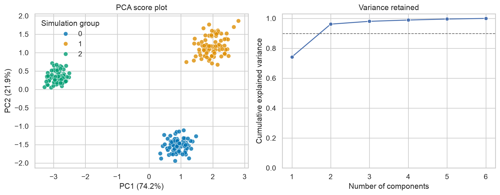
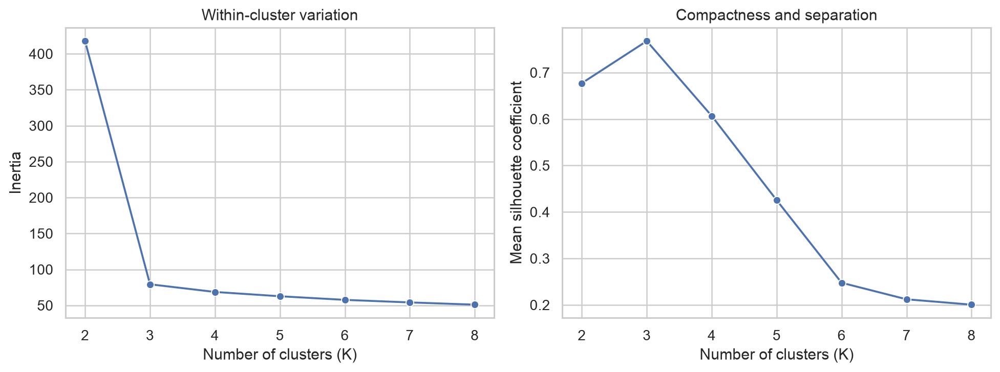
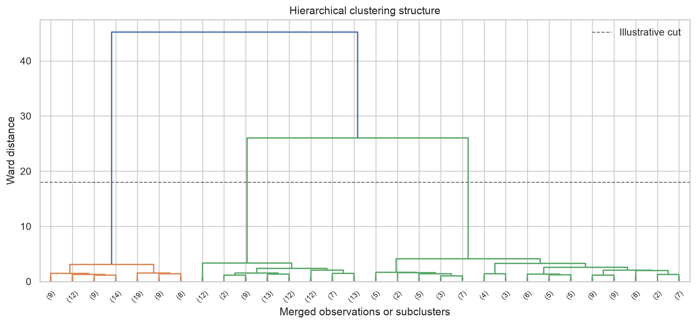
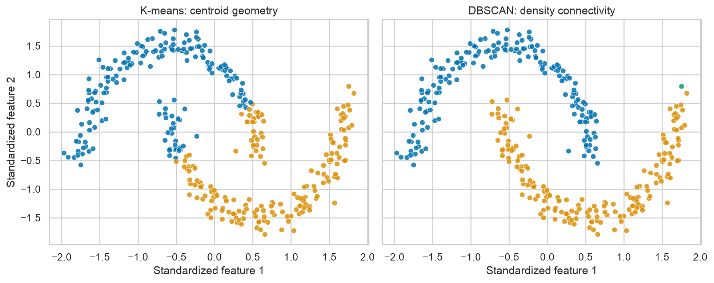

# Unsupervised Learning {#lesson11}

:::cdi-message
- **ID:** ADS-L11
- **Type:** Unsupervised learning
- **Audience:** Intermediate
- **Theme:** Unlabelled data can reveal structure without proving meaning
:::

## Learning objectives

By the end of this chapter, you will be able to:

- explain what unsupervised learning can—and cannot—establish;
- prepare numeric data for distance-based methods;
- use principal component analysis (PCA) to summarize multivariate variation;
- compare K-means, hierarchical clustering, and DBSCAN;
- evaluate cluster compactness, separation, and stability; and
- translate exploratory structure into testable follow-up questions.

## Why unsupervised learning matters

Supervised learning predicts a known outcome. Unsupervised learning starts without a target variable and searches for recurring structure in the predictors. Typical goals include:

- **dimension reduction:** representing many correlated variables with fewer components;
- **clustering:** grouping observations that are similar under a chosen definition of similarity;
- **anomaly detection:** identifying observations that do not resemble the dominant patterns; and
- **representation learning:** creating informative features for later modelling or visualization.

These methods are exploratory. A cluster is an algorithmic result determined by the variables, transformations, distance measure, and tuning choices. It is not automatically a biological subtype, customer segment, or causal mechanism.

:::cdi-note
**Core principle:** Treat discovered structure as evidence for investigation—not proof of meaning. Validate it with domain knowledge, external variables, sensitivity analysis, and, where possible, independent data.
:::

## A reproducible workflow

An effective unsupervised analysis separates data preparation, structure discovery, validation, and interpretation.

1. Define the scientific or operational question.
2. Select variables that represent the intended concept.
3. Inspect missingness, distributions, outliers, and redundancy.
4. Transform skewed variables when scientifically appropriate.
5. Scale features if their units or variances differ.
6. Fit more than one plausible method or parameter setting.
7. Evaluate separation, compactness, and stability.
8. Interpret the result using variables not used to create it.
9. Document sensitivity to preprocessing and modelling choices.

The order matters: distance-based algorithms will faithfully discover patterns created by measurement scale, duplicated variables, or batch effects.

## Preparing data for distance-based methods

Suppose `features` contains numeric measurements and `metadata` contains identifiers or variables reserved for interpretation.

```python
from sklearn.impute import SimpleImputer
from sklearn.pipeline import make_pipeline
from sklearn.preprocessing import StandardScaler

preprocessor = make_pipeline(
    SimpleImputer(strategy="median"),
    StandardScaler(),
)

X_scaled = preprocessor.fit_transform(features)
```

Standardization gives each feature mean 0 and standard deviation 1. This is often appropriate for Euclidean distance, PCA, and K-means, but it is not a universal default. For heavy-tailed data, `RobustScaler` may be preferable. For counts or compositional data, domain-specific transformations may be required before scaling.

Do not include identifiers, arbitrary numeric codes, future information, or a target-like variable merely because they are numeric.

## Principal component analysis

PCA constructs orthogonal linear combinations of the original variables. The first component captures the greatest possible variance, the second captures the greatest remaining variance, and so on.

For centred data matrix $X$, PCA can be expressed through the eigendecomposition of its covariance matrix:

$$
\Sigma = \frac{1}{n-1}X^\top X.
$$

The eigenvectors define component directions, and the eigenvalues quantify variance along those directions.

```python
import pandas as pd
from sklearn.decomposition import PCA

pca = PCA(n_components=0.90, random_state=42)
scores = pca.fit_transform(X_scaled)

score_table = pd.DataFrame(
    scores,
    columns=[f"PC{i}" for i in range(1, scores.shape[1] + 1)],
)

print(pca.explained_variance_ratio_)
```

Setting `n_components=0.90` retains the smallest number of components explaining at least 90% of the sample variance. That threshold is a modelling choice, not a guarantee that the retained components contain all domain-relevant information.

### Scores, loadings, and explained variance

- **Scores** locate observations in component space.
- **Loadings** describe how strongly original variables contribute to each component.
- **Explained variance ratios** describe how much sample variance each component captures.

A two-dimensional score plot is useful for exploration, but overlap in two components does not prove that groups overlap in the full feature space. Likewise, visible separation can reflect confounding, batch effects, or a dominant outlier.

{#fig-11-pca-overview fig-alt="Two-panel figure with PCA scores coloured by known simulation group and cumulative explained variance by component."}

## K-means clustering

K-means partitions observations into $K$ clusters by minimizing the within-cluster sum of squared Euclidean distances:

$$
\underset{C_1,\ldots,C_K}{\operatorname{minimize}}
\sum_{k=1}^{K}\sum_{x_i \in C_k}\lVert x_i-\mu_k\rVert_2^2,
$$

where $\mu_k$ is the centroid of cluster $k$.

```python
from sklearn.cluster import KMeans

kmeans = KMeans(
    n_clusters=3,
    init="k-means++",
    n_init=20,
    random_state=42,
)

cluster_labels = kmeans.fit_predict(X_scaled)
```

K-means works best when clusters are reasonably compact, approximately spherical in the selected feature space, and of broadly comparable spread. It can perform poorly with curved clusters, strong outliers, unequal densities, or an inappropriate value of $K$.

### Choosing the number of clusters

No diagnostic identifies the universally correct number of clusters. Use several kinds of evidence:

- **inertia:** decreases as $K$ increases; look for diminishing improvement rather than simply choosing the minimum;
- **silhouette coefficient:** compares cohesion within a cluster with separation from neighbouring clusters;
- **stability:** checks whether similar groups reappear under resampling or modest perturbation; and
- **interpretability:** asks whether the result is useful, coherent, and externally supported.

For observation $i$, the silhouette coefficient is

$$
s(i)=\frac{b(i)-a(i)}{\max\{a(i),b(i)\}},
$$

where $a(i)$ is its mean distance to its own cluster and $b(i)$ is its smallest mean distance to another cluster. Values near 1 indicate good separation, values near 0 indicate overlap, and negative values suggest possible misassignment.

{#fig-11-kmeans-diagnostics fig-alt="Two-panel line plot showing inertia decreasing and silhouette scores varying as the number of clusters increases."}

These diagnostics should be interpreted together. A high silhouette score can still describe a scientifically unhelpful partition, and an elbow can be ambiguous.

## Hierarchical clustering

Agglomerative hierarchical clustering begins with each observation as its own cluster and repeatedly merges the closest clusters. Its output can be represented by a dendrogram.

```python
from scipy.cluster.hierarchy import linkage

linkage_matrix = linkage(
    X_scaled,
    method="ward",
    metric="euclidean",
)
```

Ward linkage selects merges that produce the smallest increase in within-cluster variance and therefore requires Euclidean distance. Other linkage rules answer different questions:

| Linkage | Cluster distance | Typical behaviour |
|---|---|---|
| Single | Closest pair | Can recover irregular shapes but may chain observations |
| Complete | Farthest pair | Encourages compact, well-separated groups |
| Average | Average pairwise distance | Compromise between single and complete linkage |
| Ward | Increase in within-cluster variance | Often produces compact clusters |

The dendrogram is not proof of a natural hierarchy. Its appearance depends on scaling, distance, linkage, and leaf ordering.

{#fig-11-hierarchical-dendrogram fig-alt="Dendrogram showing successive merges among standardized observations, with a horizontal guide for a possible three-cluster cut."}

## Density-based clustering with DBSCAN

DBSCAN groups observations that occur in sufficiently dense neighbourhoods and labels isolated observations as noise. It does not require the number of clusters in advance and can recover non-spherical groups.

```python
from sklearn.cluster import DBSCAN

dbscan = DBSCAN(eps=0.35, min_samples=8)
labels = dbscan.fit_predict(X_scaled)

number_of_clusters = len(set(labels) - {-1})
number_of_noise_points = (labels == -1).sum()
```

Its main parameters are:

- `eps`: the neighbourhood radius; and
- `min_samples`: the number of nearby observations required for a dense region.

DBSCAN is sensitive to scale and to these parameters. A single global density threshold may be unsuitable when clusters have very different densities.

{#fig-11-method-comparison fig-alt="Side-by-side scatter plots comparing K-means partitions with DBSCAN clusters and noise points on crescent-shaped data."}

## Evaluating clusters responsibly

Evaluation is difficult because there may be no known correct labels. Combine complementary checks rather than relying on one score.

### Internal validation

Internal measures use the same features that formed the clusters.

```python
from sklearn.metrics import (
    calinski_harabasz_score,
    davies_bouldin_score,
    silhouette_score,
)

print("Silhouette:", silhouette_score(X_scaled, cluster_labels))
print("Calinski-Harabasz:", calinski_harabasz_score(X_scaled, cluster_labels))
print("Davies-Bouldin:", davies_bouldin_score(X_scaled, cluster_labels))
```

Higher silhouette and Calinski–Harabasz values usually indicate stronger separation; lower Davies–Bouldin values are preferred. These measures often favour particular cluster geometries and should not be compared across unrelated datasets as if they had universal thresholds.

### Stability analysis

A useful partition should not disappear after a small change in the sample or random initialization. Stability can be examined by:

1. repeatedly resampling observations;
2. refitting the complete preprocessing and clustering workflow;
3. assigning or matching cluster labels carefully; and
4. comparing partitions with a label-invariant measure such as the adjusted Rand index.

Stability is necessary evidence, but it is not sufficient: a stable batch effect is still a batch effect.

### External validation

After clusters are created, compare them with variables withheld from clustering—for example, later outcomes, experimental conditions, or expert annotations. This can establish association and practical relevance, but not causality.

Avoid selecting a clustering solution solely because it produces the most favourable association with a desired outcome. That turns exploratory evaluation into implicit outcome-driven optimization.

## Interpreting a fitted solution

Cluster numbers are arbitrary labels. Interpret clusters using standardized feature summaries and uncertainty-aware comparisons.

```python
profile_table = (
    features.assign(cluster=cluster_labels)
    .groupby("cluster")
    .median()
)

print(profile_table)
```

Report:

- the variables and transformations used;
- the distance measure and algorithm;
- all consequential parameter choices;
- cluster sizes, profiles, and noise counts;
- internal validation and stability results;
- sensitivity to preprocessing and alternative methods; and
- the evidence used to attach substantive meaning.

## Common pitfalls

| Pitfall | Why it matters | Better practice |
|---|---|---|
| Clustering unscaled measurements | Large-unit variables dominate distances | Transform and scale deliberately |
| Treating a PCA plot as the complete space | Two components may omit important variation | Report explained variance and inspect more components |
| Choosing $K$ from one diagnostic | A single score embeds geometric preferences | Combine diagnostics, stability, and domain usefulness |
| Interpreting labels as ordered categories | Cluster numbers have no intrinsic ranking | Use descriptive names only after validation |
| Ignoring batch or site effects | Technical structure can masquerade as discovery | Inspect metadata and conduct sensitivity analyses |
| Profiling clusters with the same means that created them | Apparent differences are partly guaranteed | Use held-out or external variables for stronger validation |
| Removing all outliers before analysis | Rare but meaningful cases may be lost | Investigate influence and report exclusion rules |

## Generate the chapter figures

From the repository root, run the Python script:

```bash
python scripts/python/11-generate-unsupervised-learning-figures.py
```

Or use the Bash wrapper:

```bash
bash scripts/bash/11-generate-unsupervised-learning-figures.sh
```

Both commands generate the same files in `results/figures/`. The figures use simulated data with known structure for teaching; the hidden simulation labels are used only to colour one explanatory PCA panel, not to fit the unsupervised models.

## Chapter summary

Unsupervised learning helps reveal multivariate structure when no target variable is available. PCA summarizes variation, while K-means, hierarchical clustering, and DBSCAN encode different definitions of a cluster. Their results depend on preprocessing, geometry, distance, and tuning choices. A credible analysis therefore combines diagnostics, stability checks, external evidence, domain reasoning, and transparent reporting.

## Knowledge check

1. Why can standardization substantially change a clustering result?
2. What information do PCA scores and loadings provide?
3. Why does the smallest K-means inertia not identify the best value of $K$?
4. When might DBSCAN be more appropriate than K-means?
5. Why does cluster stability not prove that clusters are scientifically meaningful?

## Practical exercise

Use a numeric dataset with at least five features.

1. Document variable selection, missing-data handling, transformation, and scaling.
2. Fit PCA and report the variance explained by the retained components.
3. Compare K-means solutions across several values of $K$.
4. Fit one alternative method, such as hierarchical clustering or DBSCAN.
5. Evaluate internal quality and at least one form of stability.
6. Profile the candidate groups and assess them using one variable excluded from clustering.
7. Write a short conclusion that distinguishes observed structure from substantive claims.
