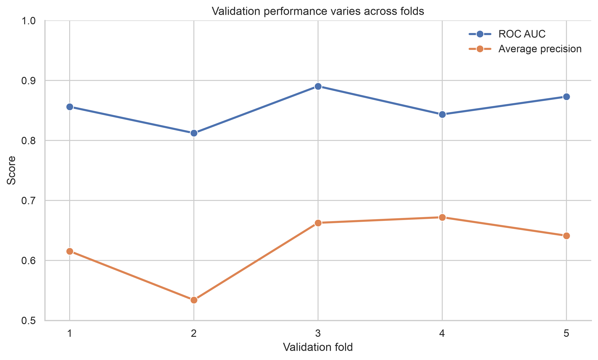
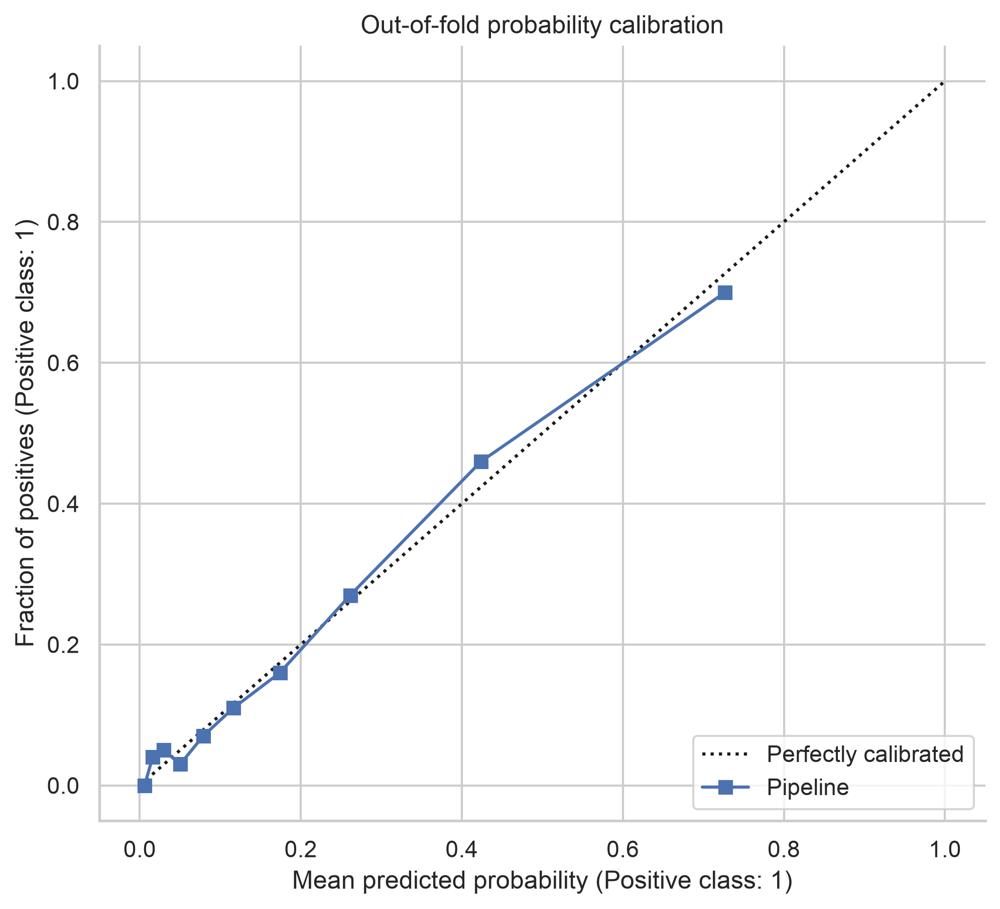

# Pipelines and Cross-Validation {#sec-lesson12}

:::cdi-message
- **ID:** ADS-L12
- **Type:** Reproducible modelling
- **Audience:** Intermediate
- **Theme:** Pipelines keep preprocessing and validation aligned
:::

Pipelines and cross-validation solve two closely related problems. A pipeline
keeps every learned transformation attached to the model, while
cross-validation estimates how that complete modelling procedure is likely to
perform on unseen data.

This distinction matters. Validation is not reliable when preprocessing is
learned from the full dataset before the folds are created. The validation
fold has then influenced the training process, even if its outcome was never
passed directly to the estimator.

By the end of this chapter, you should be able to:

- combine preprocessing and estimation in one scikit-learn pipeline;
- select a cross-validation strategy that matches the data-generating process;
- obtain out-of-fold predictions and fold-level performance estimates;
- tune a pipeline without leaking validation information; and
- distinguish routine cross-validation from nested model evaluation.

## From a fitted model to a modelling procedure

Chapter @sec-lesson09 established that evaluation design should be fixed before
candidate models are compared. Chapter @sec-lesson10 then developed model
improvements within that design. Here, the object being evaluated is the
**complete modelling procedure**:

1. learn preprocessing parameters from the training observations;
2. transform the training and validation observations separately;
3. fit the estimator on the transformed training observations; and
4. score predictions for the untouched validation observations.

Cross-validation repeats this procedure across several train-validation
splits. Each observation can therefore contribute to validation without being
used to fit the model that predicts it.

## Why preprocessing belongs inside the pipeline

Operations such as imputation, scaling, encoding, feature selection, and
dimensionality reduction learn information from data. If they are fitted
before cross-validation, their learned parameters contain information from
observations that later appear in validation folds.

```python
# Avoid: the scaler sees every observation before validation begins.
X_scaled = StandardScaler().fit_transform(X)
scores = cross_validate(model, X_scaled, y, cv=cv)
```

Place learned transformations inside a pipeline instead:

```python
from sklearn.impute import SimpleImputer
from sklearn.linear_model import LogisticRegression
from sklearn.pipeline import make_pipeline
from sklearn.preprocessing import StandardScaler

pipeline = make_pipeline(
    SimpleImputer(strategy="median"),
    StandardScaler(),
    LogisticRegression(max_iter=2_000),
)
```

During cross-validation, scikit-learn clones the pipeline for every fold. The
imputer and scaler are fitted only on that fold's training partition.

::: {.callout-important title="A pipeline prevents procedural leakage"}
A pipeline cannot repair a split that already violates the problem structure.
Repeated measurements from one person, future observations, or related samples
must still be separated using an appropriate validation strategy.
:::

## Mixed numerical and categorical predictors

Real datasets often require different transformations for different columns.
`ColumnTransformer` keeps those branches within the same fitted object.

```python
from sklearn.compose import ColumnTransformer
from sklearn.impute import SimpleImputer
from sklearn.pipeline import make_pipeline
from sklearn.preprocessing import OneHotEncoder, StandardScaler

numeric_pipeline = make_pipeline(
    SimpleImputer(strategy="median"),
    StandardScaler(),
)

categorical_pipeline = make_pipeline(
    SimpleImputer(strategy="most_frequent"),
    OneHotEncoder(handle_unknown="ignore"),
)

preprocessor = ColumnTransformer(
    transformers=[
        ("numeric", numeric_pipeline, numeric_columns),
        ("categorical", categorical_pipeline, categorical_columns),
    ]
)

pipeline = make_pipeline(
    preprocessor,
    LogisticRegression(max_iter=2_000),
)
```

The fitted pipeline is also the deployment unit. New observations receive the
same column selection, imputation, scaling, encoding, and prediction rules used
during validation.

## Choosing the cross-validation design

The best splitter is determined by how future data will arrive, not by a
default number of folds.

| Data structure | Suitable starting point | Main protection |
|---|---|---|
| Independent observations | `KFold` | General fold-to-fold variation |
| Imbalanced classification | `StratifiedKFold` | Approximate class proportions |
| Repeated subjects or related samples | `GroupKFold` or `StratifiedGroupKFold` | No group in both train and validation |
| Ordered or forecasting data | `TimeSeriesSplit` | Training observations precede validation |
| Small datasets needing repeated estimates | Repeated K-fold variants | Sensitivity to a single partition |

For classification with approximately independent observations, a shuffled,
stratified design is a defensible starting point:

```python
from sklearn.model_selection import StratifiedKFold

cv = StratifiedKFold(
    n_splits=5,
    shuffle=True,
    random_state=42,
)
```

Fixing `random_state` makes the partition reproducible. It does not make the
performance estimate certain; fold-to-fold variation should still be reported.

## Evaluating more than one metric

A single metric rarely describes all relevant behaviour. For an imbalanced
classification problem, ROC AUC and average precision can be evaluated
together, while fit and scoring times help reveal computational costs.

```python
from sklearn.model_selection import cross_validate

scores = cross_validate(
    pipeline,
    X,
    y,
    cv=cv,
    scoring={
        "roc_auc": "roc_auc",
        "average_precision": "average_precision",
    },
    return_train_score=True,
    n_jobs=-1,
)
```

Summarise the fold estimates with their centre and variability:

```python
import pandas as pd

fold_results = pd.DataFrame(scores)
summary = fold_results.agg(["mean", "std"]).T
print(summary.loc[["test_roc_auc", "test_average_precision"]])
```

The standard deviation across folds is a diagnostic of partition sensitivity,
not a universal confidence interval. When observations are grouped or ordered,
its interpretation depends on the selected splitting design.

## Out-of-fold predictions

`cross_val_predict` returns one prediction for each observation from a model
that did not train on that observation. These out-of-fold predictions are
useful for pooled diagnostic plots, error analysis, and threshold exploration.

```python
from sklearn.model_selection import cross_val_predict

out_of_fold_probability = cross_val_predict(
    pipeline,
    X,
    y,
    cv=cv,
    method="predict_proba",
    n_jobs=-1,
)[:, 1]
```

Out-of-fold predictions do not replace a final test set when one is required.
They are generated while the candidate procedure is still being assessed and
may influence later modelling decisions.

## Visualising fold stability

The Chapter 12 figure script compares validation performance across folds and
constructs a pooled out-of-fold calibration display.

```bash
python scripts/python/12-generate-pipeline-cv-figures.py
```

The output is written to `results/figures/`.

{#fig-12-fold-scores}

Figure @fig-12-fold-scores makes unstable folds visible instead of hiding them
behind a mean score. Large variation should prompt investigation of sample
size, class balance, grouping, and influential observations.

{#fig-12-oof-calibration}

Figure @fig-12-oof-calibration evaluates probability behaviour using predictions
made for held-out observations. A calibration curve created from in-sample
predictions would be optimistically biased.

## Hyperparameter tuning inside cross-validation

Search objects can tune parameters inside a pipeline. Parameter names use the
step name followed by two underscores.

```python
from sklearn.model_selection import GridSearchCV

parameter_grid = {
    "logisticregression__C": [0.01, 0.1, 1.0, 10.0],
    "logisticregression__class_weight": [None, "balanced"],
}

search = GridSearchCV(
    estimator=pipeline,
    param_grid=parameter_grid,
    scoring="average_precision",
    cv=cv,
    n_jobs=-1,
    refit=True,
)

search.fit(X_train, y_train)
best_pipeline = search.best_estimator_
```

If a separate test set was reserved before development, evaluate
`best_pipeline` on it once after the search and decision rules are complete.
Repeatedly checking the test set turns it into another validation set.

## Nested cross-validation

Using the same cross-validation results both to choose hyperparameters and to
report final performance can be optimistic. Nested cross-validation separates
these roles:

- the **inner loop** selects hyperparameters using only the outer training data;
- the **outer loop** evaluates the selected procedure on unseen outer-fold data.

```python
from sklearn.model_selection import cross_validate

outer_cv = StratifiedKFold(n_splits=5, shuffle=True, random_state=42)
inner_cv = StratifiedKFold(n_splits=4, shuffle=True, random_state=43)

search = GridSearchCV(
    pipeline,
    parameter_grid,
    scoring="average_precision",
    cv=inner_cv,
    n_jobs=-1,
)

nested_scores = cross_validate(
    search,
    X,
    y,
    scoring="average_precision",
    cv=outer_cv,
    n_jobs=-1,
)
```

Nested cross-validation is most useful when the dataset is too small for a
stable holdout set and an approximately unbiased estimate of the entire tuning
procedure is important. It is computationally expensive and does not remove
the need for an external validation dataset when transportability is the real
question.

## Common failure modes

### Preprocessing before splitting

Any transformation that learns from data must be fitted inside the relevant
training partition. This includes feature selection and target-aware encoding,
not only scaling and imputation.

### Ignoring groups

Random folds can put observations from the same patient, site, household, or
experimental unit on both sides of a split. The model may then exploit shared
information that will not be available for genuinely new groups.

### Randomly splitting time

Shuffling ordered observations allows the model to learn from the future.
Temporal validation should reproduce the intended prediction horizon and any
gap required by the application.

### Tuning outside the pipeline

Feature selection, resampling, and other tuned preprocessing choices belong
inside the search object. Otherwise, the validation folds influence which
features or transformations are retained.

### Reporting only the best fold or best search score

Report the prespecified metrics, their fold-level variation, the splitting
strategy, and the complete tuning space. A best score without its selection
process is not a reproducible performance claim.

## A reproducible workflow

1. Define the prediction target, unit of observation, and future use case.
2. Reserve a final test set when sample size and study design permit.
3. Choose folds that respect classes, groups, time, and dependence.
4. Place every learned preprocessing step inside the pipeline.
5. Define metrics and tuning rules before comparing candidates.
6. Generate fold-level scores and out-of-fold predictions.
7. Investigate variability and errors without contaminating the test set.
8. Refit the selected pipeline and preserve it as one reproducible object.

## Chapter summary

Pipelines ensure that preprocessing is learned within each training fold and
reapplied consistently to validation and future data. Cross-validation then
estimates the behaviour of that complete procedure across defensible data
splits. Together, they reduce leakage, expose instability, and make model
selection easier to reproduce.

The most important decision is not whether to use five or ten folds. It is
whether the validation design reproduces the independence, grouping, and time
structure of the problem the model will face after development.
