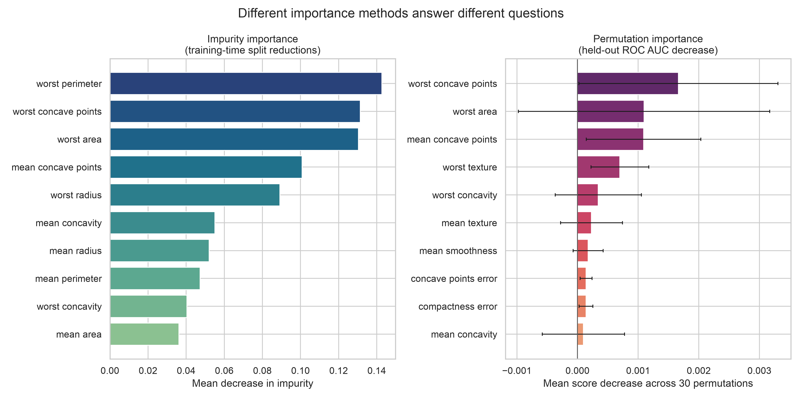
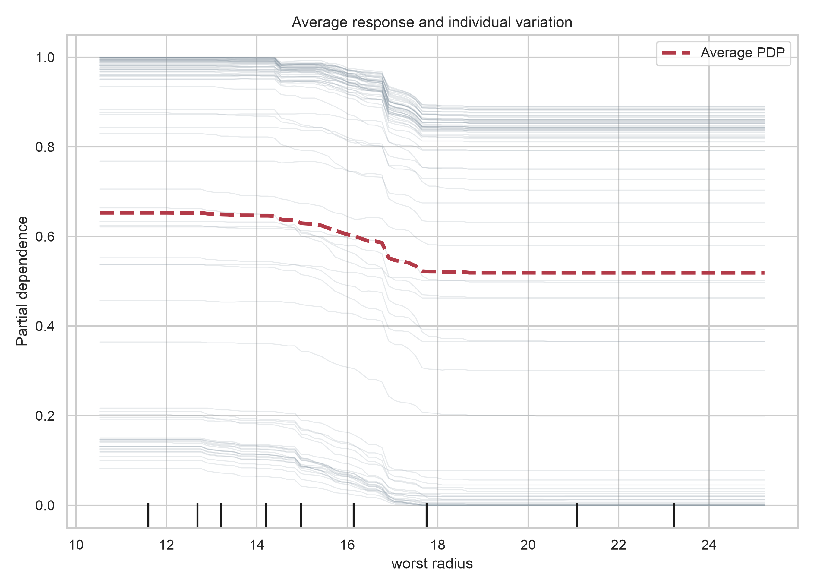

# Feature Importance and Interpretation {#sec-lesson13}

:::cdi-message
- **ID:** ADS-L13
- **Type:** Model interpretation
- **Audience:** Intermediate
- **Theme:** Model explanations are useful only within their assumptions and scope
:::

## Learning objectives

By the end of this chapter, you should be able to:

1. distinguish predictive importance from causal influence;
2. separate global explanations from local explanations;
3. interpret coefficients and tree-based importance with appropriate caution;
4. estimate held-out permutation importance without leaking validation information;
5. use partial dependence and individual conditional expectation plots to examine model behaviour; and
6. communicate model explanations together with their scope, uncertainty, and limitations.

## Why interpretation comes after evaluation

A model should be interpreted only after its evaluation design is credible. The data splits, preprocessing pipeline, comparison metric, and final candidate selection developed in @sec-lesson09 through @sec-lesson12 should remain fixed while explanations are produced.

Interpretability cannot rescue a model that performs poorly, leaks information, or fails under the conditions in which it will be used. It answers questions about the fitted model, not whether the entire analytical system is trustworthy.

Three questions should be kept separate:

- **Does the model predict well?** This is an evaluation question.
- **What information does the model use?** This is an interpretation question.
- **What would happen if the real-world feature changed?** This is usually a causal question and requires stronger assumptions or a causal design.

> A feature can be highly predictive without being a safe or effective intervention target.

## Define the explanation target

Before selecting an interpretation method, define what must be explained.

| Dimension | Examples |
|---|---|
| Model scope | one fitted model, one pipeline, or a family of refitted models |
| Observation scope | the full target population, a subgroup, or one case |
| Output | predicted probability, score, class, or regression value |
| Time | model-development period or future deployment period |
| Question | ranking features, describing response shape, or explaining one prediction |

An explanation for a single fitted model is conditional on its training data, preprocessing, hyperparameters, and feature representation. Changing any of these may change the explanation.

## Global and local interpretation

**Global interpretation** summarizes behaviour across many observations. Typical questions include:

- Which features most affect predictive performance?
- How does the average prediction vary across a feature's observed range?
- Are important patterns consistent across validation folds or subgroups?

**Local interpretation** focuses on one prediction or a small set of cases. It asks why the model produced a particular output for a particular feature profile.

Global and local explanations are complementary. A feature that is influential overall may contribute little to one case, while a less prominent global feature may dominate a particular prediction.

## Model-specific importance

### Standardized coefficients

For a linear or logistic model, a coefficient describes the change in the model's linear predictor associated with a one-unit change in a feature while the other represented features are held constant.

When numeric predictors are placed on a common scale, absolute coefficient magnitudes can provide a useful model-specific comparison.

```python
import pandas as pd

from sklearn.linear_model import LogisticRegression
from sklearn.pipeline import make_pipeline
from sklearn.preprocessing import StandardScaler

model = make_pipeline(
    StandardScaler(),
    LogisticRegression(max_iter=2_000, random_state=42),
)
model.fit(X_train, y_train)

coefficient_importance = pd.Series(
    model.named_steps["logisticregression"].coef_[0],
    index=X_train.columns,
).sort_values(key=abs, ascending=False)
```

Coefficient magnitude is not a complete measure of real-world importance. Interpretation can be affected by:

- feature scale and transformation;
- correlation among predictors;
- interactions and nonlinear terms;
- regularization;
- reference levels for encoded categories; and
- whether the model is correctly specified.

The sign indicates the direction of association in the fitted model, not a causal effect.

### Impurity-based tree importance

Tree ensembles commonly expose `feature_importances_`, which aggregates reductions in the splitting criterion. It is fast and useful for model diagnostics, but it may favour continuous or high-cardinality predictors and can distribute importance unpredictably among correlated features.

```python
impurity_importance = pd.Series(
    forest.feature_importances_,
    index=X_train.columns,
).sort_values(ascending=False)
```

Use impurity importance as a property of the fitted forest, not as the final evidence that a variable is scientifically important.

## Held-out permutation importance

Permutation importance estimates how much predictive performance deteriorates when one feature is shuffled while the other columns and fitted model are left unchanged.

For feature \(j\), a score-based importance can be written as

$$
I_j = S(X, y) - S(X_{\pi(j)}, y),
$$

where \(S\) is the evaluation score and \(X_{\pi(j)}\) is a copy of the evaluation data in which feature \(j\) has been permuted.

The method is model-agnostic and can be evaluated on held-out data:

```python
from sklearn.inspection import permutation_importance

result = permutation_importance(
    fitted_pipeline,
    X_test,
    y_test,
    scoring="roc_auc",
    n_repeats=30,
    random_state=42,
    n_jobs=-1,
)

importance = pd.DataFrame(
    {
        "feature": X_test.columns,
        "mean": result.importances_mean,
        "sd": result.importances_std,
    }
).sort_values("mean", ascending=False)
```

The scoring metric must match the model's intended use. A feature may appear important for ranking by ROC AUC but less important for probability accuracy or a threshold-specific decision metric.

### Interpreting correlated predictors

Permutation importance relies on disrupted feature values. When predictors are correlated, shuffling one feature may leave similar information available through another feature. Each feature can therefore appear less important than the predictive information shared by the group.

Permutation may also create combinations that are rare or implausible in the observed population. Useful responses include:

- reporting correlated features as a group;
- adding domain-informed grouped permutations;
- comparing results across resamples;
- examining response plots alongside importance rankings; and
- stating that importance is conditional on the other available predictors.

## Response-shape interpretation

Importance rankings indicate *whether* a feature matters to prediction, but not *how* the prediction changes across its values.

### Partial dependence

A partial dependence plot (PDP) averages predictions after replacing one feature with values from a grid:

$$
\widehat{f}_{j}(z)
=
\frac{1}{n}
\sum_{i=1}^{n}
\widehat{f}(z, x_{i,-j}).
$$

This produces an average model response. It is most credible when the feature of interest is not strongly dependent on the other predictors over the displayed range.

```python
from sklearn.inspection import PartialDependenceDisplay

PartialDependenceDisplay.from_estimator(
    fitted_pipeline,
    X_test,
    features=["mean radius"],
    kind="both",
    subsample=200,
    random_state=42,
)
```

### Individual conditional expectation

Individual conditional expectation (ICE) curves show the model response for individual observations across the same feature grid. They can reveal heterogeneous patterns that an average PDP conceals.

Interpret PDP and ICE curves as controlled probes of the model. They do not automatically describe what would happen to a person, system, or population if the feature were intervened upon.

## Reproducible interpretation example

The companion script fits a random-forest model to the scikit-learn breast-cancer dataset and generates two figures:

1. a comparison of impurity-based and held-out permutation importance; and
2. partial-dependence and ICE views for a leading feature.

Run it from the project root after activating the repository-specific environment:

```bash
python scripts/python/13-generate-feature-interpretation-figures.py
```

The script writes its outputs to `results/figures/`.

{#fig-feature-importance-comparison fig-alt="Two horizontal bar charts compare random-forest impurity importance with held-out permutation importance for breast-cancer predictors."}

@fig-feature-importance-comparison should be read as a model diagnostic. The permutation panel estimates the decrease in held-out ROC AUC, whereas the impurity panel summarizes how the forest used splits during fitting. Neither ranking establishes causality.

{#fig-partial-dependence-ice fig-alt="A partial-dependence curve overlays individual conditional expectation curves for a selected breast-cancer predictor."}

In @fig-partial-dependence-ice, disagreement among ICE curves signals heterogeneous model behaviour. Interpretation should focus on regions supported by the observed data rather than extrapolating beyond them.

## Local explanations

Local methods decompose or approximate a prediction for one observation. Examples include local surrogate models, Shapley-value methods, and model-specific contribution scores.

A local explanation should identify:

- the exact observation and model version;
- the output being explained, such as probability rather than final class;
- the baseline or reference prediction;
- the feature representation after preprocessing; and
- whether contributions are expressed in probability, log-odds, or another model-output scale.

Local attributions can change when correlated features, background samples, model versions, or explanation settings change. They should not be presented as a unique causal story about the observation.

## Stability and uncertainty

A single importance ranking can overstate precision. Repeat the analysis across validation folds, bootstrap samples, or plausible model specifications when interpretation supports an important decision.

Useful summaries include:

- mean and variation in permutation importance across repeats;
- rank stability across folds;
- agreement across reasonable model classes;
- subgroup-specific importance and response curves; and
- sensitivity to removing or grouping correlated predictors.

Near-zero permutation importance does not prove that a feature contains no information. It may be redundant, poorly measured, used only through interactions, or unnecessary for the selected metric in the evaluated sample.

## Interpretation is not fairness analysis

Feature importance does not establish that a model is fair. A protected characteristic can have low measured importance while proxy variables reproduce related information. Conversely, removing a protected field does not guarantee equitable predictions.

Fairness assessment requires explicit groups, outcomes, error measures, decision thresholds, and contextual judgment. Interpretation can support that assessment, but it cannot replace it.

## A reporting template

An interpretation report should state:

1. **Model and data:** the fitted pipeline, data split, population, and evaluation period.
2. **Explanation target:** global or local, output scale, and intended question.
3. **Method:** coefficient, impurity, permutation, PDP/ICE, or local attribution method.
4. **Metric and reference:** the score used and any baseline or background distribution.
5. **Uncertainty:** repeated permutations, folds, bootstrap intervals, or sensitivity analysis.
6. **Limitations:** correlation, extrapolation, subgroup coverage, drift, and non-causal scope.

A defensible conclusion might read:

> On the held-out test set, permuting feature A produced the largest average reduction in ROC AUC. Features A and B were strongly correlated, so their individual rankings should be interpreted as conditional on the remaining predictors. The result describes this fitted model and does not estimate the effect of intervening on either feature.

## Common failure modes

| Failure | Why it is misleading | Better practice |
|---|---|---|
| Interpreting the training set | Importance may reflect overfitting | Use untouched validation or test data |
| Treating impurity importance as universal | It is algorithm- and fit-specific | Compare with held-out permutation importance |
| Ignoring preprocessing | The model may operate on transformed features | Explain the complete fitted pipeline |
| Reading association as intervention | Predictive patterns need not be causal | Use causal language only with causal evidence |
| Reporting one exact ranking | Rankings can be unstable | Repeat across permutations or resamples |
| Ignoring correlation | Information may be shared or permutations unrealistic | Group features and run sensitivity analyses |
| Using only a PDP | Average effects can hide heterogeneity | Inspect ICE curves and data support |
| Explaining only selected successes | Examples may be unrepresentative | Predefine cases or sample them transparently |

## Chapter summary

Model interpretation is a structured investigation of fitted predictive behaviour. Coefficients and impurity scores provide fast model-specific views; held-out permutation importance connects a feature to a chosen predictive metric; PDP and ICE plots reveal average and individual response shapes; and local methods can explain specific predictions.

Every explanation remains conditional on the model, data, feature representation, metric, and interpretation method. Reliable reporting therefore combines multiple views, examines stability, acknowledges correlated predictors, and avoids turning predictive evidence into causal claims.

## Review questions

1. Why should model evaluation be completed before interpretation?
2. What is the difference between global and local interpretation?
3. Why can impurity importance favour some types of predictors?
4. How does the selected scoring metric affect permutation importance?
5. Why can correlated predictors receive deceptively low permutation importance?
6. What can ICE curves reveal that a PDP may conceal?
7. Why is a model explanation not automatically a causal explanation?
8. What evidence would you report to show that an importance ranking is stable?
