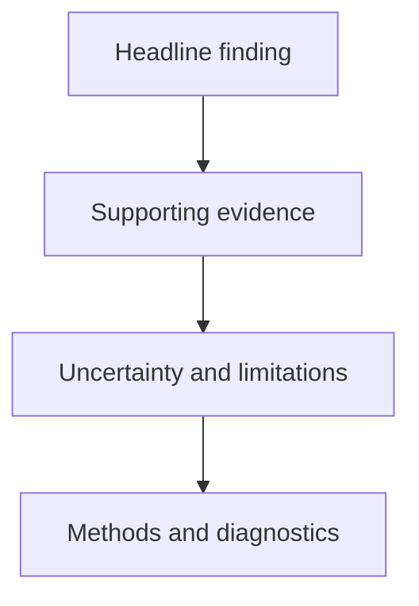

# Communicating Results Clearly {#sec-lesson15}

:::cdi-message
- **ID:** ADS-L15
- **Type:** Analytical communication
- **Audience:** Intermediate
- **Theme:** Clear communication makes evidence understandable without overstating it
:::

## Introduction

A technically correct analysis can still fail if its audience cannot identify the main result, understand the uncertainty, or see what should happen next. Analytical communication is therefore not a decorative final step. It is part of the analytical workflow.

The preceding chapter established how to move from results to defensible claims. This chapter focuses on presenting those claims clearly to different audiences while preserving their meaning, limitations, and uncertainty.

Good communication does not make evidence sound more certain than it is. It reduces unnecessary complexity while keeping the distinctions that matter.

## Learning Objectives

By the end of this chapter, you should be able to:

1. identify the audience, decision, and central message for an analytical result;
2. separate findings, interpretation, recommendations, and limitations;
3. organise results using a clear evidence hierarchy;
4. choose appropriate text, tables, and figures for different communication tasks;
5. report statistical and predictive results without hiding uncertainty;
6. improve accessibility, traceability, and reproducibility in analytical outputs; and
7. review a report, presentation, or dashboard using a practical communication checklist.

## 15.1 Communication Begins with the Decision

Before writing a report or designing a figure, determine what the audience needs to understand or decide.

Ask three questions:

1. **Who is the audience?**
2. **What decision or understanding should the analysis support?**
3. **What evidence is necessary for that purpose?**

The same analysis may need different presentations for different audiences.

| Audience | Primary need | Appropriate emphasis |
|---|---|---|
| Technical reviewer | Assess validity and reproducibility | Methods, diagnostics, assumptions, uncertainty |
| Domain specialist | Interpret substantive meaning | Context, effect sizes, limitations, practical relevance |
| Decision-maker | Compare options and consequences | Main finding, uncertainty, trade-offs, recommended action |
| General audience | Understand the essential result | Plain language, intuitive scale, minimal technical detail |

Adapting communication to an audience does not mean changing the result. It means selecting the level of detail, terminology, and format needed for accurate understanding.

:::callout-warning
Audience adaptation should simplify presentation, not weaken evidential standards. Important uncertainty, limitations, and conditions should remain visible.
:::

## 15.2 Define the Central Message

Every analytical output should have a central message that can be stated in one or two sentences.

A useful message answers:

- what was observed;
- how strong or uncertain the evidence is;
- why the result matters; and
- what should happen next, if a recommendation is justified.

Compare the following statements.

**Weak**

> The model achieved an ROC AUC of 0.84.

**Stronger**

> The model distinguished higher-risk from lower-risk cases reasonably well in held-out data (ROC AUC 0.84), but calibration should be reviewed before predicted probabilities are used for individual decisions.

The stronger statement reports the result, interprets it cautiously, and identifies a condition that affects use.

### A practical message template

> In **[population or setting]**, we found **[main result]**, with **[uncertainty or strength of evidence]**. This suggests **[careful interpretation]**. The result supports **[action or next step]**, subject to **[important limitation or condition]**.

This structure is not intended to make every conclusion sound identical. It is a prompt for checking that essential information has not been omitted.

## 15.3 Separate Result, Interpretation, and Action

Analytical writing becomes clearer when different types of statements are not blended together.

| Component | Question answered | Example |
|---|---|---|
| Result | What did the analysis show? | The estimated difference was 4.2 units. |
| Uncertainty | How precise or stable was it? | The 95% confidence interval was 1.1 to 7.3. |
| Interpretation | What might the result mean? | The groups probably differ, although the plausible magnitude remains broad. |
| Recommendation | What should be done? | Collect additional data before adopting a high-cost intervention. |
| Limitation | What constrains the conclusion? | The observational design does not establish causality. |

Keeping these components distinct makes it easier for readers to evaluate where the evidence ends and judgement begins.

:::callout-tip
Use explicit signals such as *the analysis showed*, *this may indicate*, *we recommend*, and *a limitation is*. These phrases help readers distinguish evidence from interpretation and action.
:::

## 15.4 Build an Evidence Hierarchy

Readers should encounter the most important information first and be able to access technical detail when needed.

A useful hierarchy has four layers:

1. **Headline:** the principal finding or decision-relevant message;
2. **Evidence:** the estimate, comparison, pattern, or model result supporting it;
3. **Qualification:** uncertainty, assumptions, limitations, and relevant alternatives;
4. **Technical detail:** methods, diagnostics, sensitivity analyses, and reproducibility information.

This hierarchy works across reports, presentations, dashboards, and research summaries.



The hierarchy does not imply that methods are unimportant. It places them where the intended audience can use them without obscuring the main message.

## 15.5 Use Plain Language Precisely

Plain language is not imprecise language. It removes unnecessary technical complexity while retaining analytical meaning.

| Technical or vague wording | Clearer wording |
|---|---|
| The dependent variable exhibited heteroscedasticity. | The variability of the outcome increased at higher fitted values. |
| A statistically significant association was observed. | The estimated association was unlikely to be explained by sampling variation alone under the model assumptions. |
| The model performed well. | The model achieved an ROC AUC of 0.84 and an average precision of 0.61 on held-out data. |
| Feature X was important. | Feature X strongly influenced predictions in this model, but this does not establish a causal effect. |
| There was no effect. | The analysis did not provide clear evidence of an effect; effects within the reported interval remain plausible. |

Prefer concrete nouns and active verbs where appropriate. Define specialised terms when they are necessary, and avoid replacing a precise quantity with an unsupported adjective such as *large*, *strong*, or *excellent*.

### Keep numerical meaning visible

Percentages can conceal the underlying scale. When possible, pair relative and absolute quantities.

> Risk decreased by 20%, from 10 cases per 100 people to 8 cases per 100 people.

This is more informative than reporting a 20% reduction alone.

## 15.6 Report Uncertainty as Part of the Result

Uncertainty should appear alongside the estimate, not in a footnote added after the conclusion.

Depending on the analysis, useful uncertainty information may include:

- confidence or credible intervals;
- variability across resamples or validation folds;
- prediction intervals;
- sensitivity to modelling choices;
- uncertainty caused by missing data or measurement error; and
- limits on generalisability.

### Statistical result

Instead of:

> The intervention increased the outcome by 5.4 units and was statistically significant.

Prefer:

> The estimated increase was 5.4 units (95% confidence interval: 2.0 to 8.8). Under the model assumptions, the data were inconsistent with no difference, although effects across the reported interval remain plausible.

### Predictive result

Instead of:

> The model was 87% accurate.

Prefer:

> On the held-out test set, accuracy was 0.87. Because only 12% of observations belonged to the positive class, balanced metrics and class-specific errors were also examined.

### Negative or inconclusive findings

A large p-value does not demonstrate that no meaningful effect exists. Communicate what the interval and study design allow the audience to conclude.

> The estimate was close to zero, but the confidence interval included both a small benefit and a potentially important harm. The result is therefore inconclusive rather than evidence of equivalence.

## 15.7 Design Tables for Comparison

Tables are useful when readers need exact values, several measures, or detailed comparisons. They should not reproduce every value generated by software.

A clear analytical table generally includes:

- a descriptive title;
- meaningful row and column labels;
- consistent units and decimal places;
- denominators where percentages are reported;
- uncertainty where relevant;
- notes defining abbreviations or special calculations; and
- a logical ordering that supports comparison.

### Example: model comparison table

| Model | ROC AUC | Average precision | Log loss | Main observation |
|---|---:|---:|---:|---|
| Logistic regression | 0.82 | 0.57 | 0.36 | Strong baseline and easy to explain |
| Random forest | 0.85 | 0.63 | 0.34 | Better ranking, modest probability improvement |
| Gradient boosting | 0.86 | 0.65 | 0.31 | Best overall candidate under the fixed evaluation design |

The table focuses attention on the measures used for selection. A complete technical appendix could provide fold-level results, hyperparameters, and additional diagnostics.

### Avoid false precision

Choose decimal places according to measurement quality and decision relevance. Reporting `0.863742` usually implies more precision than the evaluation supports. `0.864` or `0.86` may be more appropriate.

## 15.8 Design Figures Around a Question

A figure should help the reader answer a specific question. Choose the visual form based on the analytical task.

| Communication task | Useful visual form |
|---|---|
| Compare categories | Ordered bar chart or dot plot |
| Show change over time | Line chart |
| Show a distribution | Histogram, density plot, box plot, or empirical cumulative distribution |
| Show association | Scatter plot with appropriate uncertainty or grouping |
| Compare estimates | Coefficient or interval plot |
| Assess classification trade-offs | ROC or precision–recall curve |
| Assess predicted probabilities | Calibration plot |

### Principles for clear figures

1. Use a title that states the question or finding.
2. Label axes with meaningful names and units.
3. Use colour to encode information, not decoration.
4. Order categories intentionally.
5. Show uncertainty where it affects interpretation.
6. Remove visual elements that do not support the message.
7. Include a caption explaining the population, data, and key analytical conditions.
8. Ensure the figure remains understandable for readers with colour-vision deficiencies.

### Non-executable Python example

The following example illustrates how to produce a focused interval plot. It is intentionally non-executable in the guide; project analyses should generate publication outputs through chapter-prefixed scripts in `scripts/python/`.

```python
import matplotlib.pyplot as plt
import pandas as pd
import seaborn as sns

results = pd.DataFrame(
    {
        "feature": ["Age", "Prior exposure", "Treatment"],
        "estimate": [0.12, 0.34, -0.28],
        "lower": [0.04, 0.18, -0.46],
        "upper": [0.20, 0.50, -0.10],
    }
)

sns.set_theme(style="whitegrid", context="talk")

fig, ax = plt.subplots(figsize=(8, 4.8))
y = range(len(results))

ax.errorbar(
    results["estimate"],
    y,
    xerr=[
        results["estimate"] - results["lower"],
        results["upper"] - results["estimate"],
    ],
    fmt="o",
    color="#1f4e79",
    ecolor="#5b7fa3",
    capsize=4,
)
ax.axvline(0, color="0.35", linewidth=1, linestyle="--")
ax.set_yticks(list(y), labels=results["feature"])
ax.set_xlabel("Estimated effect with 95% confidence interval")
ax.set_ylabel("")
ax.set_title("Estimated effects differ in direction and precision")

fig.tight_layout()
plt.show()
```

The example emphasises estimates and intervals rather than using colour intensity or bar length to imply certainty.

:::callout-important
A visually attractive chart is not necessarily an informative chart. Evaluate a figure by whether it supports accurate comparison and interpretation.
:::

## 15.9 Write Captions That Stand Alone

A caption should allow a reader to understand the figure or table without searching the surrounding text for essential context.

A strong caption identifies:

- what is shown;
- the data or analytical population;
- how uncertainty was calculated;
- any important reference line, threshold, transformation, or subgroup; and
- the main pattern, when appropriate.

**Weak caption**

> Figure 1. Model results.

**Stronger caption**

> Figure 1. Held-out precision–recall curves for three candidate classifiers. Curves were calculated on the unchanged test set; the horizontal reference represents the positive-class prevalence. Gradient boosting achieved the highest average precision, although performance should be confirmed in external data.

The caption explains both the mechanics and the responsible interpretation.

## 15.10 Communicate Predictive Models Responsibly

Model communication should cover more than the best headline metric.

At minimum, report:

1. the prediction target and intended use;
2. the population and data source;
3. the evaluation design;
4. relevant baseline performance;
5. multiple metrics aligned with the decision;
6. the operating threshold, if decisions are threshold-based;
7. error patterns across important groups;
8. calibration when probabilities will be interpreted;
9. important limitations and risks; and
10. the conditions under which performance should be monitored.

### Match metrics to consequences

The practical meaning of an error depends on context.

| Decision concern | Metric or analysis to emphasise |
|---|---|
| Missing positive cases is costly | Recall or sensitivity |
| False alerts are costly | Precision or positive predictive value |
| Both classes matter under imbalance | Balanced accuracy, class-specific metrics |
| Ranking cases is the main goal | ROC AUC or average precision |
| Probabilities guide action | Calibration and proper scoring rules |
| A fixed threshold triggers action | Confusion matrix and threshold-specific consequences |

Do not describe a model as fair, safe, or deployment-ready based on aggregate performance alone. These claims require evidence matched to the intended setting.

## 15.11 Communicate Statistical Models Responsibly

For statistical models, communicate estimates in a way that preserves their scale and assumptions.

Report:

- the estimand or parameter of interest;
- the model and adjustment set;
- the estimate and uncertainty interval;
- the reference category and measurement units;
- important diagnostics or assumption checks;
- whether the interpretation is associational or causal; and
- sensitivity to reasonable alternative specifications.

### Translate without distorting

An odds ratio of 1.50 does not mean that probability increased by 50%. If decisions depend on absolute effects, translate model outputs into predicted probabilities or expected differences for meaningful scenarios.

```python
# Illustrative, non-executable example
scenario_probabilities = model.predict_proba(scenario_data)[:, 1]

comparison = scenario_data.assign(
    predicted_probability=scenario_probabilities
)
```

The resulting probabilities should be reported with clear scenario definitions and, where possible, uncertainty intervals.

## 15.12 Structure Reports for Layered Reading

Many readers scan before they read closely. A layered report supports both behaviours.

### Suggested report structure

1. **Title and purpose** — what question the analysis addresses;
2. **Executive summary** — main result, uncertainty, implication, and limitation;
3. **Context and analytical question** — why the work was undertaken;
4. **Data and methods** — enough detail to evaluate the approach;
5. **Results** — evidence organised around questions rather than software output;
6. **Interpretation** — substantive meaning and plausible alternatives;
7. **Recommendations** — actions supported by the evidence;
8. **Limitations** — constraints on validity, generalisability, and use;
9. **Technical appendix** — diagnostics, detailed methods, and supplementary results;
10. **Reproducibility information** — code, environment, data provenance, and version details.

Headings should communicate content. A heading such as **Calibration deteriorated in the external sample** is often more informative than **Additional results**.

## 15.13 Presentations and Dashboards

Reports, presentations, and dashboards serve different reading patterns.

### Presentations

Each slide should usually support one main idea. Use the slide title to state the message, then provide the evidence required to evaluate it.

Avoid:

- reading dense paragraphs from slides;
- shrinking a full report table to fit one slide;
- presenting a chart without explaining its decision relevance; and
- revealing uncertainty only after a strong claim has been made.

### Dashboards

Dashboards support monitoring and exploration. They should make the following explicit:

- definitions of metrics;
- time windows and refresh dates;
- filters currently applied;
- denominators and missing-data rules;
- alert thresholds and their meaning; and
- whether displayed changes exceed normal variation.

A dashboard is not self-explanatory merely because it is interactive. Context, definitions, and responsible defaults remain necessary.

## 15.14 Accessibility Is Part of Clarity

Accessible communication benefits all readers and is essential for some.

Use the following practices:

- provide meaningful alternative text for figures;
- do not rely on colour alone to distinguish groups;
- use sufficient colour contrast;
- label lines or groups directly where practical;
- keep text large enough to read at the intended display size;
- use descriptive link text;
- define abbreviations and specialised terms; and
- ensure tables have clear headers and a logical reading order.

### Example alternative text

Weak:

> Chart showing results.

Stronger:

> Dot-and-interval plot of three adjusted effect estimates. Treatment has a negative estimate whose 95% confidence interval remains below zero; age and prior exposure have positive estimates, with prior exposure showing the largest magnitude.

Alternative text should communicate the figure's purpose and important pattern rather than list every visual property.

## 15.15 Preserve Traceability and Reproducibility

Readers should be able to connect a claim to its evidence and, where appropriate, reproduce the output.

For project reports:

- generate tables and figures from scripts rather than editing values manually;
- use chapter-prefixed script and output names;
- record data versions and analysis dates;
- retain the evaluation design used to produce reported metrics;
- distinguish exploratory from confirmatory results;
- link claims to named tables, figures, or appendices; and
- preserve the software environment needed to regenerate outputs.

If a later project-specific version of this chapter requires generated assets,
use the established chapter prefix—for example,
`scripts/python/15-build-communication-assets.py`. This guide chapter does not
require that script because it does not depend on generated assets.

## 15.16 Review Claims Across Formats

The same claim may appear in a report, slide, abstract, dashboard annotation, and spoken presentation. Check that its meaning remains consistent.

Common inconsistencies include:

- a cautious report conclusion becoming a definitive slide headline;
- a validation metric being described as expected deployment performance;
- an association being described as an effect;
- a subgroup observation being presented without its small sample size; and
- a relative change being presented without the absolute baseline.

Create a small claim register for important projects.

| Claim ID | Claim | Evidence | Qualification | Used in |
|---|---|---|---|---|
| C1 | Candidate B ranked cases best | Held-out average precision | Single-site test set | Report, slides |
| C2 | Probabilities need recalibration | Calibration curve and log loss | External validation required | Report, model card |

This makes revisions easier and reduces accidental overstatement.

## 15.17 Common Communication Failures

### Reporting software output instead of findings

Raw coefficient tables, diagnostic dumps, and console output rarely communicate the analytical message. Select and explain the evidence relevant to the question.

### Leading with methods

Methods matter, but many audiences first need to know the question and principal result. Use layered communication to make both accessible.

### Hiding important uncertainty

Do not display a point estimate prominently while placing its uncertainty in small text or an appendix.

### Treating statistical significance as practical importance

Report magnitude, uncertainty, and practical context. A small effect can be precisely estimated but unimportant for the decision.

### Using causal language for observational results

Words such as *caused*, *improved*, and *reduced* imply causal evidence. Use associational language unless the design and assumptions support a causal claim.

### Overloading the audience

More detail is not always more transparent. Move supporting analyses to appendices while keeping the path from claim to evidence clear.

### Removing all technical language

Oversimplification can distort meaning. Retain technical terms that are necessary, define them, and explain their relevance.

## 15.18 A Communication Quality Checklist

Before publishing or presenting analytical results, check the following.

### Purpose and audience

- [ ] The intended audience and decision are clear.
- [ ] The central message can be stated in one or two sentences.
- [ ] The level of technical detail matches the audience.

### Evidence and claims

- [ ] Every important claim is linked to appropriate evidence.
- [ ] Results, interpretations, recommendations, and limitations are distinguishable.
- [ ] Causal language is supported by the design and assumptions.
- [ ] Negative or inconclusive results are not described as proof of no effect.

### Numbers, tables, and figures

- [ ] Units, denominators, reference groups, and time periods are defined.
- [ ] Uncertainty appears alongside important estimates.
- [ ] Tables support comparison and avoid unnecessary precision.
- [ ] Figures answer a clear question and have informative captions.
- [ ] Colour, labels, and alternative text support accessibility.

### Models and decisions

- [ ] Metrics match the intended use and error consequences.
- [ ] Evaluation data are clearly distinguished from training data.
- [ ] Thresholds and subgroup performance are reported when relevant.
- [ ] Limitations on transportability and deployment are explicit.

### Reproducibility

- [ ] Reported values are generated from traceable analysis outputs.
- [ ] Data, code, environment, and output versions are recorded.
- [ ] The same claims remain consistent across communication formats.

## 15.19 Mini Communication Exercise

Suppose a classifier has the following held-out results:

- ROC AUC: 0.88;
- average precision: 0.68;
- recall at the proposed threshold: 0.81;
- precision at the proposed threshold: 0.42;
- positive-class prevalence: 0.18; and
- calibration is weaker for the highest-risk group.

### Poor summary

> The model is highly accurate and ready for deployment.

### Improved summary

> In held-out data, the model ranked higher-risk cases well (ROC AUC 0.88; average precision 0.68). At the proposed threshold, it identified 81% of positive cases, but fewer than half of its alerts were correct (precision 0.42). Because predicted probabilities were less reliable in the highest-risk group, recalibration and external validation are needed before deployment.

The improved version:

- names the evaluation setting;
- reports complementary metrics;
- translates threshold performance into practical meaning;
- identifies a group-specific limitation; and
- recommends an evidence-aligned next step.

## 15.20 Key Takeaways

1. Analytical communication begins with the audience and the decision, not with formatting.
2. A central message should combine the main result with uncertainty and appropriate qualification.
3. Results, interpretations, recommendations, and limitations should remain distinguishable.
4. Tables communicate exact comparisons; figures communicate patterns and relationships.
5. Model performance should be reported using metrics and error consequences aligned with intended use.
6. Accessibility, traceability, and reproducibility are components of analytical quality.
7. Clear communication simplifies presentation without overstating evidence.

## 15.21 Reflection Questions

1. How would you explain the same model result differently to a technical reviewer and a programme manager?
2. Which uncertainty information is essential for the decisions supported by your current analysis?
3. Does your most important figure answer a specific question without relying on surrounding text?
4. Are any associational findings currently expressed using causal language?
5. Can each major claim in your report be traced to a table, figure, or documented analysis result?
6. What information should move to an appendix so that the main message becomes clearer without losing transparency?

## Conclusion

Clear analytical communication preserves the relationship between evidence, uncertainty, interpretation, and action. It helps audiences understand not only what an analysis found, but also how confidently the result can be used and where judgement is still required.

The strongest communication is neither the most technical nor the most simplified. It is the presentation that allows its intended audience to understand the evidence accurately, evaluate its limitations, and make an appropriately informed decision.
