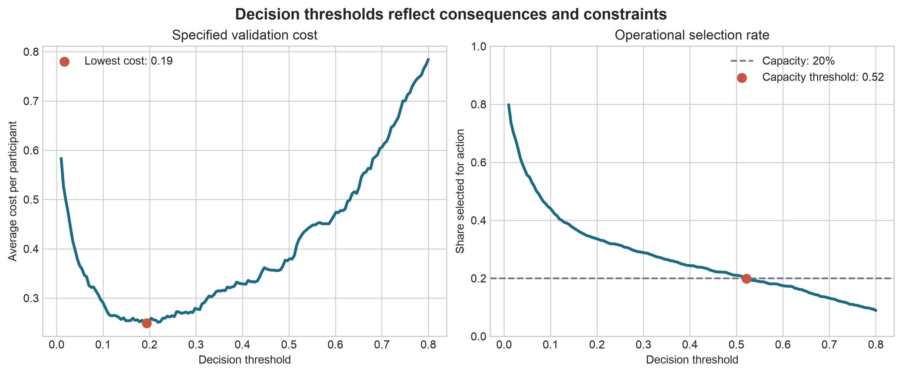

# From Analysis to Decision-Making {#sec-lesson16}

:::cdi-message
- **ID:** ADS-L16
- **Type:** Decision support
- **Audience:** Intermediate
- **Theme:** Analysis informs decisions but does not replace judgment
:::

## Learning objectives

By the end of this chapter, you should be able to:

- distinguish an analytical result from a decision;
- define the action, decision-maker, constraints, and consequences before selecting a model;
- translate predictions or estimates into decision rules;
- incorporate asymmetric costs, capacity limits, uncertainty, and distributional effects;
- document where evidence ends and judgment begins; and
- design monitoring that tests whether a decision remains useful after deployment.

## The final analytical step is not the final decision

Chapter @sec-lesson14 established how results become defensible claims, and Chapter @sec-lesson15 showed how those claims should be communicated clearly. A claim, however, does not determine what should be done.

Analysis describes evidence under stated assumptions. A decision combines that evidence with objectives, values, constraints, opportunity costs, and accountability. Two decision-makers can reasonably choose different actions from the same result because they face different consequences or have different tolerances for risk.

The distinction is fundamental:

> **Analytical conclusion:** what the evidence supports.  
> **Decision:** what an accountable person or organisation chooses to do with that evidence.

A model can estimate that an event is likely. It cannot decide whether intervention is affordable, proportionate, ethical, or operationally feasible.

## Begin with the decision, not the dataset

Before analysing data, write a decision statement:

> **Who** will decide **what action**, for **which population**, **when**, using **what evidence**, under **which constraints**?

For example:

> The programme manager will decide which currently enrolled participants should receive additional follow-up next month, using predicted disengagement risk, subject to a capacity of 120 follow-up calls.

This statement is more useful than “build a churn model.” It identifies the accountable decision-maker, available action, target population, time horizon, evidence, and binding constraint.

### A decision-framing table

| Element | Question to answer | Example |
|---|---|---|
| Decision-maker | Who has authority and accountability? | Programme manager |
| Population | Who is eligible for the decision? | Currently enrolled participants |
| Action | What can actually be done? | Offer an additional follow-up call |
| Alternative | What happens otherwise? | Continue standard support |
| Timing | When must the choice be made? | Before next month's call schedule |
| Objective | What outcome should improve? | Continued programme participation |
| Evidence | What information is available at decision time? | Baseline and prior engagement data |
| Constraints | What limits the available action? | 120 calls and staff availability |
| Harms | Who may be burdened or excluded? | Participants incorrectly labelled high-risk |
| Review | When will the rule be reconsidered? | After each quarterly cohort |

If any of these elements remains vague, a technically strong analysis may still be unusable.

## Match the analytical target to the decision

Different decisions require different analytical quantities.

| Decision need | Useful analytical target | Common mistake |
|---|---|---|
| Describe the current situation | Prevalence, rate, distribution, or subgroup summary | Treating description as causal explanation |
| Estimate the effect of an intervention | Causal contrast or treatment effect | Using predictive importance as evidence of causation |
| Prioritise limited services | Calibrated individual risk or expected benefit | Ranking people without specifying capacity |
| Forecast resource demand | Future counts, probabilities, or intervals | Reporting point forecasts without uncertainty |
| Select among policies | Expected utility, cost, benefit, and distributional effects | Choosing the policy with the best average metric only |

A prediction of risk is not necessarily a prediction of benefit. A person with the highest event risk may not be the person most likely to benefit from the available intervention. When the decision concerns treatment or service allocation, the ideal target may be the expected outcome under each available action rather than risk under current practice.

## From predictions to actions

A predictive model produces scores or probabilities. An operational system needs a decision rule.

For a binary action, a simple threshold rule is:

\[
a_i =
\begin{cases}
1, & \hat{p}_i \ge t \\
0, & \hat{p}_i < t,
\end{cases}
\]

where \(\hat{p}_i\) is the estimated probability for case \(i\), \(t\) is the chosen threshold, and \(a_i\) indicates whether action is taken.

The threshold is a policy choice, not a property discovered by the model. The default value of 0.50 is rarely justified merely because software uses it.

### Use consequences to select a threshold

Suppose action is taken to prevent an adverse event. Let:

- \(C_{FP}\) be the cost of acting when the event would not occur; and
- \(C_{FN}\) be the cost of failing to act when the event would occur.

When probabilities are calibrated and these are the only relevant consequences, the expected-cost threshold is:

\[
t^* = \frac{C_{FP}}{C_{FP} + C_{FN}}.
\]

If a missed event costs four times as much as an unnecessary action, then \(C_{FP}=1\), \(C_{FN}=4\), and \(t^*=0.20\). This calculation makes the value judgment explicit; it does not make the judgment objective.

```python
false_positive_cost = 1
false_negative_cost = 4

decision_threshold = false_positive_cost / (
    false_positive_cost + false_negative_cost
)

print(f"Decision threshold: {decision_threshold:.2f}")
```

Real decisions can also involve intervention effectiveness, direct financial costs, participant burden, downstream harms, and uncertain consequences. These should be represented when they materially affect the choice.

## Capacity can determine the rule

Many organisations cannot act on every case above a theoretically optimal threshold. If only \(K\) cases can receive an intervention, a ranking rule may be more appropriate:

1. estimate the relevant score for each eligible case;
2. exclude cases for whom the action is inappropriate or unavailable;
3. rank the remaining cases using the pre-specified score;
4. act on at most the top \(K\); and
5. define how ties and exceptions will be handled.

Capacity-constrained selection changes the evaluation question. Accuracy at a 0.50 threshold becomes less informative than measures such as precision among the top \(K\), recall at capacity, expected benefit per action, total expected utility, and subgroup selection rates.

```python
import pandas as pd

capacity = 120

priority_list = (
    eligible_participants
    .sort_values("predicted_risk", ascending=False)
    .head(capacity)
    .assign(recommended_action="additional_follow_up")
)
```

This example is intentionally non-executable because `eligible_participants` represents data supplied by the local decision context.

## Compare policies, not only models

The model with the highest area under the ROC curve is not automatically the best decision system. Candidate policies should be compared with realistic baselines:

- take no additional action;
- act on everyone;
- continue the current human or rule-based process;
- use a model-based threshold;
- rank cases until capacity is filled; or
- combine a model recommendation with structured human review.

For a policy \(d\), expected utility can be written as:

\[
EU(d) = \frac{1}{n}\sum_{i=1}^{n} U\left(d(x_i), y_i\right),
\]

where \(d(x_i)\) is the action selected for case \(i\), \(y_i\) is the observed outcome, and \(U\) assigns a value or cost to each action–outcome combination.

The utility table must be discussed with domain experts and affected stakeholders. It embeds priorities that a data scientist should not silently invent.

## A worked decision analysis

Consider a service that can contact participants who are at risk of disengagement. Historical validation data contain calibrated probabilities and observed outcomes. The team wants to compare thresholds under the following illustrative costs:

- unnecessary contact: 1 cost unit;
- missed disengagement: 5 cost units; and
- available follow-up capacity: 20% of participants.

The companion script evaluates candidate thresholds and produces a decision-focused figure:

```bash
python scripts/python/16-generate-decision-making-figures.py
```

{#fig-16-decision-threshold-trade-offs fig-alt="Two-panel chart showing expected cost and share selected across probability thresholds, with cost-based and capacity-based operating points marked."}

Figure @fig-16-decision-threshold-trade-offs illustrates two distinct rules. A cost-based threshold minimises the specified validation cost. A capacity-based threshold selects only the number of cases the service can contact. Neither rule should be adopted until its assumptions, uncertainty, and subgroup consequences have been reviewed.

## Make uncertainty decision-relevant

Confidence intervals and predictive intervals are useful only when connected to the choice being considered. Ask:

- Would the action change across plausible values of the estimate?
- Which uncertain assumption has the greatest influence on the decision?
- Is more information worth the delay or cost of collecting it?
- Can a reversible pilot reduce uncertainty before full implementation?

### Sensitivity analysis

Do not report one decision under one assumed cost structure. Recalculate the preferred policy across plausible values for:

- false-positive and false-negative costs;
- intervention effectiveness;
- operational capacity;
- outcome prevalence;
- probability calibration; and
- missing-data or transportability assumptions.

A decision is robust when the preferred action remains reasonable across credible assumptions. If small changes reverse the choice, communicate that instability directly.

### Value of additional information

More analysis is valuable when it has a realistic chance of changing the decision enough to justify its cost and delay. Otherwise, a limited pilot with monitoring may be preferable to indefinite analysis.

## Examine who benefits and who bears the errors

Average utility can hide unequal effects. Before recommending a policy, examine:

- eligibility and data availability across groups;
- calibration and error rates in substantively relevant subgroups;
- selection rates under the proposed rule;
- access to the intervention after selection;
- burdens created by false positives and harms created by false negatives; and
- whether historically produced labels encode unequal prior treatment.

Equalising one metric does not guarantee an equitable policy. Metrics can conflict, and the appropriate standard depends on the decision context. Distributional results should therefore be presented alongside overall performance and considered with people who understand the affected setting.

Sensitive attributes may be necessary for auditing even when they are not used as predictors. Their collection and use must follow appropriate legal, ethical, privacy, and governance requirements.

## Preserve meaningful human judgment

“Human in the loop” is useful only if the human role is specified. Document:

- what information the reviewer receives;
- which decisions may be overridden;
- acceptable reasons for an override;
- how overrides are recorded;
- who can appeal or request reconsideration; and
- how reviewer consistency and outcomes will be audited.

Unstructured overrides can reproduce bias while obscuring accountability. Conversely, preventing any override can make a system brittle when data are incomplete or exceptional circumstances arise.

The goal is not to place a person somewhere in the workflow. It is to allocate responsibility clearly.

## Write a decision memo

A concise decision memo separates evidence, assumptions, and judgment. A useful structure is:

### Decision

State the decision required, the decision-maker, and the deadline.

### Recommendation

State the preferred action and any limits on its use.

### Evidence

Summarise the most relevant estimates, validation results, comparisons, and uncertainty. Link to the complete analysis rather than reproducing every output.

### Assumptions and value judgments

List the assumed costs, benefits, capacity, time horizon, and ethical or policy priorities.

### Alternatives considered

Describe credible alternatives, including the current process and no-action option, and explain why they were not preferred.

### Risks and distributional effects

Identify failure modes, affected groups, privacy concerns, operational risks, and possible unintended consequences.

### Implementation and monitoring

Specify ownership, review points, outcome measures, override rules, stopping conditions, and the next decision date.

## Monitor the decision system, not only the model

After implementation, model metrics are only part of the evidence. Monitoring should connect the entire pathway:

| Layer | Example question |
|---|---|
| Data | Has the eligible population or measurement process changed? |
| Model | Are discrimination and calibration stable? |
| Decision rule | How many cases are selected, deferred, or overridden? |
| Operations | Are recommended actions delivered on time and as intended? |
| Outcomes | Do selected cases experience better outcomes? |
| Distribution | Are benefits, errors, and burdens concentrated in particular groups? |
| Governance | Are incidents, appeals, and exceptions reviewed? |

A model may remain statistically accurate while the programme fails because staff cannot deliver the intervention. Alternatively, the model may drift while experienced reviewers temporarily prevent harm. Monitoring must detect both situations.

### Pre-specify review and stopping rules

Define conditions that trigger investigation, recalibration, retraining, policy revision, or suspension. Examples include:

- missingness exceeding an agreed limit;
- calibration error becoming operationally material;
- intervention capacity being repeatedly exceeded;
- a harmful subgroup disparity emerging;
- implementation fidelity falling below an acceptable level; or
- evidence that the intervention no longer improves outcomes.

Thresholds for these triggers should reflect practical importance, not statistical significance alone.

## Common failure modes

### Letting the metric choose the action

Optimising accuracy, \(R^2\), or AUC does not define the relevant costs, benefits, or constraints.

### Treating 0.50 as a neutral threshold

Every threshold creates a pattern of actions and errors. The default is still a policy choice.

### Confusing risk with intervention benefit

High-risk cases may be difficult to help, while moderate-risk cases may respond strongly to the available action.

### Ignoring the current process

A new policy should be compared with what decision-makers actually do now, including its costs and strengths.

### Hiding value judgments inside technical language

Weights, thresholds, utility values, and fairness criteria express priorities. Name who selected them and why.

### Automating before validating the action pathway

Prediction has little value when the recommended action is unavailable, ineffective, or not delivered.

### Monitoring only model drift

Stable inputs do not guarantee useful implementation or improved outcomes.

## Decision-readiness checklist

Before recommending action, confirm that:

- [ ] the decision-maker, population, action, timing, and alternative are explicit;
- [ ] the analytical target matches the decision need;
- [ ] only information available at decision time is used;
- [ ] relevant costs, benefits, constraints, and capacity are documented;
- [ ] candidate policies are compared with current practice and simple baselines;
- [ ] uncertainty and sensitivity analyses could meaningfully change the recommendation;
- [ ] subgroup performance, access, burdens, and benefits have been examined;
- [ ] human review, overrides, appeals, and accountability are defined;
- [ ] implementation ownership and intervention fidelity can be measured;
- [ ] monitoring, review dates, and stopping rules are pre-specified; and
- [ ] the final communication separates evidence from judgment.

## Key takeaways

1. Start with an actionable decision statement, not a preferred method.
2. Match the analytical target to the decision: description, causal effect, risk, benefit, demand, and utility answer different questions.
3. Translate estimates into explicit policies using consequences and operational constraints.
4. Compare complete decision policies with realistic alternatives, not models in isolation.
5. Test whether the recommendation survives plausible uncertainty and whether its benefits and burdens are acceptably distributed.
6. Preserve accountability by documenting value judgments, human roles, and governance.
7. Monitor data, models, actions, implementation, outcomes, and distributional effects together.

## Closing perspective

Advanced data science is not complete when a model converges, a hypothesis test is significant, or a dashboard is published. It is complete only when the evidence is connected to a clearly framed choice, its limitations are visible, responsibility is assigned, and outcomes can be examined after action.

The most credible analyst does not claim that data make the decision. The analyst makes the evidence useful, distinguishes calculation from judgment, and helps decision-makers act with greater clarity and accountability.
